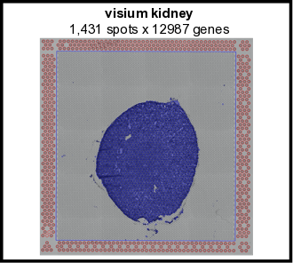

<!-- README.md is generated from README.Rmd. Please edit that file -->

<!-- This line is from RStudio -->

# Giotto

<!-- badges: start -->

<!-- badges: end -->

The Giotto package consists of two modules, Giotto Analyzer and Viewer
(see [www.spatialgiotto.com](http://www.spatialgiotto.com)), which
provide tools to process, analyze and visualize **single-cell spatial
expression** data. The underlying framework is generalizable to
virtually all currently available spatial datasets. We recently
demonstrated the general applicability on 10 different datasets created
by 9 different state-of-the-art spatial technologies, including *in
situ* hybridization (seqFISH+, merFISH, osmFISH), sequencing (Slide-seq,
Visium, STARmap) and imaging-based multiplexing/proteomics (CyCIF, MIBI,
CODEX). These technologies differ in terms of resolution (single cell vs
multiple cells), spatial dimension (2D vs 3D), molecular modality
(protein vs RNA), and throughput (number of cells and genes). More
information and documentation about the latest version of Giotto
Analyzer can be found at <https://rubd.github.io/Giotto_site/> (**URL
change \!\!**).


## Requirements

  - R (\>= 3.5.1)
  - Python (\>= 3.0)
  - Windows, MacOS or Linux specific installation tools. See
    [link](https://support.rstudio.com/hc/en-us/articles/200486498-Package-Development-Prerequisites).

 

## Installation

See [FAQs](https://rubd.github.io/Giotto_site/articles/faqs.html) for
additional information.

#### R installation

You can install Giotto with (\~1-5 mins):

``` r
library(devtools)  # if not installed: install.packages('devtools')
library(remotes)  # if not installed: install.packages('remotes')
remotes::install_github("RubD/Giotto")
```

#### Required python modules

These are necessary to run all available analyses, but can be installed
automatically.

Required python modules:  
\- pandas  
\- python-igraph (igraph)  
\- networkx  
\- leidenalg  
\- python-louvain (community)  
\- smfishHmrf  
\- python.app (OSX only)  
\- scikit-learn

##### Automatic installation

The python modules will be installed automatically in a miniconda
environment when installing Giotto. However, it will ask you whether you
want to install them and you can opt out and select your preferred
python path. In that case you need to do a manual installation of the
python modules.

##### Manual installation

See [python
installation](https://rubd.github.io/Giotto_site/articles/installation_issues.html#python-manual-installation)

#### Giotto Viewer

See
[link](http://spatial.rc.fas.harvard.edu/spatialgiotto/giotto.install.native.html)

 

## Examples

  - see <https://github.com/RubD/spatial-datasets> to find raw and
    pre-processed input data and Giotto scripts (in progress).
  - typical run time range for the different datasets on a personal
    computer is around 10\~45 mins.  
  - click on the image and try them out yourself.  
  - all examples are gradually updated to the latest Giotto version
    \[work in progress\]

[](https://rubd.github.io/Giotto_site/articles/mouse_seqFISH_cortex_200914.html)
[](https://rubd.github.io/Giotto_site/articles/mouse_merFISH_preoptic_region_200909.html)
[](https://rubd.github.io/Giotto_site/articles/mouse_starmap_cortex_200917.html)
[](https://rubd.github.io/Giotto_site/articles/mouse_visium_brain_200601.html)
[](https://rubd.github.io/Giotto_site/articles/mouse_visium_kidney_200916.html)
[](https://rubd.github.io/Giotto_site/articles/human_cycif_PDAC_200916.html)
[](https://rubd.github.io/Giotto_site/articles/mouse_osmFISH_SScortex_200915.html)
[](https://rubd.github.io/Giotto_site/articles/mouse_CODEX_spleen.html)

## References

  - [Dries, R. et al. Giotto, a toolbox for integrative analysis and
    visualization of spatial expression data. bioRxiv 701680
    (2019).](https://www.biorxiv.org/content/10.1101/701680v2)
    <doi:10.1101/701680>

  - [Eng, C.-H. L. et al. Transcriptome-scale super-resolved imaging in
    tissues by RNA seqFISH+. Nature 1
    (2019).](https://www.nature.com/articles/s41586-019-1049-y)
    <doi:10.1038/s41586-019-1049-y>

  - [Zhu, Q., Shah, S., Dries, R., Cai, L. & Yuan, G.-C. Identification
    of spatially associated subpopulations by combining scRNAseq and
    sequential fluorescence in situ hybridization data. Nature
    Biotechnology (2018).](https://www.nature.com/articles/nbt.4260)
    <doi:10.1038/nbt.4260>
