```{r, include = FALSE}
knitr::opts_chunk$set(
  collapse = TRUE,
  comment = "#>",
  fig.path = "man/figures/README-",
  out.width = "100%"
)
```

```{r eval=TRUE, echo=FALSE}
giotto_version = utils::packageVersion(pkg = 'Giotto')

if(giotto_version == '0.3.6.9038') {
  NULL
} else if(giotto_version > '0.3.6.9038'){
  warning('This tutorial was written with Giotto version 0.3.6.9038, your version is ', giotto_version, '.', 
  'This is a more recent version and results should be reproducible')
} else {
  warning('This tutorial was written with Giotto version 0.3.6.9038, your version is ', giotto_version, '.', 
  'This is an older version and results could be slightly different')
}
```


```{r eval=FALSE, message=FALSE, warning=FALSE}
library(Giotto)

# 1. set working directory
results_folder = '/path/to/directory/'

# 2. set giotto python path
# set python path to your preferred python version path
# set python path to NULL if you want to automatically install (only the 1st time) and use the giotto miniconda environment
python_path = NULL 
if(is.null(python_path)) {
  installGiottoEnvironment()
}
```


## Dataset explanation
The CyCIF data to run this tutorial can be found [here](https://github.com/RubD/spatial-datasets/tree/master/data/2018_CyCIF_PDAC). Alternatively you can use the **getSpatialDataset** to automatically download this dataset like we do in this example.

We will re-analyze the PDAC data generated by tissue-CyCIF as explained in the paper by [Lin et al](https://elifesciences.org/articles/31657).

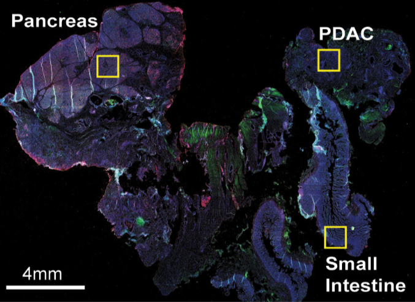{ width=50% }


## Dataset download
```{r eval=FALSE, message=FALSE, warning=FALSE}
# download data to working directory ####
# if wget is installed, set method = 'wget'
# if you run into authentication issues with wget, then add " extra = '--no-check-certificate' "
getSpatialDataset(dataset = 'cycif_PDAC', directory = results_folder, method = 'wget')
```


## Part 1: Giotto global instructions and preparations

```{r eval=FALSE, message=FALSE, warning=FALSE}
# 1. (optional) set Giotto instructions
instrs = createGiottoInstructions(save_plot = TRUE,
                                  show_plot = FALSE,
                                  save_dir = results_folder)

# 2. create giotto object from provided paths ####
expr_path = paste0(results_folder, "cyCIF_PDAC_expression.txt.gz")
loc_path = paste0(results_folder, "cyCIF_PDAC_coord.txt")
meta_path = paste0(results_folder, "cyCIF_PDAC_annot.txt")
png_path = paste0(results_folder, "canvas.png")
```


## part 2: Create Giotto object & process data

```{r, eval=FALSE}
# read in data information

# expression info
pdac_expression = readExprMatrix(expr_path, transpose = T)
# cell coordinate info
pdac_locations = data.table::fread(loc_path)
# metadata
pdac_metadata = data.table::fread(meta_path)
pdac_test <- createGiottoObject(raw_exprs = pdac_expression, 
                                spatial_locs = pdac_locations,
                                instructions = instrs,
                                cell_metadata = pdac_metadata)

## normalize & adjust
pdac_test <- normalizeGiotto(gobject = pdac_test, scalefactor = 10000, verbose = T)
pdac_test <- addStatistics(gobject = pdac_test)

## visualize original annotations ##
spatPlot(gobject = pdac_test, point_size = 0.5, coord_fix_ratio = 1, cell_color = 'frame',
         background_color = 'black', legend_symbol_size = 3,
         save_param = list(save_name = '2_a_spatPlot'))

```

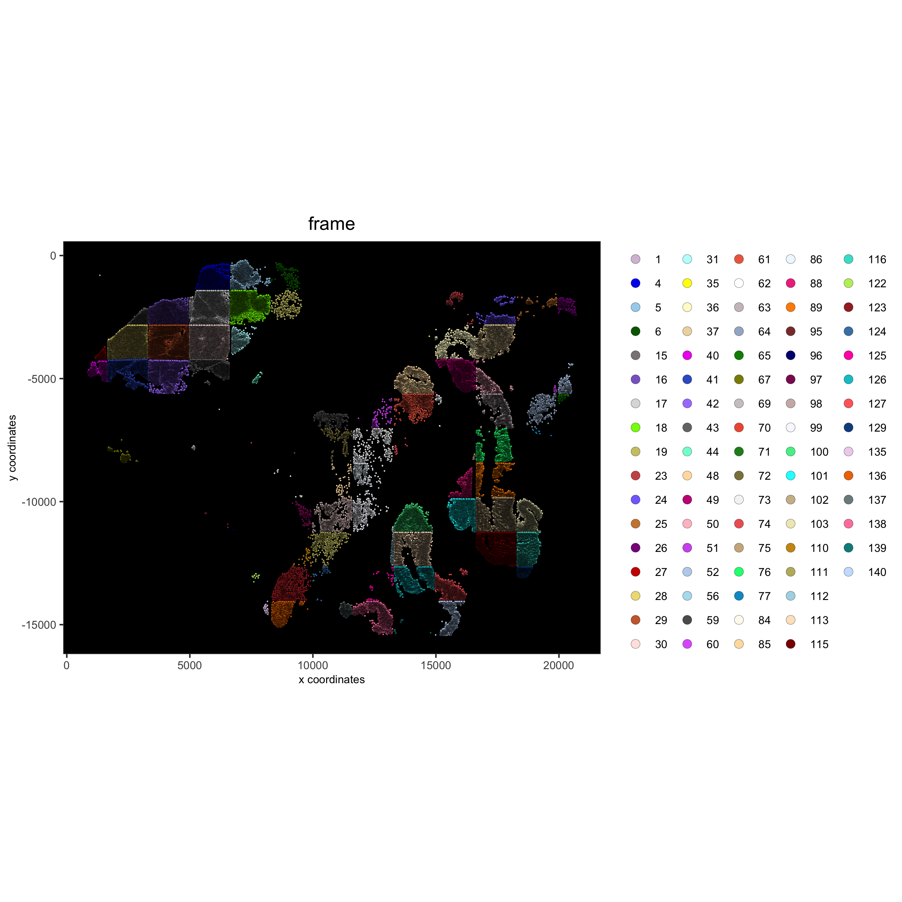{ width=50% } 
  
```{r eval=FALSE}
spatPlot(gobject = pdac_test, point_size = 0.3, coord_fix_ratio = 1, 
         cell_color = 'COL', background_color = 'black', legend_symbol_size = 3,
         save_param = list(save_name = '2_b_spatPlot_column'))
```

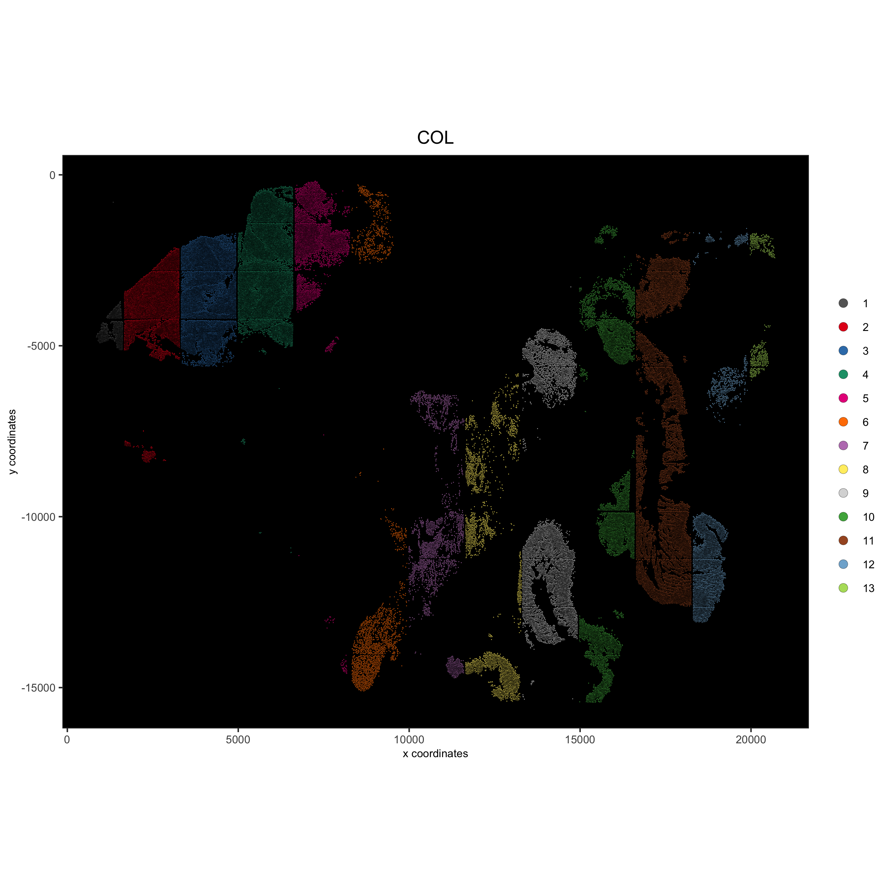{ width=50% } 

```{r eval=FALSE}
spatPlot(gobject = pdac_test, point_size = 0.3, coord_fix_ratio = 1, 
         cell_color = 'ROW', background_color = 'black', legend_symbol_size = 3,
         save_param = list(save_name = '2_c_spatPlot_row'))
```

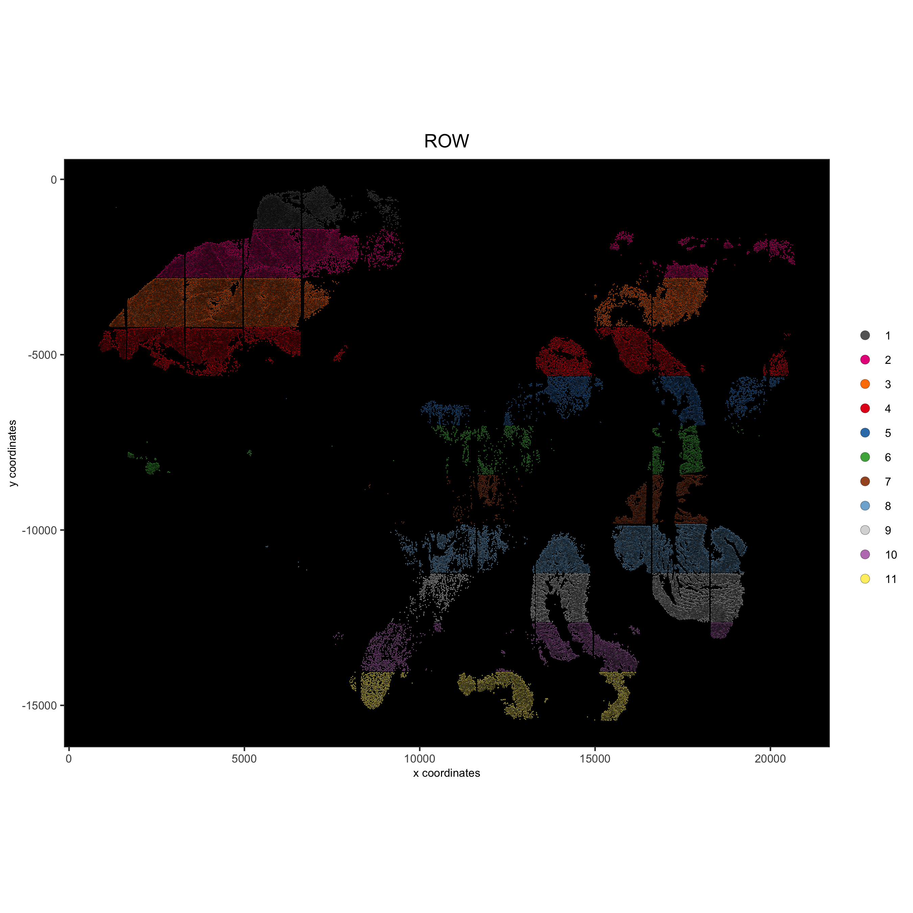{ width=50% } 

```{r eval=FALSE}
## add external histology information
pdac_metadata = pDataDT(pdac_test)
pancreas_frames = c(1:6, 27:31, 15:19, 40:44)
PDAC_frames = c(23:26, 35:37, 51:52, 64:65, 77)
small_intestines_frames = c(49:50, 63, 75:76, 88:89, 100:103, 112:116, 125:129, 137:140)

# detailed histology
hist_info = ifelse(pdac_metadata$frame %in% pancreas_frames, 'pancr', 
                   ifelse(pdac_metadata$frame %in% PDAC_frames, 'PDAC',
                          ifelse(pdac_metadata$frame %in% small_intestines_frames, 'small_intest', 'other')))
pdac_test = addCellMetadata(pdac_test, new_metadata = hist_info)

spatPlot(gobject = pdac_test, point_size = 0.3, coord_fix_ratio = 1, cell_color = 'hist_info',
         background_color = 'black', legend_symbol_size = 3,
         save_param = list(save_name = '2_d_spatPlot_hist'))
```

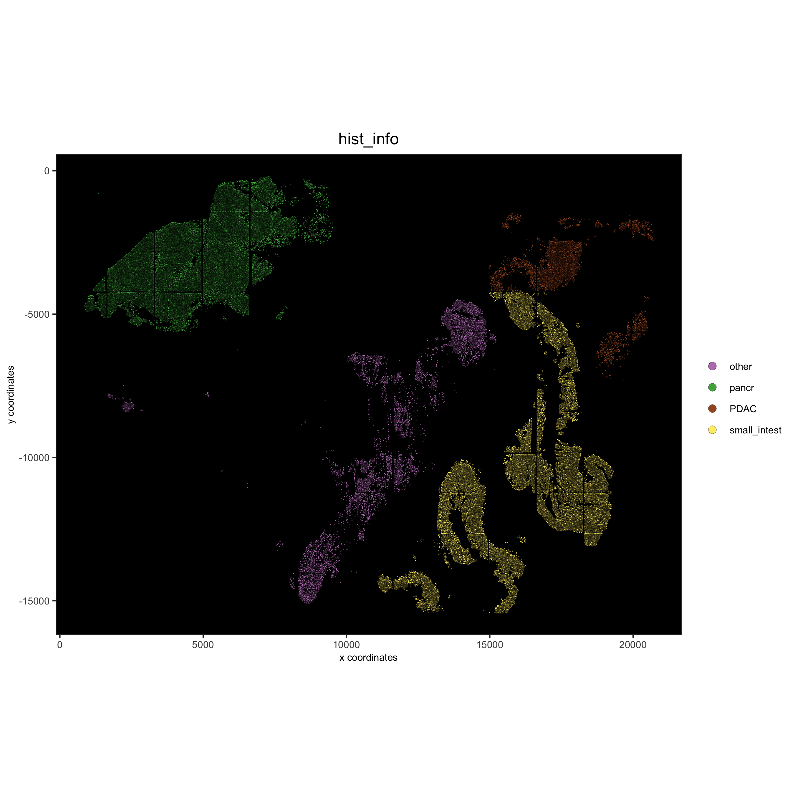{ width=50% } 

```{r eval=FALSE}
# coarse histology
hist_info2 = ifelse(pdac_metadata$frame %in% pancreas_frames, 'pancr', 
                    ifelse(pdac_metadata$frame %in% small_intestines_frames, 'small_intest','PDAC'))
pdac_test = addCellMetadata(pdac_test, new_metadata = hist_info2)

spatPlot(gobject = pdac_test, point_size = 0.3, coord_fix_ratio = 1, cell_color = 'hist_info2',
         background_color = 'black', legend_symbol_size = 3, point_border_stroke = 0.001,
         save_param = list(save_name = '2_e_spatPlot_hist2'))

```
 
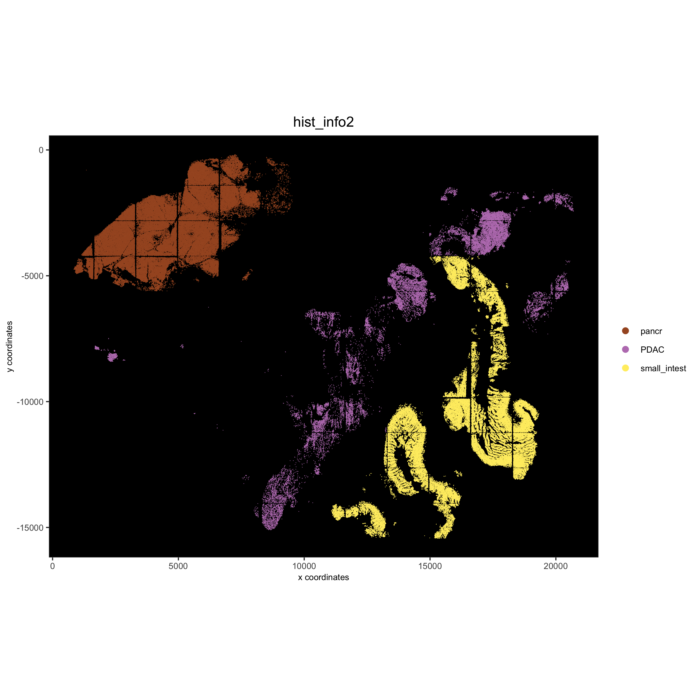{ width=50% } 

#### add and align image: 

1. read image with magick  
2. modify image optional (e.g. flip axis, negate, change background, ...)  
3. test if image is aligned    
```{r eval=FALSE}
# read
mg_img = magick::image_read(png_path)

# flip/flop (convert x and y axes)
mg_img = magick::image_flip(mg_img)
mg_img = magick::image_flop(mg_img)

# negate image
mg_img2 = magick::image_negate(mg_img)


## align image ##
# 1. create spatplot
mypl = spatPlot(gobject = pdac_test, point_size = 0.3, coord_fix_ratio = NULL, cell_color = 'hist_info2',
       legend_symbol_size = 3, point_border_stroke = 0.001,
       save_plot = F, return_plot = T)

# 2.create giotto image and make adjustments (xmax_adj, xmin_adj, ...)
hist_png = createGiottoImage(gobject = pdac_test, mg_object = mg_img2, name = 'image_hist',
                                 xmax_adj = 5000, xmin_adj = 2500, ymax_adj = 1500, ymin_adj = 1500)

# 3. add giotto image to spatplot to check alignment
mypl_image = addGiottoImageToSpatPlot(mypl, hist_png)
mypl_image
```

4. add giotto image(s) to giotto object to call them within spat functions
```{r eval=FALSE}
## add images to Giotto object ##
image_list = list(hist_png)
pdac_test = addGiottoImage(gobject = pdac_test,
                               images = image_list)
showGiottoImageNames(pdac_test)
```


## part 3: dimension reduction

```{r eval=FALSE}
# PCA
pdac_test <- runPCA(gobject = pdac_test, expression_values = 'normalized',
                    scale_unit = T, center = F, method = 'factominer')
signPCA(pdac_test, scale_unit = T, scree_ylim = c(0, 3),
        save_param = list(save_name = '3_a_signPCA'))
```

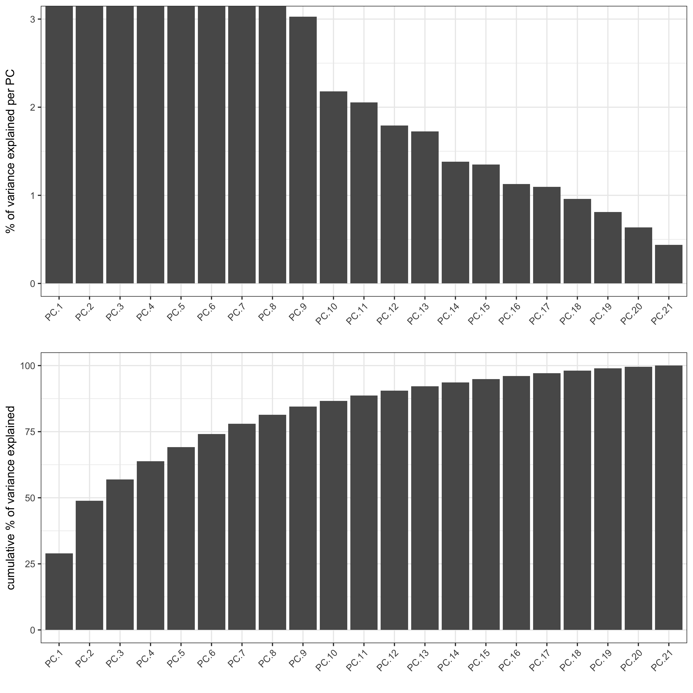{ width=50% } 

```{r eval=FALSE}
plotPCA(gobject = pdac_test, point_shape = 'no_border', point_size = 0.2, 
        save_param = list(save_name = '3_b_PCAplot'))
```

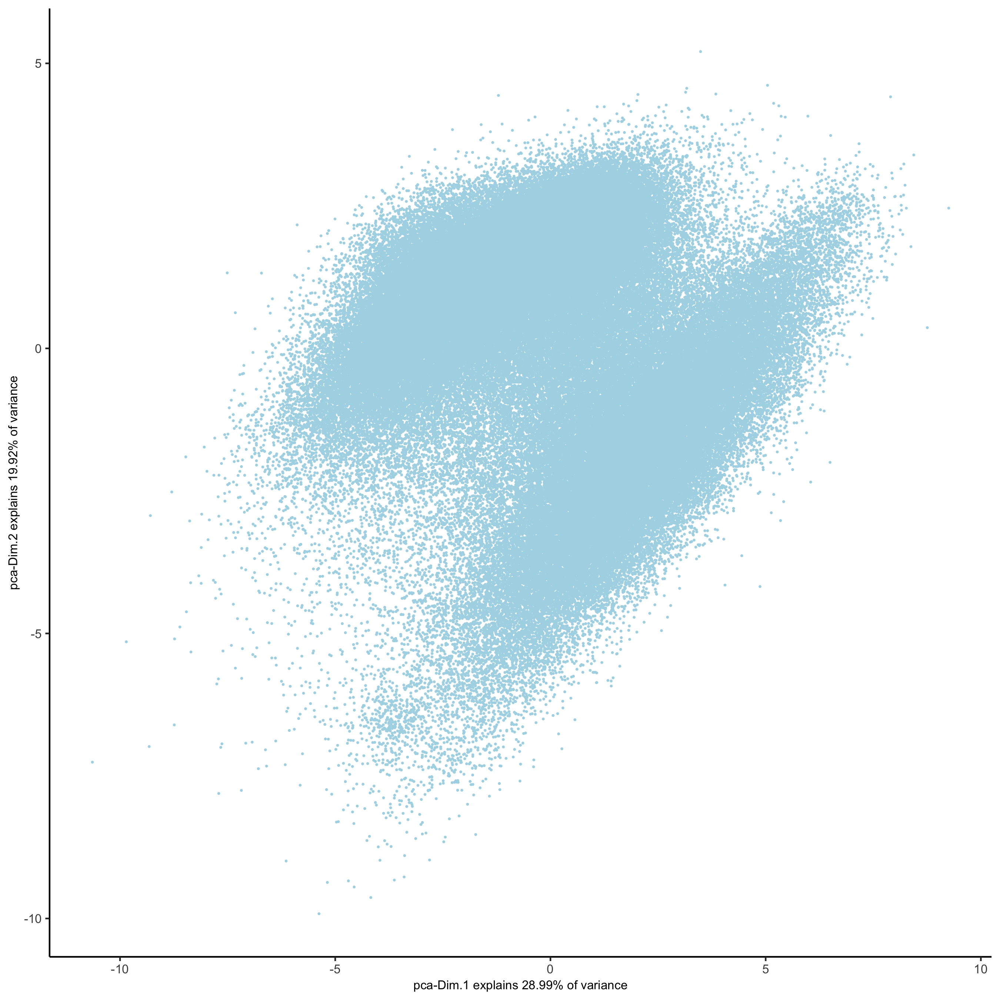{ width=50% } 

```{r eval=FALSE}
# UMAP
pdac_test <- runUMAP(pdac_test, dimensions_to_use = 1:14, n_components = 2, n_threads = 12)
plotUMAP(gobject = pdac_test, point_shape = 'no_border', point_size = 0.2,
         save_param = list(save_name = '3_c_UMAP'))
```

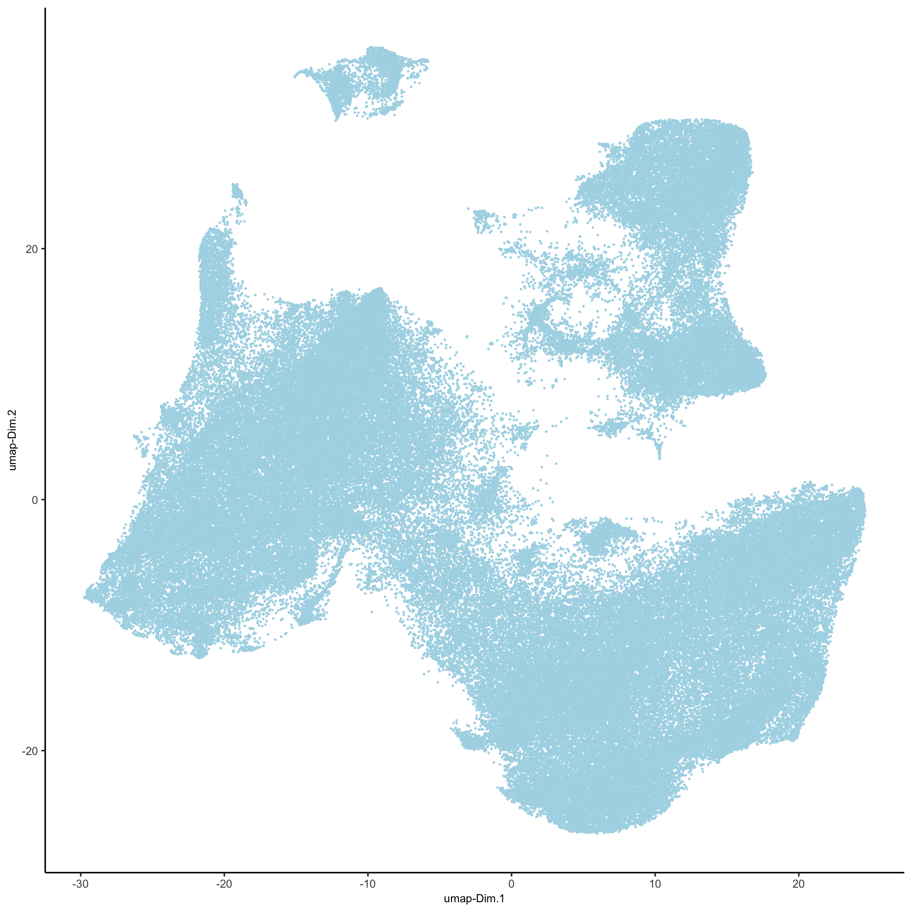{ width=50% } 

## part 4: cluster

```{r eval=FALSE}
## sNN network (default)
pdac_test <- createNearestNetwork(gobject = pdac_test, dimensions_to_use = 1:14, k = 20)

## 0.2 resolution
pdac_test <- doLeidenCluster(gobject = pdac_test, resolution = 0.2, n_iterations = 100, name = 'leiden')

# create customized color palette for leiden clustering results
pdac_metadata = pDataDT(pdac_test)
leiden_colors = Giotto:::getDistinctColors(length(unique(pdac_metadata$leiden)))
names(leiden_colors) = unique(pdac_metadata$leiden)
color_3 = leiden_colors['3'];color_10 = leiden_colors['10']
leiden_colors['3'] = color_10; leiden_colors['10'] = color_3

plotUMAP(gobject = pdac_test, cell_color = 'leiden', point_shape = 'no_border', 
         point_size = 0.2, cell_color_code = leiden_colors,
         save_param = list(save_name = '4_a_UMAP'))
```


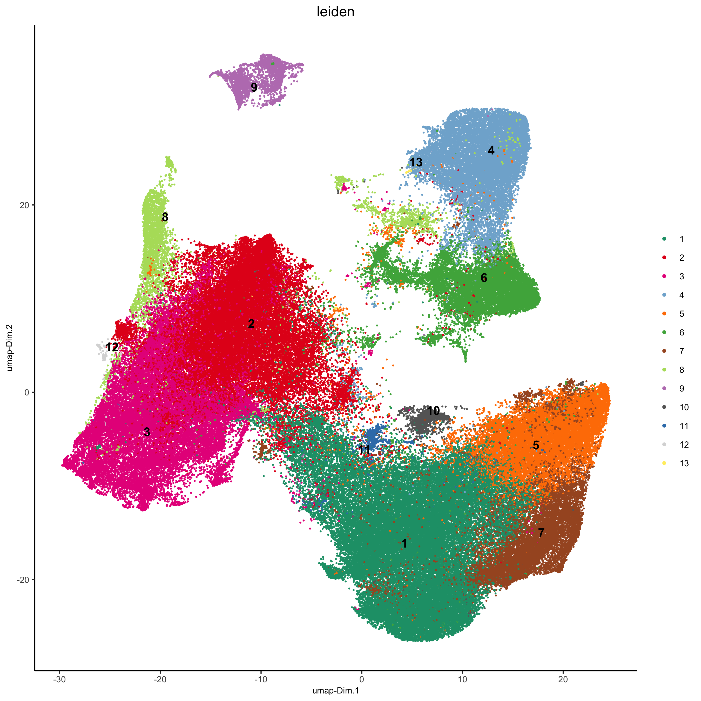{ width=50% } 

```{r eval=FALSE}
plotUMAP(gobject = pdac_test, cell_color = 'hist_info',point_shape = 'no_border',   point_size = 0.2,
         save_param = list(save_name = '4_b_UMAP'))
```


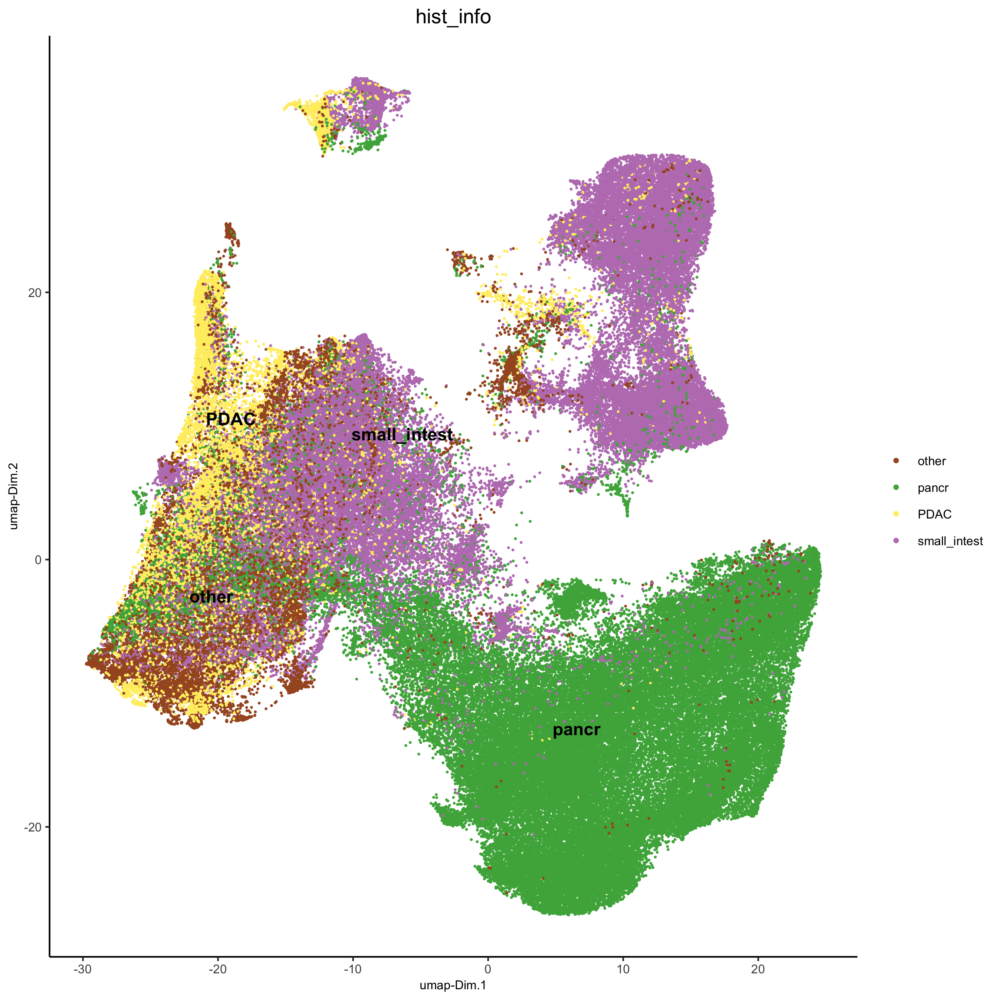{ width=50% } 

```{r eval=FALSE}
spatPlot(gobject = pdac_test, cell_color = 'leiden', point_shape = 'no_border', point_size = 0.2, 
         cell_color_code = leiden_colors, coord_fix_ratio = 1,
         save_param = list(save_name = '4_c_spatplot'))
```


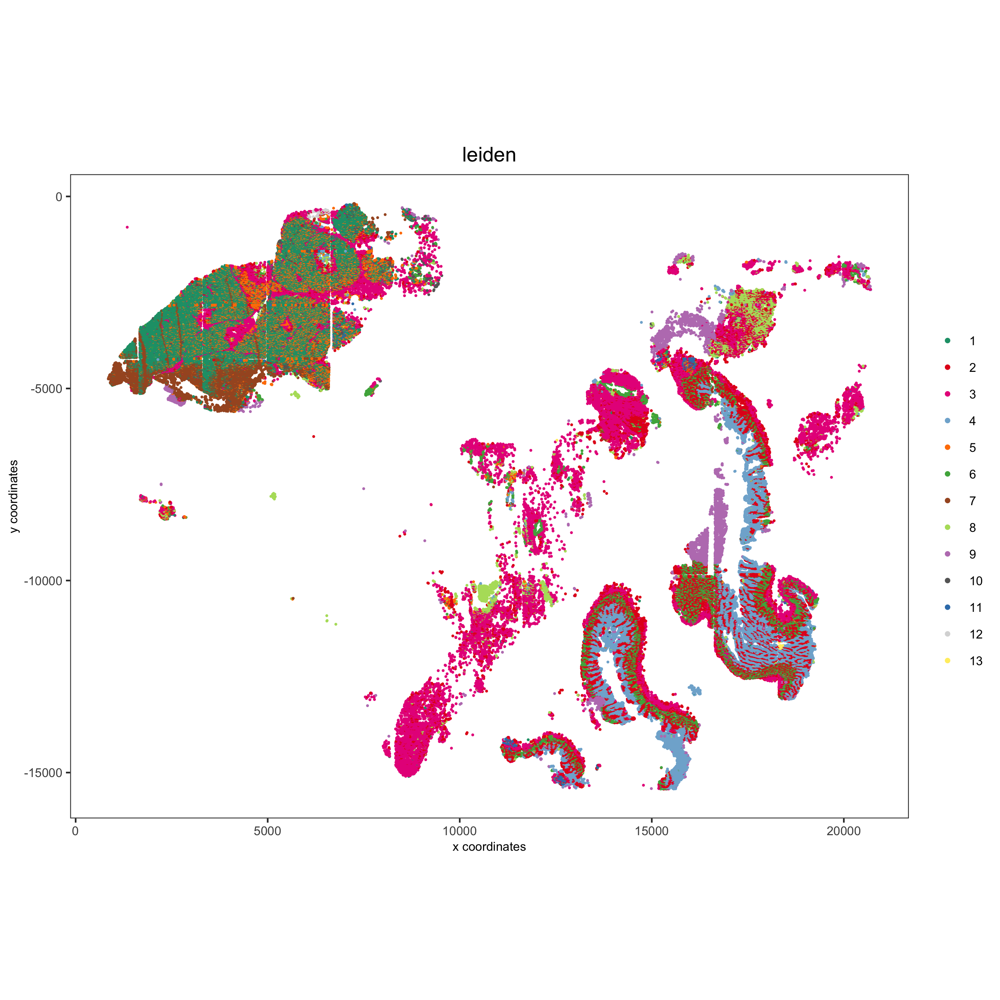{ width=50% } 

Add background image:  
```{r eval=FALSE}
showGiottoImageNames(pdac_test)
spatPlot(gobject = pdac_test, show_image = T, image_name = 'image_hist',
         cell_color = 'leiden',
         point_shape = 'no_border', point_size = 0.2, point_alpha = 0.7, 
         cell_color_code = leiden_colors, coord_fix_ratio = 1,
         save_param = list(save_name = '4_d_spatPlot'))
```


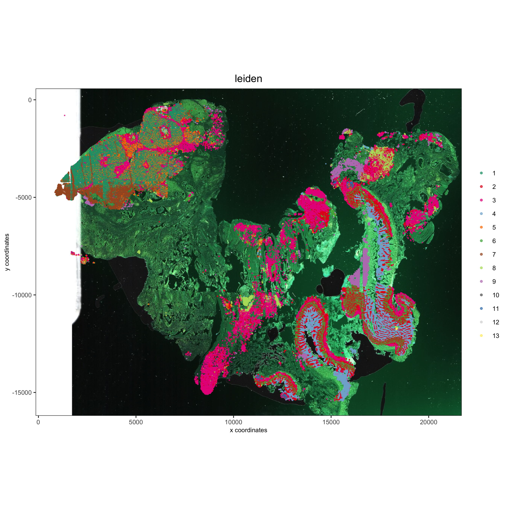{ width=50% } 


## part 5: visualize spatial and expression space

```{r eval=FALSE}
spatDimPlot2D(gobject = pdac_test, cell_color = 'leiden',
              spat_point_shape = 'no_border', spat_point_size = 0.2,
              dim_point_shape = 'no_border', dim_point_size = 0.2,
              cell_color_code = leiden_colors,
              save_param = list(save_name = '5_a_spatdimplot'))
```

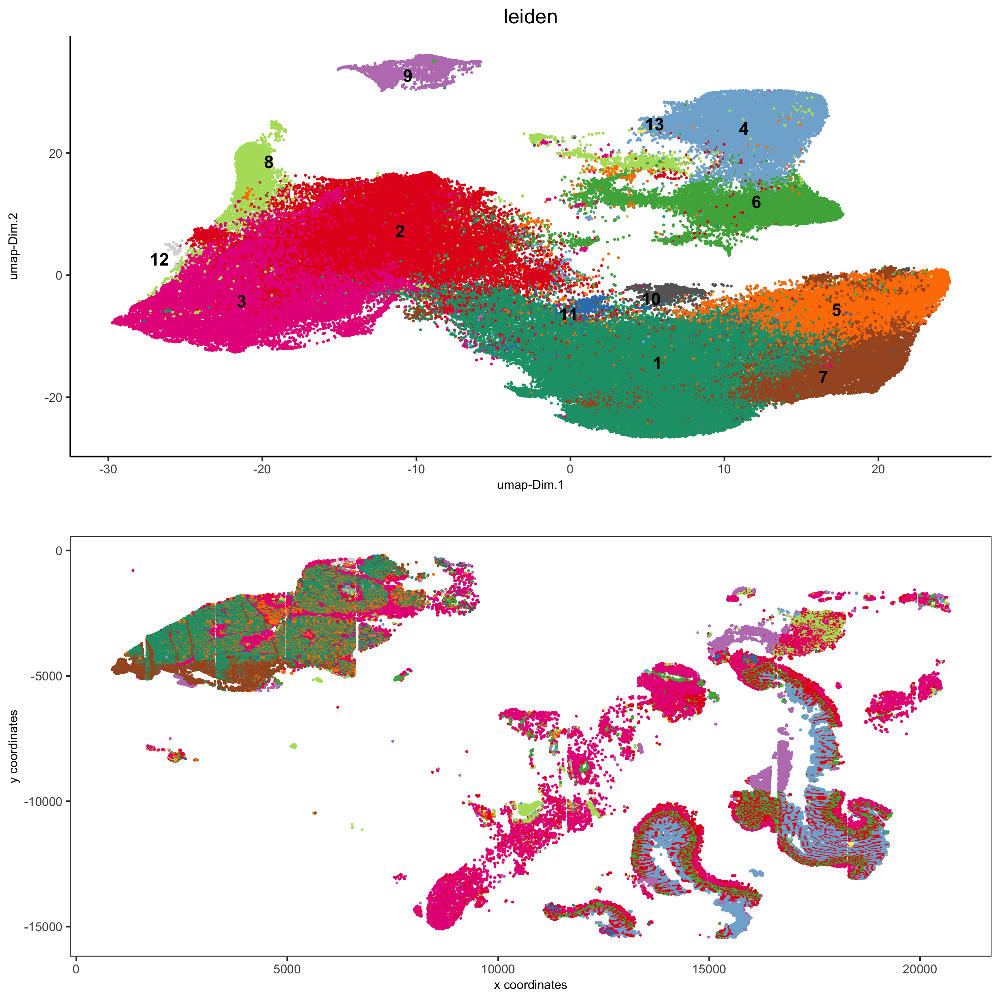{ width=50% } 

```{r eval=FALSE}
spatDimPlot2D(gobject = pdac_test, cell_color = 'leiden',
              spat_point_shape = 'border',
              spat_point_size = 0.2, spat_point_border_stroke = 0.01,
              dim_point_shape = 'border', dim_point_size = 0.2,
              dim_point_border_stroke = 0.01, cell_color_code = leiden_colors,
              save_param = list(save_name = '5_b_spatdimplot'))
```

{ width=50% } 

```{r eval=FALSE}
spatDimPlot2D(gobject = pdac_test, cell_color = 'hist_info2',
              spat_point_shape = 'border', spat_point_size = 0.2,
              spat_point_border_stroke = 0.01, dim_point_shape = 'border',
              dim_point_size = 0.2, dim_point_border_stroke = 0.01,
              save_param = list(save_name = '5_c_spatdimplot'))
```

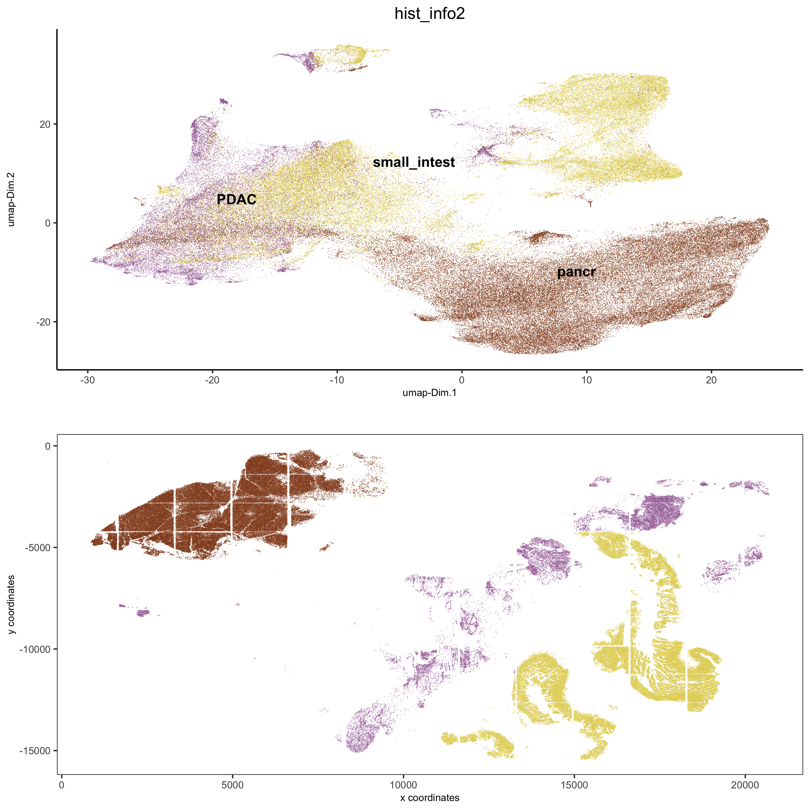{ width=50% } 


## part 6: cell type marker gene detection

```{r eval=FALSE}
# resolution 0.2
cluster_column = 'leiden'

# gini
markers_gini = findMarkers_one_vs_all(gobject = pdac_test,
                                      method = "gini",
                                      expression_values = "scaled",
                                      cluster_column = cluster_column,
                                      min_genes = 5)
markergenes_gini = unique(markers_gini[, head(.SD, 5), by = "cluster"][["genes"]])

plotMetaDataHeatmap(pdac_test, expression_values = "norm",
                    metadata_cols = c(cluster_column),
                    selected_genes = markergenes_gini, 
                    custom_cluster_order = c(1, 10, 3, 12, 8, 2, 9, 6, 11, 13, 4, 5, 7),
                    y_text_size = 8, show_values = 'zscores_rescaled',
                    save_param = list(save_name = '6_a_metaheatmap'))
```

{ width=50% } 

```{r eval=FALSE}
topgenes_gini = markers_gini[, head(.SD, 1), by = 'cluster']$genes
violinPlot(pdac_test, genes = unique(topgenes_gini), cluster_column = cluster_column,
           strip_text = 8, strip_position = 'right',
           save_param = c(save_name = '6_b_violinplot_gini', base_width = 5, base_height = 10))
```

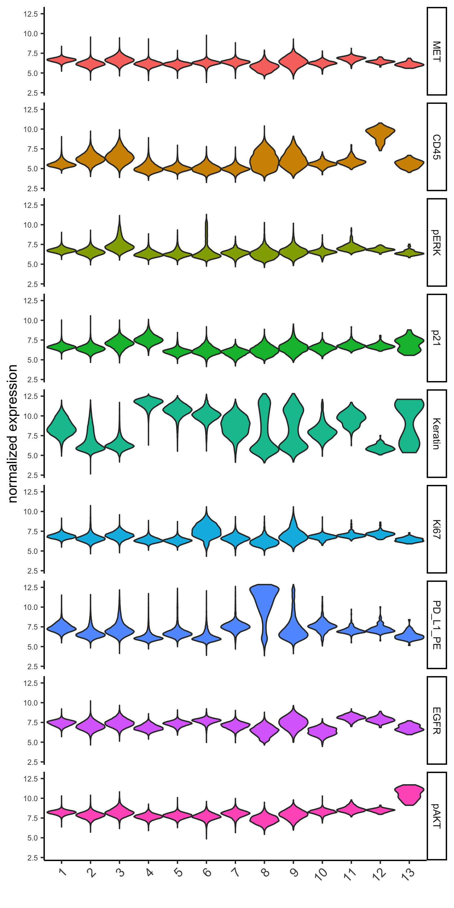{ width=50% } 


## part 7: cell type annotation

#### Metadata heatmap

Inspect the potential cell type markers
```{r eval=FALSE}
## all genes heatmap
plotMetaDataHeatmap(pdac_test, expression_values = "norm", metadata_cols = 'leiden', 
                    custom_cluster_order = c(1, 10, 3, 12, 8, 2, 9, 6, 11, 13, 4, 5, 7),
                    y_text_size = 8, show_values = 'zscores_rescaled',
                    save_param = list(save_name = '7_a_metaheatmap'))
```

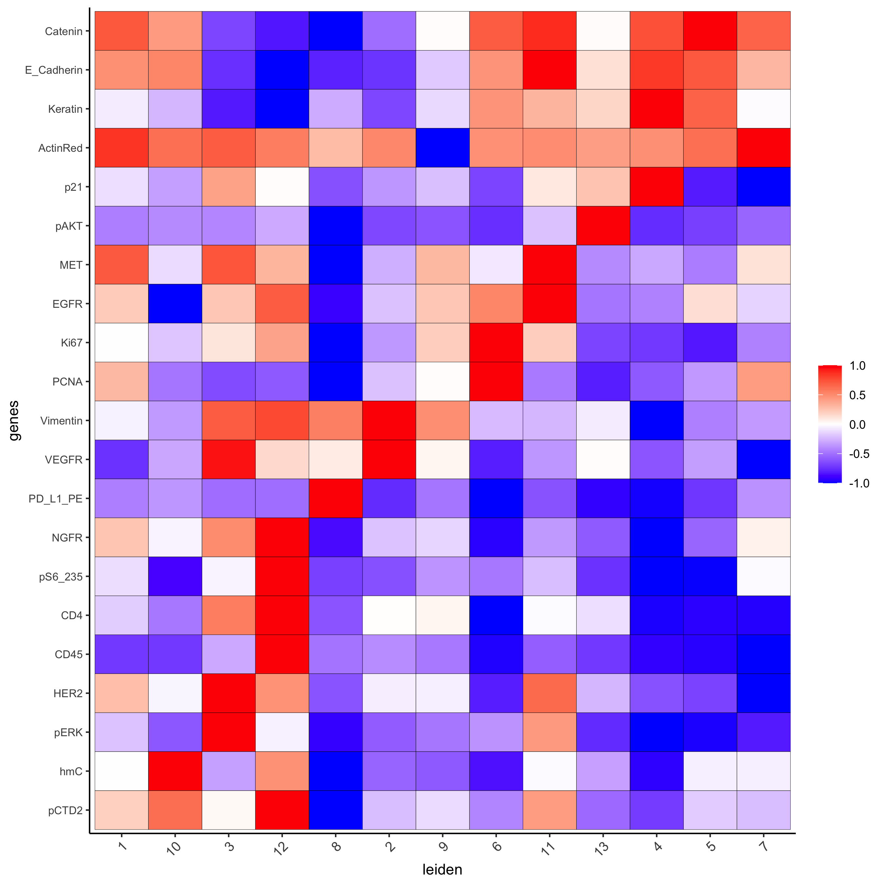{ width=50% } 

Inspect the potential cell type markers stratified by tissue location
```{r eval=FALSE}
plotMetaDataHeatmap(pdac_test, expression_values = "norm", metadata_cols = c('leiden','hist_info2'), 
                    first_meta_col = 'leiden', second_meta_col = 'hist_info2',
                    y_text_size = 8, show_values = 'zscores_rescaled',
                    save_param = list(save_name = '7_b_metaheatmap'))
```

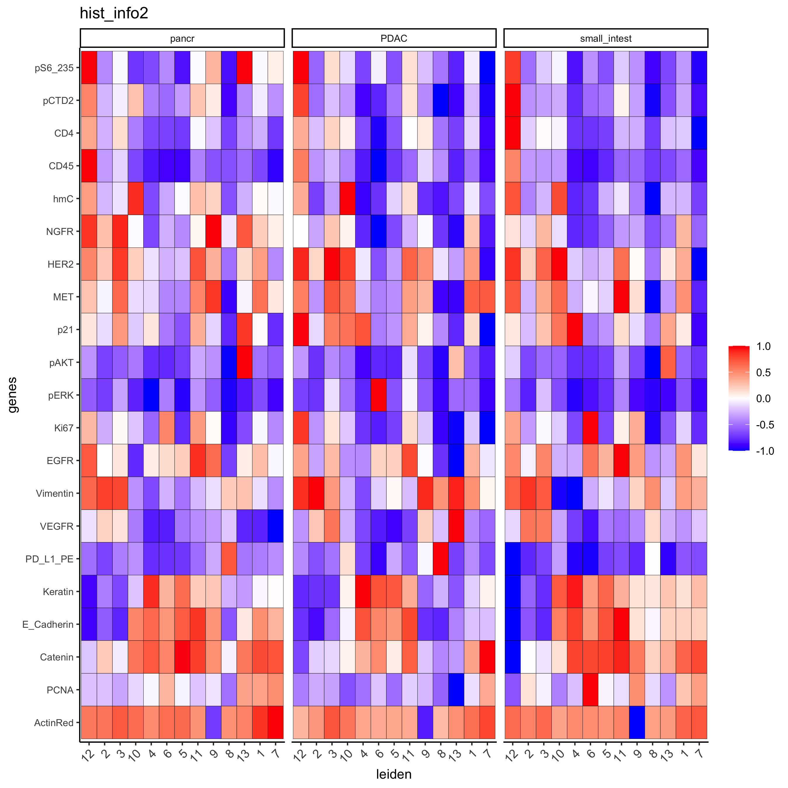{ width=50% } 


#### Spatial subsets

Inspect subsets of the data based on tissue location
```{r eval=FALSE}
spatPlot(pdac_test, cell_color = 'leiden', cell_color_code = leiden_colors,
         point_shape = 'no_border', point_size = 0.75, group_by = 'hist_info2',
         save_param = list(save_name = '7_c_spatplot'))
```

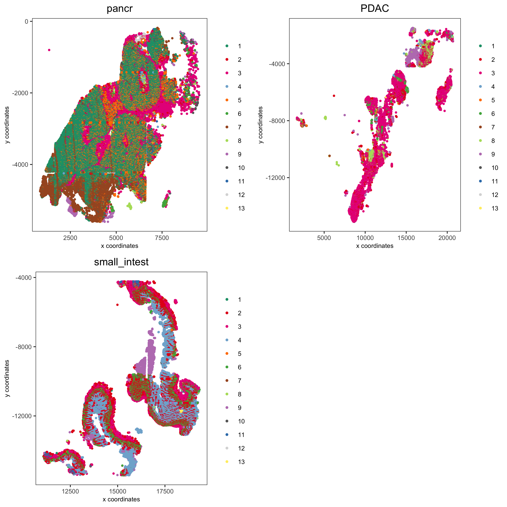{ width=50% } 

```{r eval=FALSE}
spatPlot(pdac_test, cell_color = 'leiden', cell_color_code = leiden_colors,
         point_shape = 'no_border', point_size = 0.3,
         group_by = 'hist_info2', group_by_subset = c('pancr'), cow_n_col = 1,
         save_param = list(save_name = '7_d_spatplot'))
```

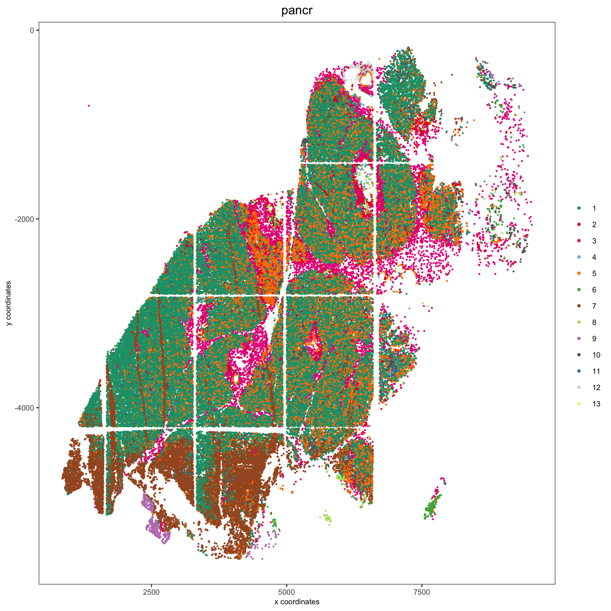{ width=50% } 

```{r eval=FALSE}
spatPlot(pdac_test, cell_color = 'leiden', cell_color_code = leiden_colors,
         point_shape = 'no_border', point_size = 0.3,
         group_by = 'hist_info2', group_by_subset = c('PDAC'), cow_n_col = 1,
         save_param = list(save_name = '7_e_spatplot'))
```

{ width=50% } 

```{r eval=FALSE}  
spatPlot(pdac_test, cell_color = 'leiden', cell_color_code = leiden_colors,
         point_shape = 'no_border', point_size = 0.3,
         group_by = 'hist_info2', group_by_subset = c('small_intest'), cow_n_col = 1,
         save_param = list(save_name = '7_f_spatplot'))
```

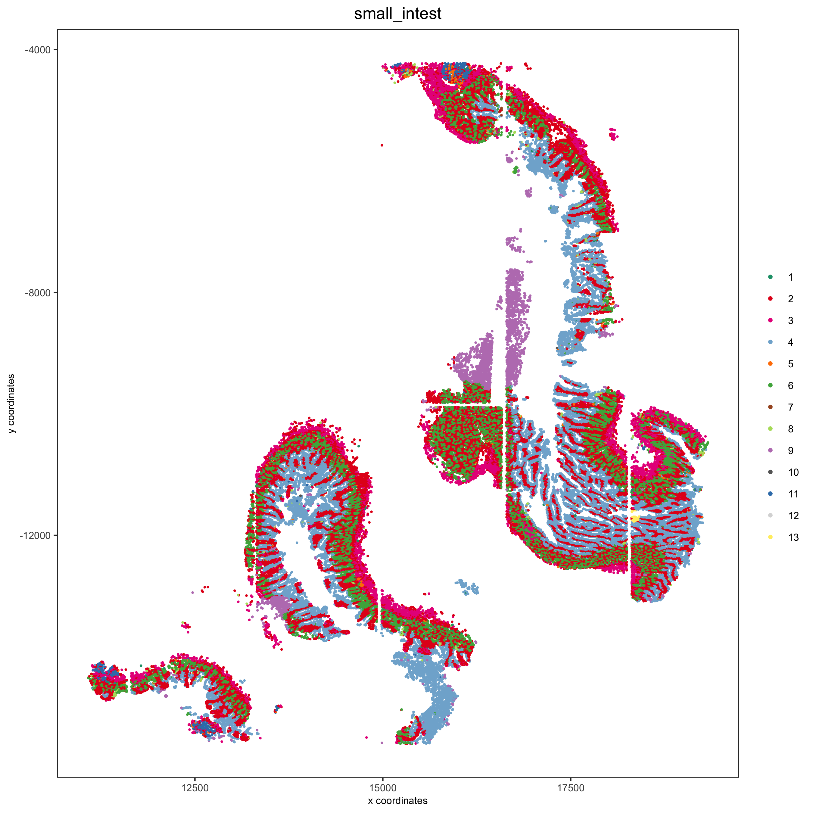{ width=50% } 

#### Spatial distribution of clusters

Visually inspect the spatial distribution of different clusters
```{r eval=FALSE}
# spatial enrichment of groups
for(group in unique(pDataDT(pdac_test)$leiden)) {
  spatPlot(pdac_test, cell_color = 'leiden', point_shape = 'no_border',
           point_size = 0.3, other_point_size = 0.1,
           select_cell_groups = group, cell_color_code = 'red',
           save_param = list(save_name = paste0('7_g_spatplot_', group)))
}
```

Here we show a subset of the resulting plots:  

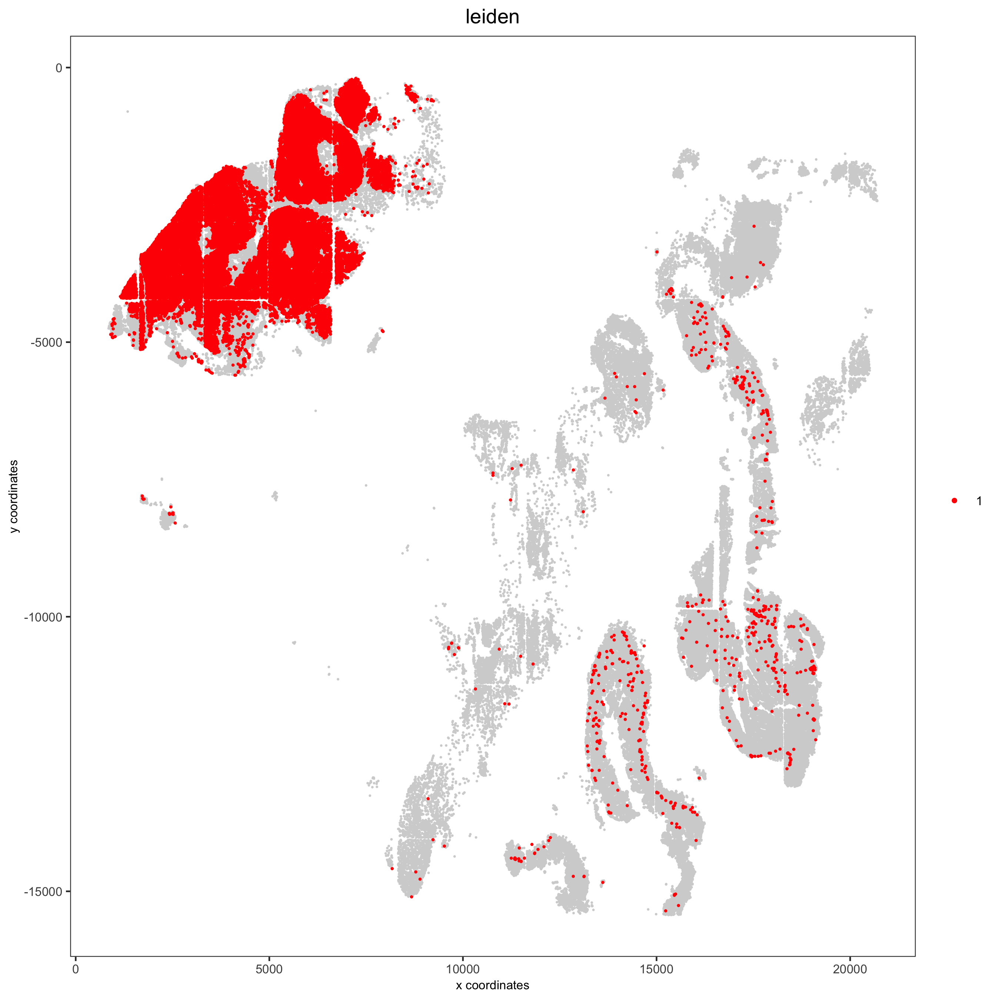{ width=50% } 

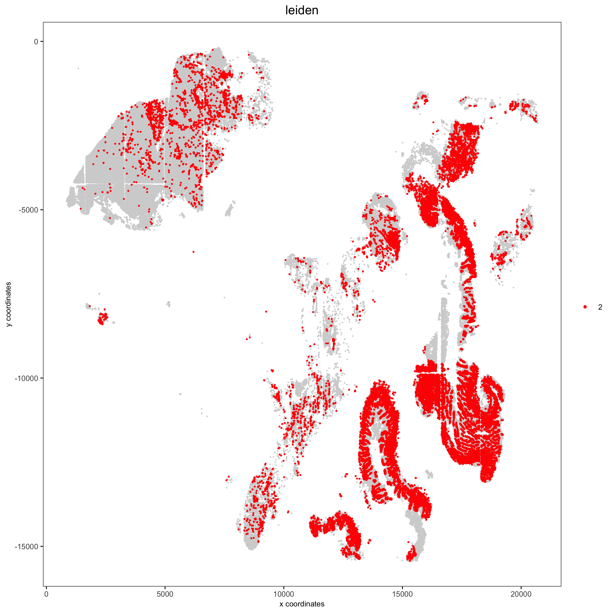{ width=50% } 


#### Annotate clusters based on spatial position and dominant expression patterns

```{r eval=FALSE}
cell_metadata =  pDataDT(pdac_test)
cluster_data = cell_metadata[, .N, by = c('leiden', 'hist_info2')]
cluster_data[, fraction:= round(N/sum(N), 2), by = c('leiden')]
data.table::setorder(cluster_data, leiden, hist_info2, fraction)

# final annotation
names = 1:13
location = c('pancr', 'intest', 'general', 'intest', 'pancr',
             'intest', 'pancr', 'canc', 'general', 'pancr',
             'general', 'pancr', 'intest')
feats = c('epithelial_I', 'fibroblast_VEGFR+', 'stroma_HER2+_pERK+', 'epithelial_lining_p21+', 'epithelial_keratin',
          'epithelial_prolif', 'epithelial_actin++', 'immune_PD-L1+', 'stromal_actin-', 'epithelial_tx_active',
          'epithelial_MET+_EGFR+', 'immune_CD45+', 'epithelial_pAKT')

annot_dt = data.table::data.table('names' = names, 'location' = location, 'feats' = feats)
annot_dt[, annotname := paste0(location,'_',feats)]
cell_annot = annot_dt$annotname;names(cell_annot) = annot_dt$names
pdac_test = annotateGiotto(pdac_test, annotation_vector = cell_annot, cluster_column = 'leiden')


# specify colors
leiden_colors
leiden_names = annot_dt$annotname; names(leiden_names) = annot_dt$names

cell_annot_colors = leiden_colors
names(cell_annot_colors) = leiden_names[names(leiden_colors)]

# covisual
spatDimPlot(gobject = pdac_test, cell_color = 'cell_types', cell_color_code = cell_annot_colors,
            spat_point_shape = 'border', spat_point_size = 0.2, spat_point_border_stroke = 0.01,
            dim_point_shape = 'border', dim_point_size = 0.2, dim_point_border_stroke = 0.01,
            dim_show_center_label = F, spat_show_legend = T, dim_show_legend = T, legend_symbol_size = 3,
            save_param = list(save_name = '7_h_spatdimplot'))
```

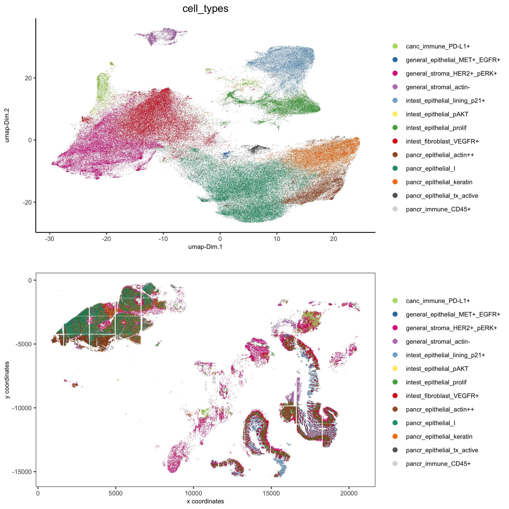{ width=50% } 

```{r eval=FALSE}
# spatial only
spatPlot(gobject = pdac_test, cell_color = 'cell_types', point_shape = 'no_border', point_size = 0.2, 
         coord_fix_ratio = 1, show_legend = T, cell_color_code = cell_annot_colors, background_color = 'black',
         save_param = list(save_name = '7_i_spatplot'))
```

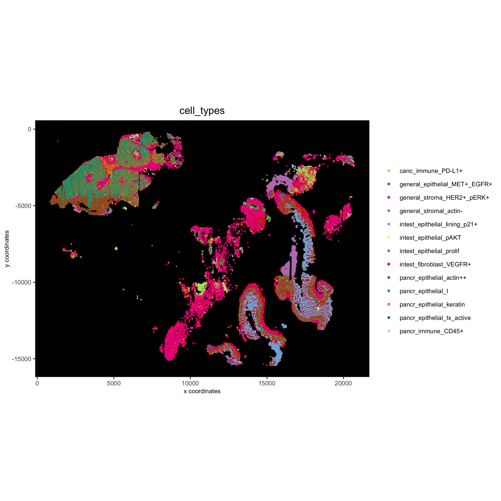{ width=50% } 

```{r eval=FALSE}
# dimension only
plotUMAP(gobject = pdac_test, cell_color = 'cell_types', point_shape = 'no_border', point_size = 0.2, 
         show_legend = T, cell_color_code = cell_annot_colors, show_center_label = F, background_color = 'black',
         save_param = list(save_name = '7_j_umap'))
```

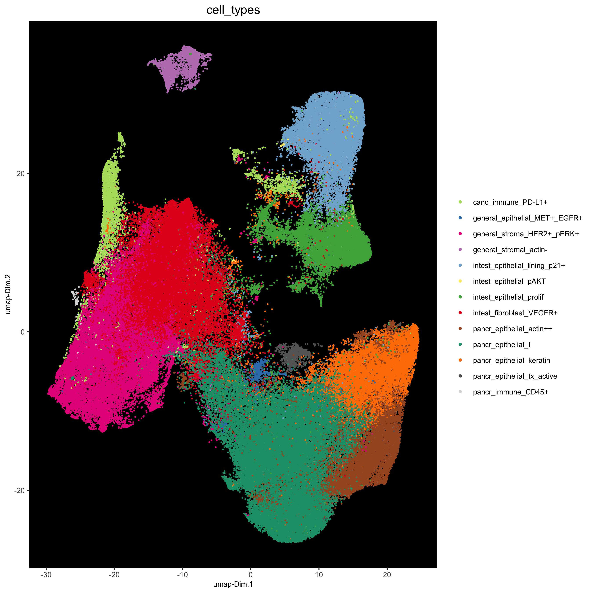{ width=50% } 

## 8. spatial grid 
```{r eval=FALSE}
pdac_test <- createSpatialGrid(gobject = pdac_test,
                               sdimx_stepsize = 150,
                               sdimy_stepsize = 150,
                               minimum_padding = 0)
spatPlot(pdac_test, 
         cell_color = 'leiden', 
         show_grid = T, point_size = 0.75, point_shape = 'no_border',
         grid_color = 'red', spatial_grid_name = 'spatial_grid',
         save_param = list(save_name = '8_a_spatplot'))
```

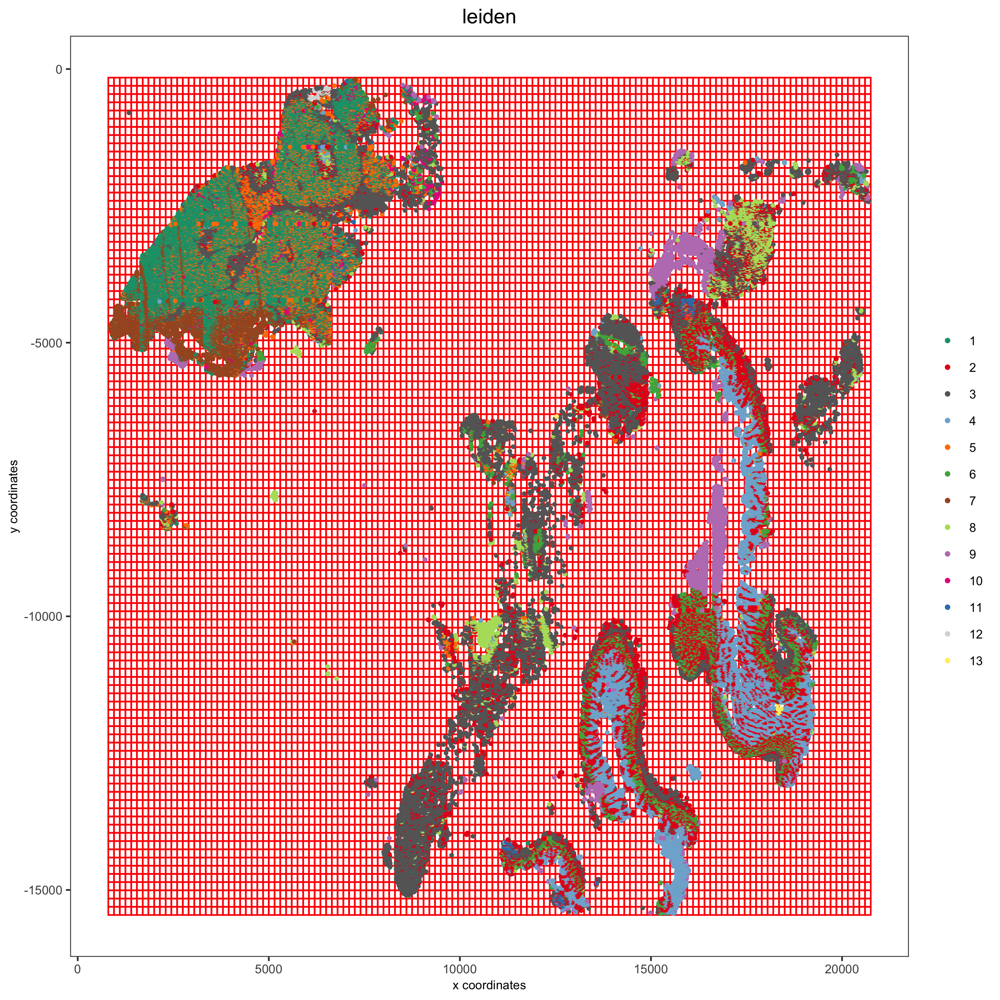{ width=50% } 

## 9. spatial network
```{r eval=FALSE}
pdac_test <- createSpatialNetwork(gobject = pdac_test, minimum_k = 2)
```


## 12. cell-cell preferential proximity 

```{r eval=FALSE}
## calculate frequently seen proximities
cell_proximities = cellProximityEnrichment(gobject = pdac_test,
                                           cluster_column = 'cell_types',
                                           spatial_network_name = 'Delaunay_network',
                                           number_of_simulations = 200)
## barplot
cellProximityBarplot(gobject = pdac_test, CPscore = cell_proximities, min_orig_ints = 5, min_sim_ints = 5,
                     save_param = list(save_name = '12_a_barplot'))
```

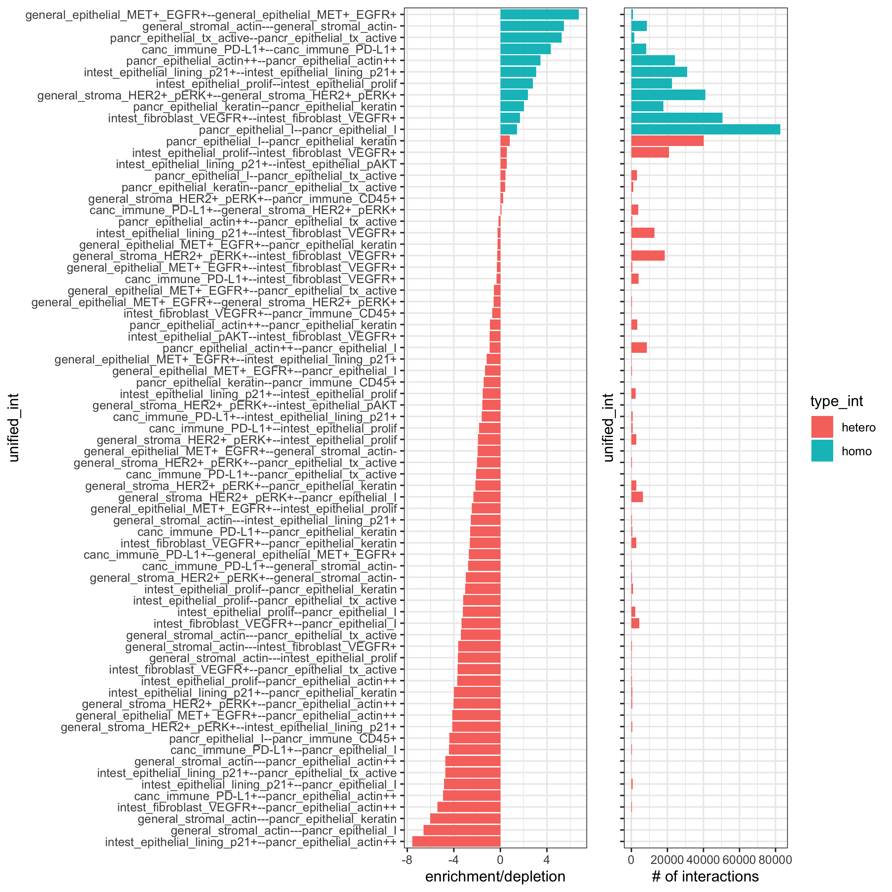{ width=50% }


```{r eval=FALSE}
## network
cellProximityNetwork(gobject = pdac_test, CPscore = cell_proximities,
                     remove_self_edges = T, only_show_enrichment_edges = F,
                     save_param = list(save_name = '12_b_network'))
```

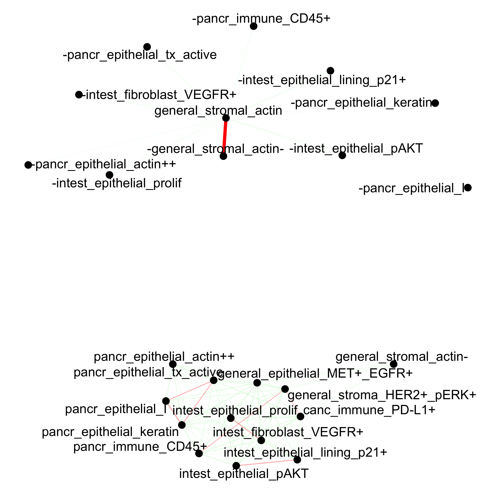{ width=50% } 

```{r eval=FALSE}
## visualization
spec_interaction = "1--5"
cellProximitySpatPlot2D(gobject = pdac_test, point_select_border_stroke = 0,
                        interaction_name = spec_interaction,
                        cluster_column = 'leiden', show_network = T,
                        cell_color = 'leiden', coord_fix_ratio = NULL,
                        point_size_select = 0.3, point_size_other = 0.1,
                        save_param = list(save_name = '12_c_proxspatplot'))

```

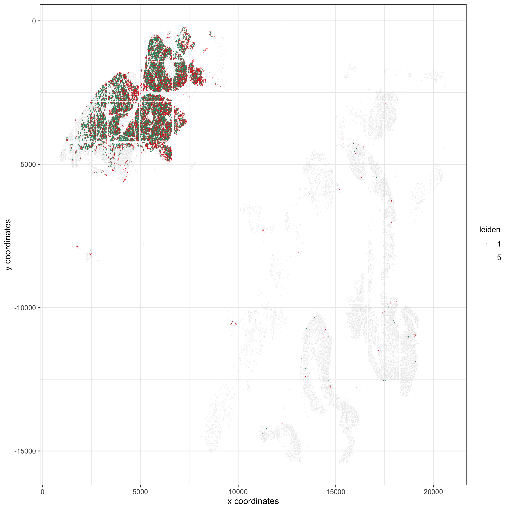{ width=50% } 


## part X: analyses for paper

Heatmap for cell type annotation:
```{r eval=FALSE}
cell_type_order_pdac = c("pancr_epithelial_actin++", "pancr_epithelial_I",
                         "intest_epithelial_lining_p21+", "pancr_epithelial_keratin", 
                         "intest_epithelial_prolif" ,"general_epithelial_MET+_EGFR+",
                         "intest_epithelial_pAKT", "pancr_epithelial_tx_active",
                         "canc_immune_PD-L1+","general_stromal_actin-",
                         "pancr_immune_CD45+", "intest_fibroblast_VEGFR+",
                         "general_stroma_HER2+_pERK+")

plotMetaDataHeatmap(pdac_test, expression_values = "scaled", metadata_cols = c('cell_types'), 
                    custom_cluster_order = cell_type_order_pdac,
                    y_text_size = 8, show_values = 'zscores_rescaled',
                    save_param = list(save_name = 'xx_a_metaheatmap'))
```

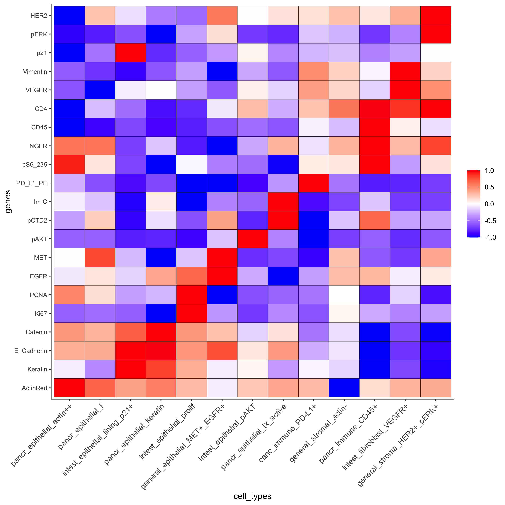{ width=50% } 

#### Pancreas
Highlight region in pancreas:
```{r eval=FALSE}

## pancreas region ##
my_pancreas_Ids = pdac_metadata[frame == 17][['cell_ID']]
my_pancreas_giotto = subsetGiotto(pdac_test, cell_ids = my_pancreas_Ids)

spatPlot(my_pancreas_giotto, cell_color = 'leiden', point_shape = 'no_border', 
         point_size = 1, cell_color_code = leiden_colors,
         save_param = list(save_name = 'xx_b_spatplot'))
```

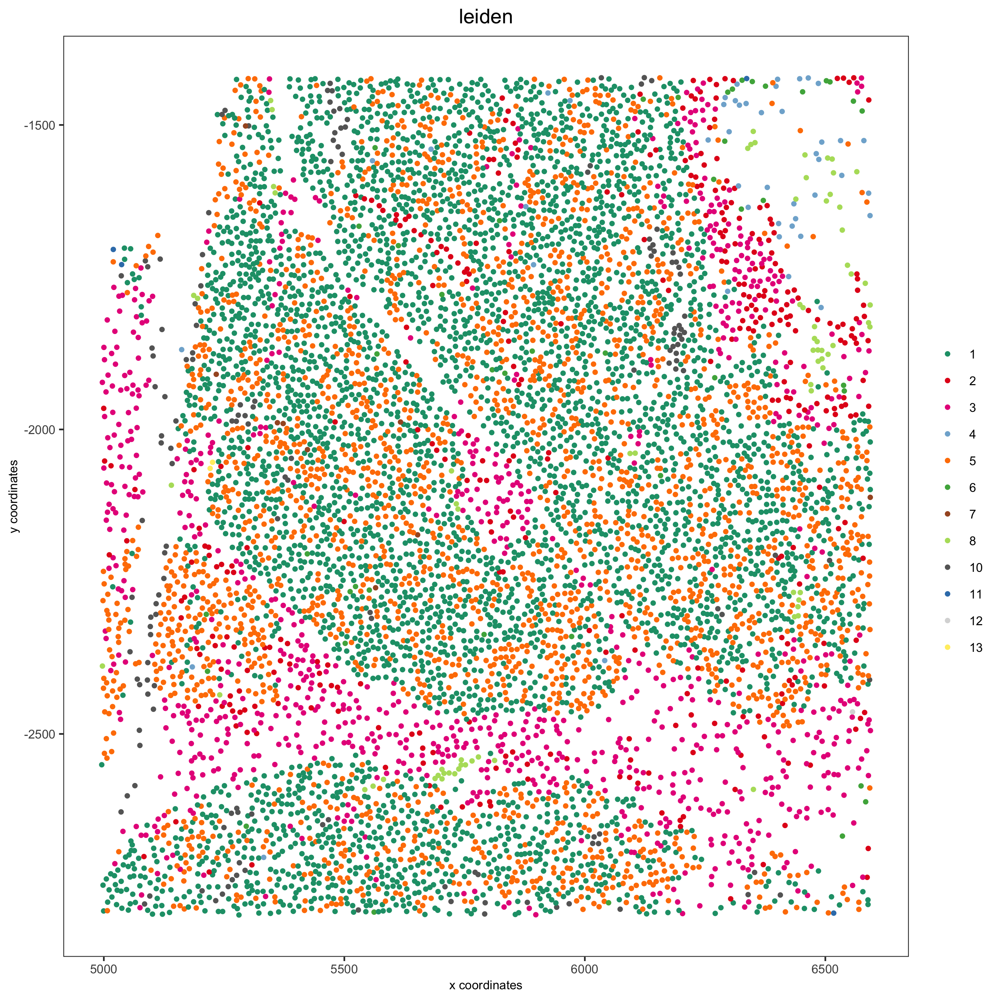{ width=50% } 

```{r eval=FALSE}
spatGenePlot(my_pancreas_giotto, expression_values = 'scaled', point_border_stroke = 0.01,
             genes = c('E_Cadherin','Catenin', 'Vimentin',  'VEGFR'), point_size = 1,
             save_param = list(save_name = 'xx_c_spatgeneplot'))
```

{ width=50% } 

```{r eval=FALSE}
plotUMAP(my_pancreas_giotto, cell_color = 'leiden', point_shape = 'no_border', point_size = 0.5, 
         cell_color_code = leiden_colors, show_center_label = F,
         save_param = list(save_name = 'xx_d_umap'))
```

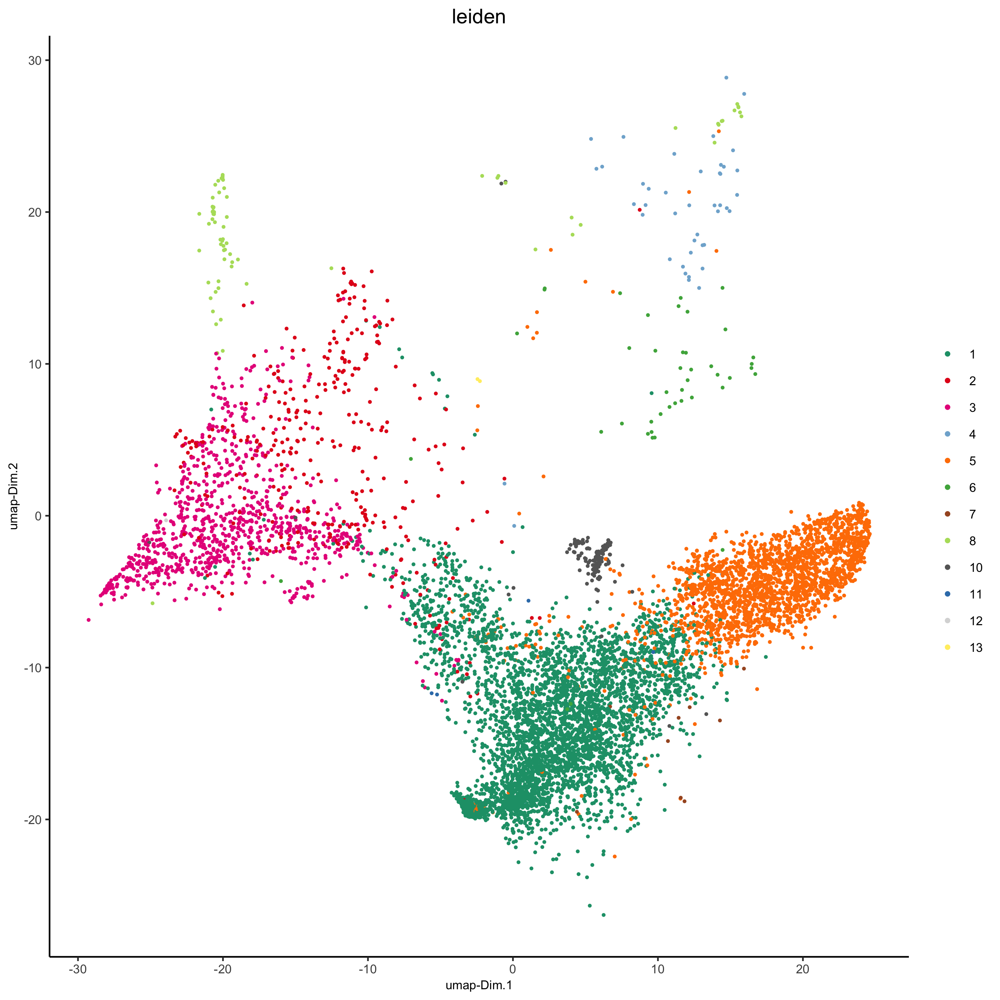{ width=50% } 

```{r eval=FALSE}
dimGenePlot(my_pancreas_giotto, expression_values = 'scaled', point_border_stroke = 0.01,
            genes = c('E_Cadherin','Catenin', 'Vimentin',  'VEGFR'), point_size = 1,
            save_param = list(save_name = 'xx_e_dimGeneplot'))

```

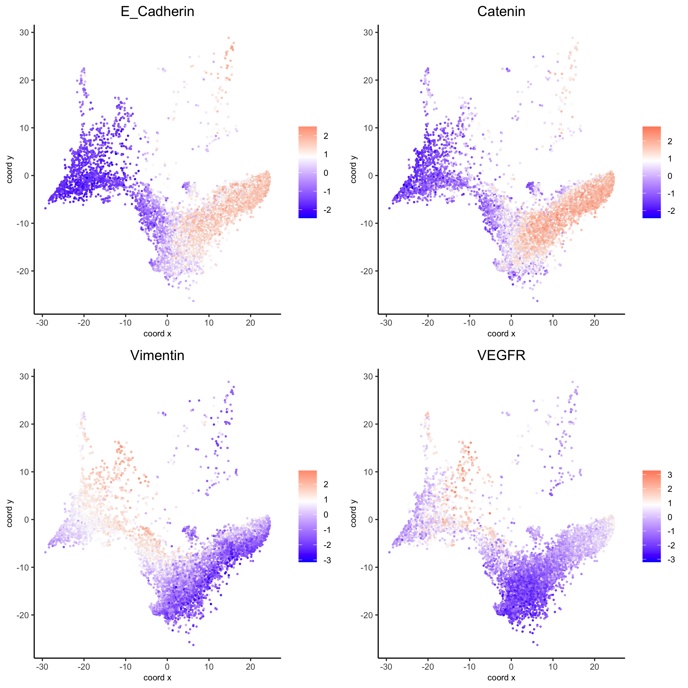{ width=50% } 

#### Small intestines
Highlight region in small intestines (same as in original paper):
```{r eval=FALSE}
## intestine region ##
my_intest_Ids = pdac_metadata[frame == 115][['cell_ID']]
my_intest_giotto = subsetGiotto(pdac_test, cell_ids = my_intest_Ids)

spatPlot(my_intest_giotto, cell_color = 'leiden', point_shape = 'no_border',
         point_size = 1, cell_color_code = leiden_colors,
         save_param = list(save_name = 'xx_f_spatplot'))
```

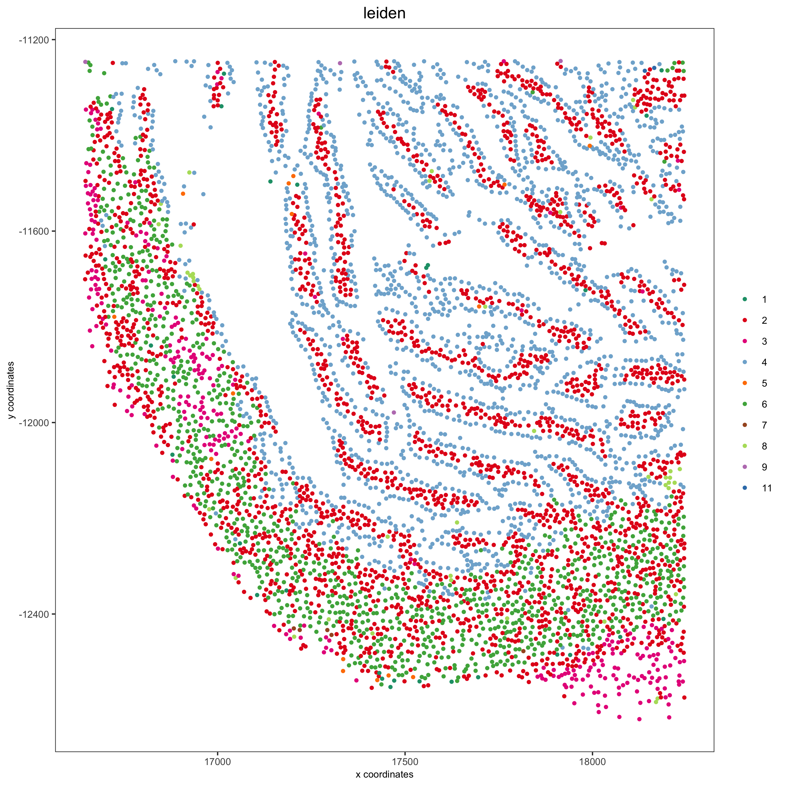{ width=50% } 

```{r eval=FALSE}
spatGenePlot(my_intest_giotto, expression_values = 'scaled', point_border_stroke = 0.01,
             genes = c('PCNA','Catenin', 'Ki67',  'pERK'), point_size = 1,
             save_param = list(save_name = 'xx_g_spatGeneplot'))
```

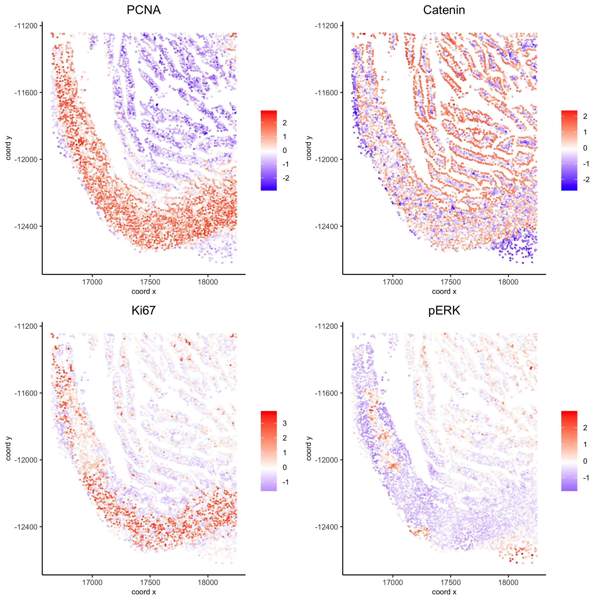{ width=50% } 

```{r eval=FALSE}
plotUMAP(my_intest_giotto, cell_color = 'leiden', point_shape = 'no_border', point_size = 0.5, 
         cell_color_code = leiden_colors, show_center_label = F,
         save_param = list(save_name = 'xx_h_umap'))
```

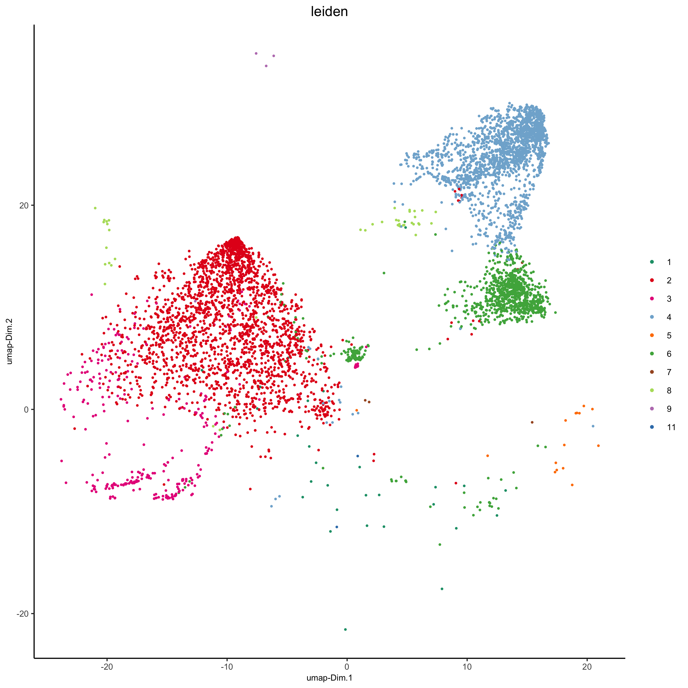{ width=50% } 

```{r eval=FALSE}
dimGenePlot(my_intest_giotto, expression_values = 'scaled', point_border_stroke = 0.01,
            genes = c('PCNA','Catenin', 'Ki67',  'pERK'), point_size = 1,
            save_param = list(save_name = 'xx_i_dimGeneplot'))

```

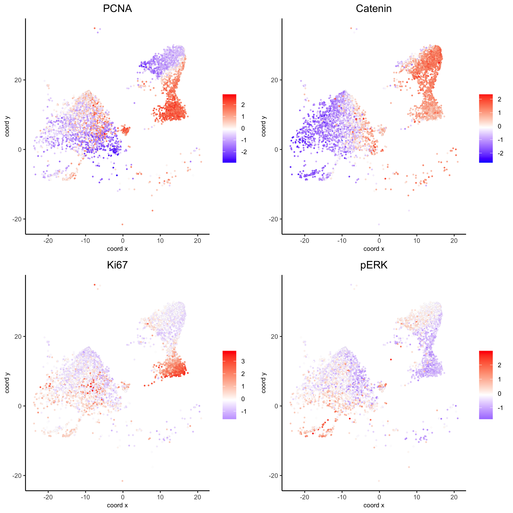{ width=50% } 


