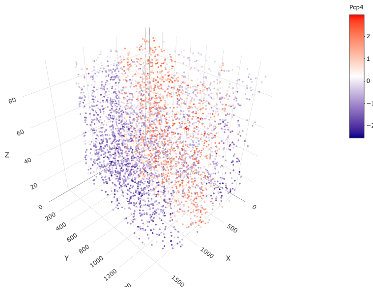
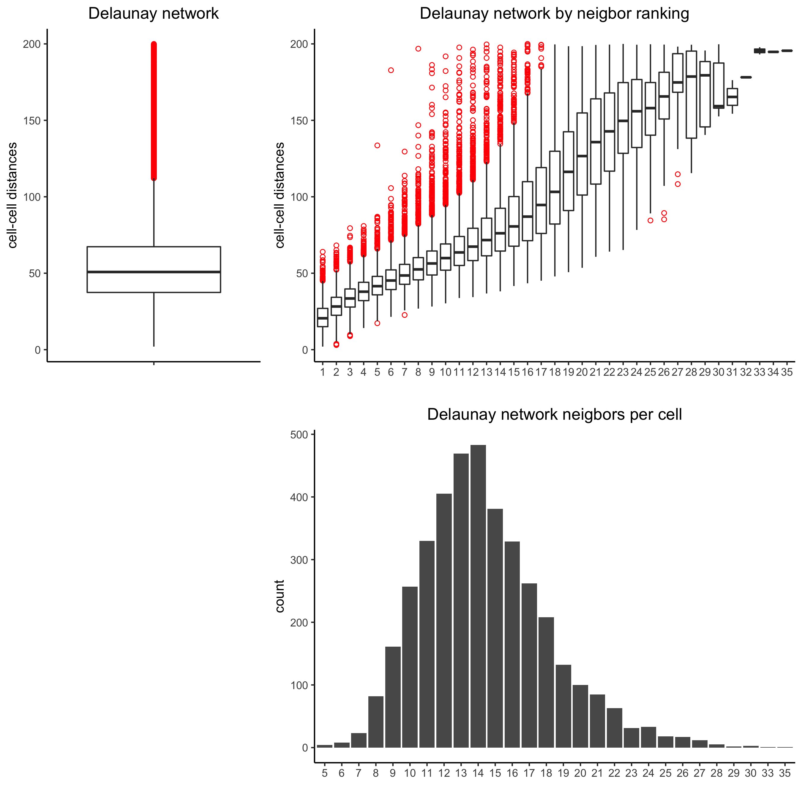

```{r, include = FALSE}
knitr::opts_chunk$set(
  collapse = TRUE,
  comment = "#>"
)
options(rmarkdown.html_vignette.check_title = FALSE)
```

<<<<<<< HEAD

```{r eval=TRUE, echo=FALSE}
giotto_version = utils::packageVersion(pkg = 'Giotto')

if(giotto_version == '0.3.6.9038') {
  NULL
} else if(giotto_version > '0.3.6.9038'){
  warning('This tutorial was written with Giotto version 0.3.6.9038, your version is ', giotto_version, '.', 
  ' This is a more recent version and results should be reproducible')
} else {
  warning('This tutorial was written with Giotto version 0.3.6.9038, your version is ', giotto_version, '.', 
  ' This is an older version and results could be slightly different')
}
```

```{r setup, eval=FALSE}
library(Giotto)

# (optional)
temp_dir = '/path/to/directory/'
=======
```{r setup, eval=FALSE}
library(Giotto)
```

### Install Python modules

To run this vignette you need to install all the necessary Python modules.  

1. This can be done manually, see https://rubd.github.io/Giotto_site/articles/installation_issues.html#python-manual-installation  

2. This can be done within R using our installation tools (installGiottoEnvironment), see  https://rubd.github.io/Giotto_site/articles/tut0_giotto_environment.html for more information.  


### (optional) set giotto instructions
```{r eval=FALSE}
# to automatically save figures in save_dir set save_plot to TRUE
temp_dir = '~/Temp/'
>>>>>>> upstream/master
myinstructions = createGiottoInstructions(save_dir = temp_dir,
                                          save_plot = TRUE, 
                                          show_plot = FALSE)

# set python_path if you want to or install giotto environment
python_path = NULL 
if(is.null(python_path)) {
  installGiottoEnvironment()
}
```


## 1. Create a Giotto object  
minimum requirements:  
- matrix with expression information (or path to)  
- x,y(,z) coordinates for cells or spots (or path to)

```{r eval=FALSE}
# giotto object 
expr_path = system.file("extdata", "starmap_expr.txt", package = 'Giotto')
loc_path = system.file("extdata", "starmap_cell_loc.txt", package = 'Giotto')
starmap_mini <- createGiottoObject(raw_exprs = expr_path,
                                   spatial_locs = loc_path,
                                   instructions = myinstructions)
```


How to work with Giotto instructions that are part of your Giotto object:  
- show the instructions associated with your Giotto object with **showGiottoInstructions**  
- change one or more instructions with **changeGiottoInstructions**  
- replace all instructions at once with **replaceGiottoInstructions**  
- read or get a specific giotto instruction with **readGiottoInstructions**  
Of note, the python path can only be set once in an R session. See the reticulate package for more information.  
```{r eval=FALSE}
# show instructions associated with giotto object (starmap_mini)
showGiottoInstructions(starmap_mini)
```


## 2. processing steps
- filter genes and cells based on detection frequencies  
- normalize expression matrix (log transformation, scaling factor and/or z-scores) 
- add cell and gene statistics (optional)  
- adjust expression matrix for technical covariates or batches (optional). These results will be stored in the *custom* slot. 

```{r eval=FALSE}
<<<<<<< HEAD
filterDistributions(starmap_mini, detection = 'genes',
                    save_param = list(save_name = '2_a_filtergenes'))
```

{ width=50% } 

```{r eval=FALSE}
filterDistributions(starmap_mini, detection = 'cells',
                    save_param = list(save_name = '2_b_filtercells'))
```

{ width=50% } 

```{r eval=FALSE}
=======
filterDistributions(starmap_mini, detection = 'genes')
filterDistributions(starmap_mini, detection = 'cells')
>>>>>>> upstream/master
filterCombinations(starmap_mini,
                   expression_thresholds = c(1),
                   gene_det_in_min_cells = c(50, 100, 200),
                   min_det_genes_per_cell = c(20, 28, 28),
                   save_param = list(save_name = '2_c_filtercombos'))
```

{ width=50% } 

```{r eval=FALSE}
starmap_mini <- filterGiotto(gobject = starmap_mini,
                           expression_threshold = 1,
                           gene_det_in_min_cells = 50,
                           min_det_genes_per_cell = 20,
                           expression_values = c('raw'),
                           verbose = T)
starmap_mini <- normalizeGiotto(gobject = starmap_mini,
                                scalefactor = 6000, verbose = T)
starmap_mini <- addStatistics(gobject = starmap_mini)
```


## 3. dimension reduction
- identify highly variable genes (HVG) will not be performed here, because there are only few genes  
- perform PCA  
- identify number of significant prinicipal components (PCs)  
- run UMAP and/or TSNE on PCs  (or directly on matrix)  
```{r eval=FALSE}
starmap_mini <- runPCA(gobject = starmap_mini, method = 'factominer')
screePlot(starmap_mini, ncp = 30, 
          save_param = list(save_name = '3_a_screeplot'))
```

{ width=50% } 

```{r eval=FALSE}
plotPCA(gobject = starmap_mini,
        save_param = list(save_name = '3_b_PCA'))
```

{ width=50% } 

```{r eval=FALSE}
# 2D umap
starmap_mini <- runUMAP(starmap_mini, dimensions_to_use = 1:8)
plotUMAP(gobject = starmap_mini,
         save_param = list(save_name = '3_c_UMAP'))
```

{ width=50% } 

```{r eval=FALSE}
# 3D umap
starmap_mini <- runUMAP(starmap_mini, dimensions_to_use = 1:8, name = '3D_umap', n_components = 3)
plotUMAP_3D(gobject = starmap_mini, dim_reduction_name = '3D_umap',
            save_param = list(save_name = '3_d_UMAP_3D'))
```

{ width=50% } 

```{r eval=FALSE}
# 2D tsne
starmap_mini <- runtSNE(starmap_mini, dimensions_to_use = 1:8)
plotTSNE(gobject = starmap_mini,
         save_param = list(save_name = '3_e_TSNE'))
```

{ width=50% } 


## 4. clustering
- create a shared (default) nearest network in PCA space (or directly on matrix)  
- cluster on nearest network with Leiden or Louvan (kmeans and hclust are alternatives) 

```{r eval=FALSE}
<<<<<<< HEAD
starmap_mini <- createNearestNetwork(gobject = starmap_mini,
                                     dimensions_to_use = 1:8, k = 25)
starmap_mini <- doLeidenCluster(gobject = starmap_mini,
                                resolution = 0.5, n_iterations = 1000)
=======
starmap_mini <- createNearestNetwork(gobject = starmap_mini, dimensions_to_use = 1:8, k = 25)
starmap_mini <- doLeidenCluster(gobject = starmap_mini, resolution = 0.5, n_iterations = 1000)
>>>>>>> upstream/master

# 2D umap
plotUMAP(gobject = starmap_mini,
         cell_color = 'leiden_clus', show_NN_network = T, point_size = 2.5,
         save_param = list(save_name = '4_a_UMAP'))
```

{ width=50% }

```{r eval=FALSE}
# 3D umap
plotUMAP_3D(gobject = starmap_mini, dim_reduction_name = '3D_umap',
            cell_color = 'leiden_clus',
            save_param = list(save_name = '4_b_UMAP_3D'))
```

{ width=50% }

```{r eval=FALSE}
# 2D umap + coordinates
spatDimPlot(gobject = starmap_mini, cell_color = 'leiden_clus',
            dim_point_size = 2, spat_point_size = 2.5,
            save_param = list(save_name = '4_c_spatdimplot'))
```

{ width=50% }

```{r eval=FALSE}
# 3D umap + coordinates
spatDimPlot3D(gobject = starmap_mini,
              cell_color = 'leiden_clus', dim_reduction_name = '3D_umap',
              save_param = list(save_name = '4_d_spatdimplot3D'))
```


```{r eval=FALSE}
# heatmap and dendrogram
showClusterHeatmap(gobject = starmap_mini, cluster_column = 'leiden_clus',
                   save_param = list(save_name = '4_e_clusterheatmap'))
```

{ width=50% }

```{r eval=FALSE}
showClusterDendrogram(starmap_mini, h = 0.5, rotate = T,
                      cluster_column = 'leiden_clus',
                      save_param = list(save_name = '4_f_clusterdendrogram'))
```

{ width=50% }

## 5. differential expression
```{r eval=FALSE}
gini_markers = findMarkers_one_vs_all(gobject = starmap_mini,
                                                  method = 'gini',
                                                  expression_values = 'normalized',
                                                  cluster_column = 'leiden_clus',
                                                  min_genes = 20,
                                                  min_expr_gini_score = 0.5,
                                                  min_det_gini_score = 0.5)

# get top 2 genes per cluster and visualize with violinplot
topgenes_gini = gini_markers[, head(.SD, 2), by = 'cluster']
violinPlot(starmap_mini, genes = topgenes_gini$genes,
           cluster_column = 'leiden_clus',
           save_param = list(save_name = '5_a_violinplot'))
```

{ width=50% }

```{r eval=FALSE}
# get top 6 genes per cluster and visualize with heatmap
topgenes_gini2 = gini_markers[, head(.SD, 6), by = 'cluster']
plotMetaDataHeatmap(starmap_mini, selected_genes = topgenes_gini2$genes,
                    metadata_cols = c('leiden_clus'),
                    save_param = list(save_name = '5_b_metaheatmap'))
```

{ width=50% }

## 6. A. cell type annotation
```{r eval=FALSE}
clusters_cell_types = c('cell A', 'cell B', 'cell C', 'cell D',
                        'cell E', 'cell F', 'cell G', 'cell H')
names(clusters_cell_types) = 1:8
starmap_mini = annotateGiotto(gobject = starmap_mini, 
                              annotation_vector = clusters_cell_types, 
                              cluster_column = 'leiden_clus', 
                              name = 'cell_types')
# check new cell metadata
pDataDT(starmap_mini)

# visualize annotations
spatDimPlot(gobject = starmap_mini, cell_color = 'cell_types', 
            spat_point_size = 2, dim_point_size = 2,
            save_param = list(save_name = '6_a_spatdimplot'))
```

{ width=50% }

## 6. B. cell type gene expression
```{r eval=FALSE}
dimGenePlot3D(starmap_mini,
              dim_reduction_name = '3D_umap',
              expression_values = 'scaled',
              genes = "Pcp4",
              genes_high_color = 'red', genes_mid_color = 'white', genes_low_color = 'darkblue',
              save_param = list(save_name = '6_b_dimgeneplot'))
```

{ width=50% }

```{r eval=FALSE}
spatGenePlot3D(starmap_mini,
               expression_values = 'scaled',
               genes = "Pcp4",
               show_other_cells = F,
               genes_high_color = 'red', genes_mid_color = 'white', genes_low_color = 'darkblue',
               save_param = list(save_name = '6_c_spatgeneplot'))

```

{ width=50% }

## 7. spatial grid
Create a grid based on defined stepsizes in the x,y(,z) axes.  
```{r eval=FALSE}
starmap_mini <- createSpatialGrid(gobject = starmap_mini,
                              sdimx_stepsize = 200,
                              sdimy_stepsize = 200,
                              sdimz_stepsize = 20,
                              minimum_padding = 10)
showGrids(starmap_mini)

# visualize grid
spatPlot2D(gobject = starmap_mini, show_grid = T, point_size = 1.5,
           save_param = list(save_name = '7_a_spatplot'))
```

{ width=50% }


## 8. spatial network
Only the *method = delaunayn_geometry* can make 3D Delaunay networks. This requires the package
geometry to be installed.  

- visualize information about the default Delaunay network  
- create a spatial Delaunay network (default)  
- create a spatial kNN network   
```{r eval=FALSE}
plotStatDelaunayNetwork(gobject = starmap_mini, maximum_distance = 200, 
                        method = 'delaunayn_geometry',
                        save_param = list(save_name = '8_aa_delnetwork'))
```


{ width=50% }

```{r eval=FALSE}
starmap_mini = createSpatialNetwork(gobject = starmap_mini, minimum_k = 2, 
                                    maximum_distance_delaunay = 200, 
                                    method = 'Delaunay', 
                                    delaunay_method = 'delaunayn_geometry')
starmap_mini = createSpatialNetwork(gobject = starmap_mini, minimum_k = 2, 
                                    method = 'kNN', k = 10)
showNetworks(starmap_mini)

# visualize the two different spatial networks  
spatPlot(gobject = starmap_mini, show_network = T,
         network_color = 'blue', spatial_network_name = 'Delaunay_network',
         point_size = 2.5, cell_color = 'leiden_clus',
         save_param = list(save_name = '8_a_spatplot'))
```

{ width=50% }

```{r eval=FALSE}
spatPlot(gobject = starmap_mini, show_network = T,
         network_color = 'blue', spatial_network_name = 'kNN_network',
         point_size = 2.5, cell_color = 'leiden_clus',
         save_param = list(save_name = '8_b_spatplot'))
```

{ width=50% }


## 9. spatial genes
Identify spatial genes with 3 different methods:  
- binSpect with kmeans binarization (default)  
- binSpect with rank binarization  
- silhouetteRank  

Visualize top 4 genes per method.  
```{r eval=FALSE, fig.width=10, fig.height=10}
km_spatialgenes = binSpect(starmap_mini)
spatGenePlot(starmap_mini, expression_values = 'scaled', 
             genes = km_spatialgenes[1:4]$genes,
             point_shape = 'border', point_border_stroke = 0.1,
             show_network = F, network_color = 'lightgrey', point_size = 2.5,
             cow_n_col = 2,
             save_param = list(save_name = '9_a_spatgeneplot'))
```

{ width=50% }

```{r eval=FALSE, fig.width=10, fig.height=10}
rank_spatialgenes = binSpect(starmap_mini, bin_method = 'rank')
spatGenePlot(starmap_mini, expression_values = 'scaled', 
             genes = rank_spatialgenes[1:4]$genes,
             point_shape = 'border', point_border_stroke = 0.1,
             show_network = F, network_color = 'lightgrey', point_size = 2.5,
             cow_n_col = 2,
             save_param = list(save_name = '9_b_spatgeneplot'))

```

{ width=50% }

```{r eval=FALSE, fig.width=10, fig.height=10}
silh_spatialgenes = silhouetteRank(gobject = starmap_mini) # TODO: suppress print output
spatGenePlot(starmap_mini, expression_values = 'scaled', 
             genes = silh_spatialgenes[1:4]$genes,
             point_shape = 'border', point_border_stroke = 0.1,
             show_network = F, network_color = 'lightgrey', point_size = 2.5,
             cow_n_col = 2,
             save_param = list(save_name = '9_c_spatgeneplot'))
```


## 10. spatial co-expression patterns
Identify robust spatial co-expression patterns using the spatial network or grid 
and a subset of individual spatial genes.  
1. calculate spatial correlation scores  
2. cluster correlation scores
```{r eval=FALSE, fig.width=10, fig.height=10}

# 1. calculate spatial correlation scores 
ext_spatial_genes = km_spatialgenes[1:20]$genes
spat_cor_netw_DT = detectSpatialCorGenes(starmap_mini,
                                         method = 'network', 
                                         spatial_network_name = 'Delaunay_network',
                                         subset_genes = ext_spatial_genes)

# 2. cluster correlation scores
spat_cor_netw_DT = clusterSpatialCorGenes(spat_cor_netw_DT, 
                                          name = 'spat_netw_clus', k = 6)
heatmSpatialCorGenes(starmap_mini, spatCorObject = spat_cor_netw_DT, 
                     use_clus_name = 'spat_netw_clus',
                     save_param = list(save_name = '10_a_heatmspatcor', units = 'in'))
```

{ width=50% }

```{r eval=FALSE, fig.width=10, fig.height=10}
netw_ranks = rankSpatialCorGroups(starmap_mini, 
                                  spatCorObject = spat_cor_netw_DT, 
                                  use_clus_name = 'spat_netw_clus',
                                  save_param = list(save_name = '10_b_rankcorgroup'))
```

{ width=50% }

```{r eval=FALSE, fig.width=10, fig.height=10}
top_netw_spat_cluster = showSpatialCorGenes(spat_cor_netw_DT, 
                                            use_clus_name = 'spat_netw_clus',
                                            selected_clusters = 6, 
                                            show_top_genes = 1)

cluster_genes_DT = showSpatialCorGenes(spat_cor_netw_DT, 
                                       use_clus_name = 'spat_netw_clus',
                                       show_top_genes = 1)
cluster_genes = cluster_genes_DT$clus; names(cluster_genes) = cluster_genes_DT$gene_ID


starmap_mini = createMetagenes(starmap_mini,
                               gene_clusters = cluster_genes,
                               name = 'cluster_metagene')
spatCellPlot(starmap_mini,
             spat_enr_names = 'cluster_metagene',
             cell_annotation_values = netw_ranks$clusters,
             point_size = 1.5, cow_n_col = 3,
             save_param = list(save_name = '10_c_spatcellplot'))
```

{ width=50% }

## 11. spatial HMRF domains
```{r eval=FALSE}
hmrf_folder = paste0(temp_dir,'/','11_HMRF/')
if(!file.exists(hmrf_folder)) dir.create(hmrf_folder, recursive = T)

# perform hmrf
my_spatial_genes = km_spatialgenes[1:20]$genes
HMRF_spatial_genes = doHMRF(gobject = starmap_mini,
                            expression_values = 'scaled',
                            spatial_genes = my_spatial_genes,
                            spatial_network_name = 'Delaunay_network',
                            k = 6,
                            betas = c(10,2,2),
                            output_folder = paste0(hmrf_folder, '/', 'Spatial_genes/SG_top20_k6_scaled'))

# check and select hmrf
for(i in seq(10, 14, by = 2)) {
  viewHMRFresults2D(gobject = starmap_mini,
                    HMRFoutput = HMRF_spatial_genes,
                    k = 6, betas_to_view = i,
                    point_size = 2)
}

starmap_mini = addHMRF(gobject = starmap_mini,
                  HMRFoutput = HMRF_spatial_genes,
                  k = 6, betas_to_add = c(12),
                  hmrf_name = 'HMRF')

# visualize selected hmrf result
giotto_colors = Giotto:::getDistinctColors(6)
names(giotto_colors) = 1:6
spatPlot(gobject = starmap_mini, cell_color = 'HMRF_k6_b.12',
         point_size = 3, coord_fix_ratio = 1, cell_color_code = giotto_colors,
         save_param = list(save_name = '11_a_spatplot'))
```


## 12. cell neighborhood: cell-type/cell-type interactions
```{r eval=FALSE}
set.seed(seed = 2841)
cell_proximities = cellProximityEnrichment(gobject = starmap_mini,
                                           cluster_column = 'cell_types',
                                           spatial_network_name = 'Delaunay_network',
                                           adjust_method = 'fdr',
                                           number_of_simulations = 1000)
# barplot
cellProximityBarplot(gobject = starmap_mini, 
                     CPscore = cell_proximities, 
                     min_orig_ints = 2, min_sim_ints = 2, p_val = 0.5,
                     save_param = list(save_name = '12_a_barplot'))
```

{ width=50% }

```{r eval=FALSE}
## heatmap
cellProximityHeatmap(gobject = starmap_mini, CPscore = cell_proximities, 
                     order_cell_types = T, scale = T,
                     color_breaks = c(-1.5, 0, 1.5), 
                     color_names = c('blue', 'white', 'red'),
                     save_param = list(save_name = '12_b_heatmap', units = 'in'))
```

{ width=50% }

```{r eval=FALSE}
# network
cellProximityNetwork(gobject = starmap_mini, CPscore = cell_proximities, 
                     remove_self_edges = T, only_show_enrichment_edges = T,
                     save_param = list(save_name = '12_c_network'))
```

{ width=50% }

```{r eval=FALSE}
# network with self-edges
cellProximityNetwork(gobject = starmap_mini, CPscore = cell_proximities,
                     remove_self_edges = F, self_loop_strength = 0.3,
                     only_show_enrichment_edges = F,
                     rescale_edge_weights = T,
                     node_size = 8,
                     edge_weight_range_depletion = c(1, 2),
                     edge_weight_range_enrichment = c(2,5),
                     save_param = list(save_name = '12_d_network'))
```

{ width=50% }


### visualization of specific cell types
```{r eval=FALSE}
pDataDT(starmap_mini)
# Option 1
spec_interaction = "cell D--cell H" # needs to be in alphabetic order! first D, then H
cellProximitySpatPlot2D(gobject = starmap_mini,
                        interaction_name = spec_interaction,
                        show_network = T,
                        cluster_column = 'cell_types',
                        cell_color = 'cell_types',
                        cell_color_code = c('cell H' = 'lightblue', 'cell D' = 'red'),
                        point_size_select = 4, point_size_other = 2,
                        save_param = list(save_name = '12_e_cellproximity'))
```

{ width=50% }

```{r eval=FALSE}
# Option 2: create additional metadata
starmap_mini = addCellIntMetadata(starmap_mini,
                             spatial_network = 'Delaunay_network',
                             cluster_column = 'cell_types',
                             cell_interaction = spec_interaction,
                             name = 'D_H_interactions')
spatPlot(starmap_mini, cell_color = 'D_H_interactions', legend_symbol_size = 3,
         select_cell_groups =  c('other_cell D', 'other_cell H', 'select_cell D', 'select_cell H'),
         save_param = list(save_name = '12_e_spatplot'))
```

{ width=50% }

## 13. 2D cross sections from 3D object
```{r eval=FALSE}

# create cross section
starmap_mini = createCrossSection(starmap_mini,
                                method="equation",
                                equation=c(0,1,0,600),
                                extend_ratio = 0.6)

# show cross section
insertCrossSectionSpatPlot3D(starmap_mini, cell_color = 'leiden_clus',
                             axis_scale = 'cube',
                             point_size = 2,
                             save_param = list(save_name = '13_a_insertcross'))
```


```{r eval=FALSE}
insertCrossSectionGenePlot3D(starmap_mini, expression_values = 'scaled',
                             axis_scale = "cube",
                             genes = "Slc17a7",
                             save_param = list(save_name = '13_b_insertcrossgene'))
```

{ width=50% }

```{r eval=FALSE}
# for cell annotation
crossSectionPlot(starmap_mini,
                 point_size = 2, point_shape = "border",
                 cell_color = "leiden_clus",
                 save_param = list(save_name = '13_c_crossplot'))
```

{ width=50% }

```{r eval=FALSE}
crossSectionPlot3D(starmap_mini,
                   point_size = 2, cell_color = "leiden_clus",
                   axis_scale = "cube",
                   save_param = list(save_name = '13_c_crossplot3D'))
```

{ width=50% }

```{r eval=FALSE}
# for gene expression
crossSectionGenePlot(starmap_mini,
                     genes = "Slc17a7",
                     point_size = 2,
                     point_shape = "border",
                     cow_n_col = 1.5,
                     expression_values = 'scaled',
                     save_param = list(save_name = '13_d_crossgeneplot'))
```

{ width=50% }

```{r eval=FALSE}
crossSectionGenePlot3D(starmap_mini,
                       point_size = 2,
                       genes = c("Slc17a7"),
                       expression_values = 'scaled',
                       save_param = list(save_name = '13_e_crossgeneplot3D'))

```

{ width=50% }

## 14. export Giotto Analyzer to Viewer
```{r eval=FALSE}
viewer_folder = paste0(temp_dir, '/', 'Mouse_cortex_viewer')

# select annotations, reductions and expression values to view in Giotto Viewer
exportGiottoViewer(gobject = starmap_mini, output_directory = viewer_folder,
                   factor_annotations = c('cell_types',
                                          'leiden_clus',
                                          'HMRF_k6_b.12'),
                   numeric_annotations = 'total_expr',
                   dim_reductions = c('umap'),
                   dim_reduction_names = c('umap'),
                   expression_values = 'scaled',
                   expression_rounding = 3,
                   overwrite_dir = T)
```


