  
  ```{r, include = FALSE}
knitr::opts_chunk$set(
  collapse = TRUE,
  comment = "#>",
  fig.path = "man/figures/README-",
  out.width = "100%"
)
```

```{r eval=TRUE, echo=FALSE}
giotto_version = utils::packageVersion(pkg = 'Giotto')

if(giotto_version == '0.3.6.9048') {
  cat('You are using the same Giotto version with which this tutorial was written')
} else if(giotto_version > '0.3.6.9048'){
  warning('This tutorial was written with Giotto version 0.3.6.9048, your version is ', giotto_version, '.', 
  'This is a more recent version and results should be reproducible')
} else {
  warning('This tutorial was written with Giotto version 0.3.6.9048, your version is ', giotto_version, '.', 
  'This is an older version and results could be slightly different')
}
```


```{r eval=FALSE, message=FALSE, warning=FALSE}
library(Giotto)

# 1. set working directory
results_folder = '/path/to/directory/'

# 2. set giotto python path
# set python path to your preferred python version path
# set python path to NULL if you want to automatically install (only the 1st time) and use the giotto miniconda environment
python_path = NULL 
if(is.null(python_path)) {
  installGiottoEnvironment()
}
```

## Dataset explanation
The CODEX data to run this tutorial can be found [here](https://github.com/RubD/spatial-datasets/tree/master/data/2018_codex_spleen)
Alternatively you can use the **getSpatialDataset** to automatically download this dataset like we do in this example.

[Goltsev et al.](https://www.cell.com/cell/pdf/S0092-8674(18)30904-8.pdf) created a multiplexed datasets of normal and lupus (MRL/lpr) murine spleens using CODEX technique. The dataset consists of 30 protein markers from 734,101 single cells. In this tutorial, 83,787 cells from sample "BALBc-3" were selected for the analysis. 


## Dataset download
```{r eval=FALSE, echo=TRUE, message=FALSE, warning=FALSE}
# download data to working directory
# use method = 'wget' if wget is available. This should be much faster.
# if you run into authentication issues with wget, then add " extra = '--no-check-certificate' "
getSpatialDataset(dataset = 'codex_spleen', directory = results_folder, method = 'wget')
```


## Part 1: Giotto global instructions and preparations

```{r eval=FALSE, echo=TRUE, message=FALSE, warning=FALSE}
# 1. (optional) set Giotto instructions
instrs = createGiottoInstructions(show_plot = FALSE,
                                  save_plot = TRUE,
                                  save_dir = results_folder,
                                  python_path = python_path)

# 2. create giotto object from provided paths ####
expr_path = paste0(results_folder, "codex_BALBc_3_expression.txt.gz")
loc_path = paste0(results_folder, "codex_BALBc_3_coord.txt")
meta_path = paste0(results_folder, "codex_BALBc_3_annotation.txt")

```


## Part 2: Create Giotto object & process data

```{r eval=FALSE}
# read in data information

# expression info
codex_expression = readExprMatrix(expr_path, transpose = F)
# cell coordinate info
codex_locations = data.table::fread(loc_path)
# metadata
codex_metadata = data.table::fread(meta_path)


## stitch x.y tile coordinates to global coordinates 
xtilespan = 1344;
ytilespan = 1008;
# TODO: expand the documentation and input format of stitchTileCoordinates. Probably not enough information for new users.
stitch_file = stitchTileCoordinates(location_file = codex_metadata, Xtilespan = xtilespan, Ytilespan = ytilespan);
codex_locations = stitch_file[,.(Xcoord, Ycoord)]

# create Giotto object
codex_test <- createGiottoObject(raw_exprs = codex_expression, 
                                 spatial_locs = codex_locations,
                                 instructions = instrs,
                                 cell_metadata = codex_metadata)

# subset Giotto object
cell_meta = pDataDT(codex_test)
cell_IDs_to_keep = cell_meta[Imaging_phenotype_cell_type != "dirt" & Imaging_phenotype_cell_type != "noid" & Imaging_phenotype_cell_type != "capsule",]$cell_ID
codex_test = subsetGiotto(codex_test, cell_ids = cell_IDs_to_keep)

## filter
codex_test <- filterGiotto(gobject = codex_test,
                           expression_threshold = 1,
                           gene_det_in_min_cells = 10,
                           min_det_genes_per_cell = 2,
                           expression_values = c('raw'),
                           verbose = T)

codex_test <- normalizeGiotto(gobject = codex_test, scalefactor = 6000, verbose = T,
                              log_norm = FALSE,library_size_norm = FALSE,
                              scale_genes = FALSE, scale_cells = TRUE)

## add gene & cell statistics
codex_test <- addStatistics(gobject = codex_test,expression_values = "normalized")

## adjust expression matrix for technical or known variables
codex_test <- adjustGiottoMatrix(gobject = codex_test, 
                                 expression_values = c('normalized'),
                                 batch_columns = NULL, 
                                 covariate_columns = NULL,
                                 return_gobject = TRUE,
                                 update_slot = c('custom'))

## visualize
spatPlot(gobject = codex_test,point_size = 0.1, 
         coord_fix_ratio = NULL,point_shape = 'no_border',
         save_param = list(save_name = '2_a_spatPlot'))
```

{ width=50% }

```{r eval=FALSE}
spatPlot(gobject = codex_test, point_size = 0.2,
         coord_fix_ratio = 1, cell_color = 'sample_Xtile_Ytile',
         legend_symbol_size = 3,legend_text = 5,
         save_param = list(save_name = '2_b_spatPlot'))

```


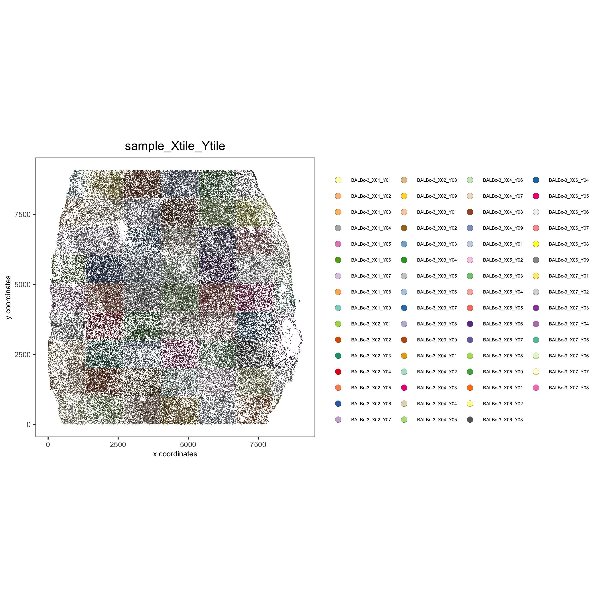{ width=50% }


## Part 3: Dimension reduction

```{r eval=FALSE}
# use all Abs

# PCA
codex_test <- runPCA(gobject = codex_test, expression_values = 'normalized', scale_unit = T, method = "factominer")
signPCA(codex_test, scale_unit = T, scree_ylim = c(0, 3),
        save_param = list(save_name = '3_a_spatPlot'))
```

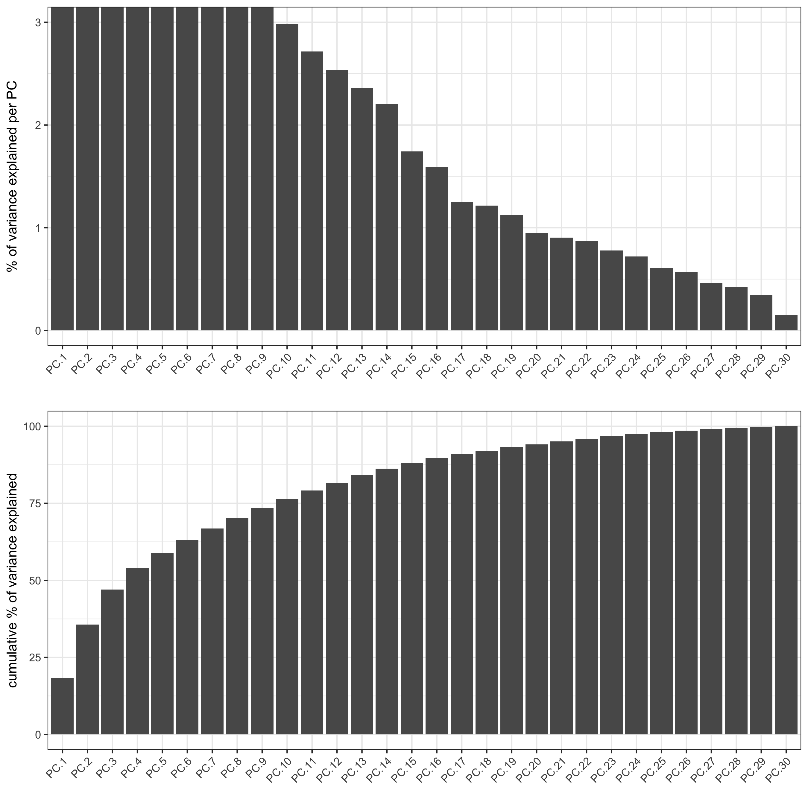{ width=50% }

```{r eval=FALSE}
plotPCA(gobject = codex_test, point_shape = 'no_border', point_size = 0.2,
        save_param = list(save_name = '3_b_PCA'))
```

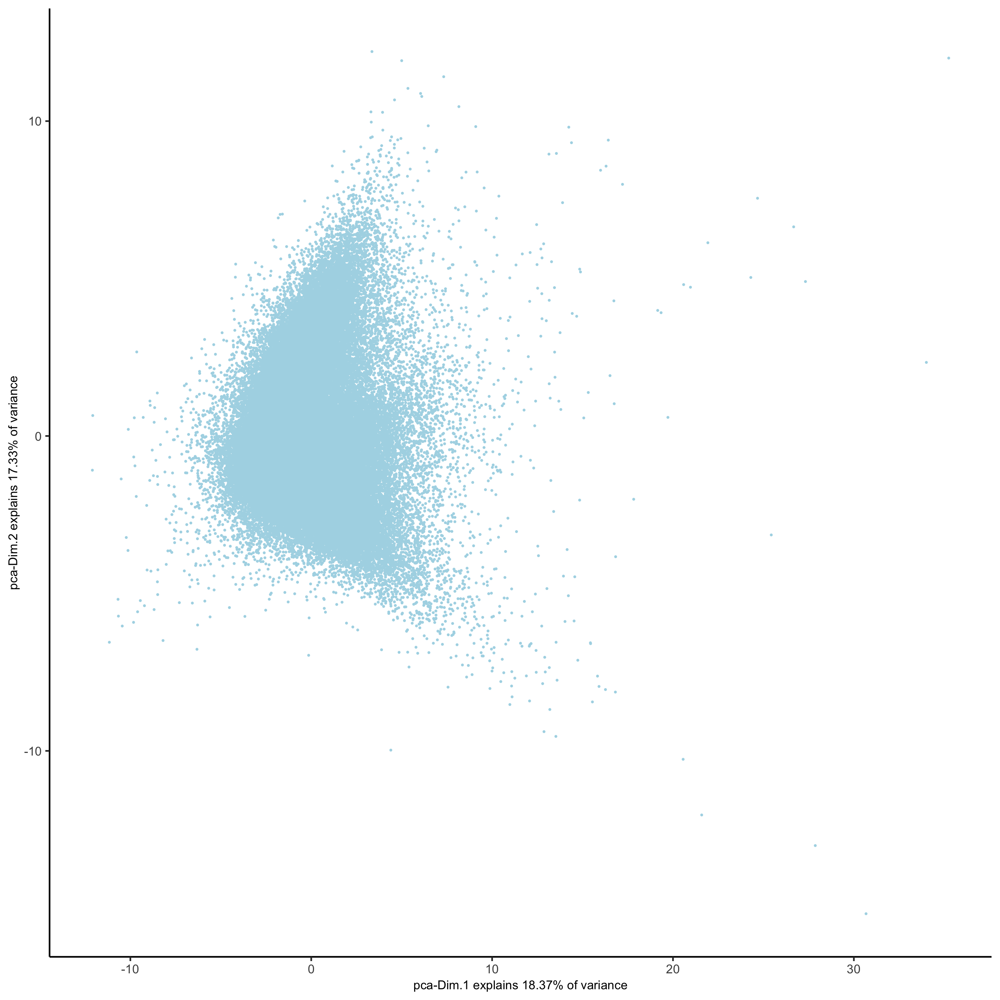{ width=50% }

```{r eval=FALSE}
# UMAP
codex_test <- runUMAP(codex_test, dimensions_to_use = 1:14, n_components = 2, n_threads = 12)
plotUMAP(gobject = codex_test, point_shape = 'no_border', point_size = 0.2,
         save_param = list(save_name = '3_c_UMAP'))

```


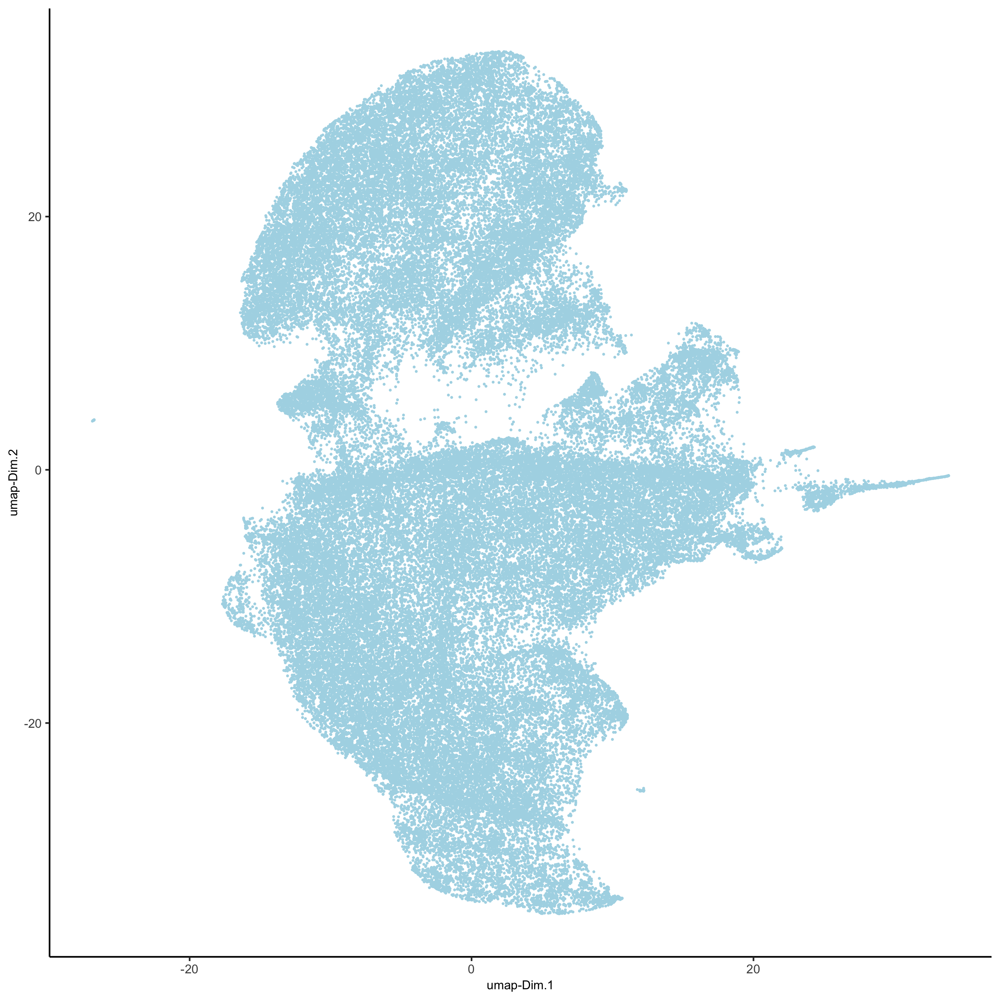{ width=50% }

## Part 4: Cluster 

```{r eval=FALSE}
## sNN network (default)
codex_test <- createNearestNetwork(gobject = codex_test, dimensions_to_use = 1:14, k = 20)

## 0.1 resolution
codex_test <- doLeidenCluster(gobject = codex_test, resolution = 0.5, n_iterations = 100, name = 'leiden',python_path = python_path)

codex_metadata = pDataDT(codex_test)
leiden_colors = Giotto:::getDistinctColors(length(unique(codex_metadata$leiden)))
names(leiden_colors) = unique(codex_metadata$leiden)

plotUMAP(gobject = codex_test, 
         cell_color = 'leiden', point_shape = 'no_border', point_size = 0.2, cell_color_code = leiden_colors,
         save_param = list(save_name = '4_a_UMAP'))
```


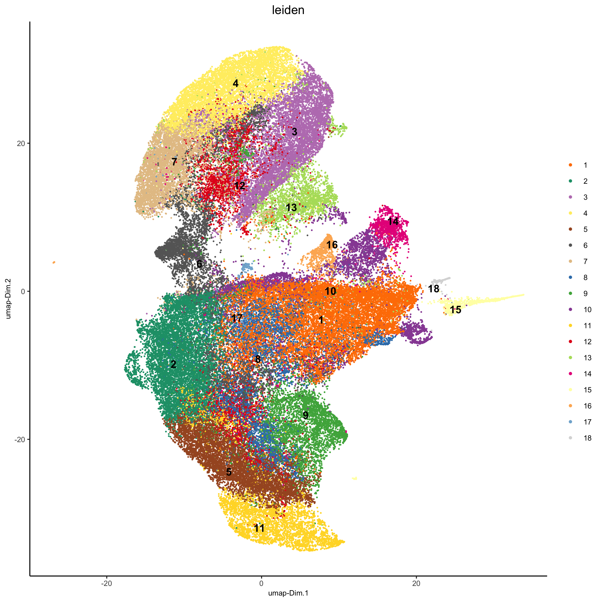{ width=50% }

```{r eval=FALSE}
spatPlot(gobject = codex_test, cell_color = 'leiden', point_shape = 'no_border', point_size = 0.2, 
         cell_color_code = leiden_colors, coord_fix_ratio = 1,label_size =2,
         legend_text = 5,legend_symbol_size = 2,
         save_param = list(save_name = '4_b_spatplot'))
```


{ width=50% }

## Part 5: Co-visualize

```{r eval=FALSE}
spatDimPlot2D(gobject = codex_test, cell_color = 'leiden', spat_point_shape = 'no_border', 
              spat_point_size = 0.2, dim_point_shape = 'no_border', dim_point_size = 0.2, 
              cell_color_code = leiden_colors,plot_alignment = c("horizontal"),
              save_param = list(save_name = '5_a_spatdimplot'))
```

{ width=50% }

## Part 6: Differential expression

```{r eval=FALSE}

# resolution 0.5
cluster_column = 'leiden'
markers_scran = findMarkers_one_vs_all(gobject=codex_test, method="scran",
                                       expression_values="norm", cluster_column=cluster_column, min_genes=3)
markergenes_scran = unique(markers_scran[, head(.SD, 5), by="cluster"][["genes"]])

plotMetaDataHeatmap(codex_test, expression_values = "norm", metadata_cols = c(cluster_column), 
                    selected_genes = markergenes_scran,
                    y_text_size = 8, show_values = 'zscores_rescaled',
                    save_param = list(save_name = '6_a_metaheatmap'))
```

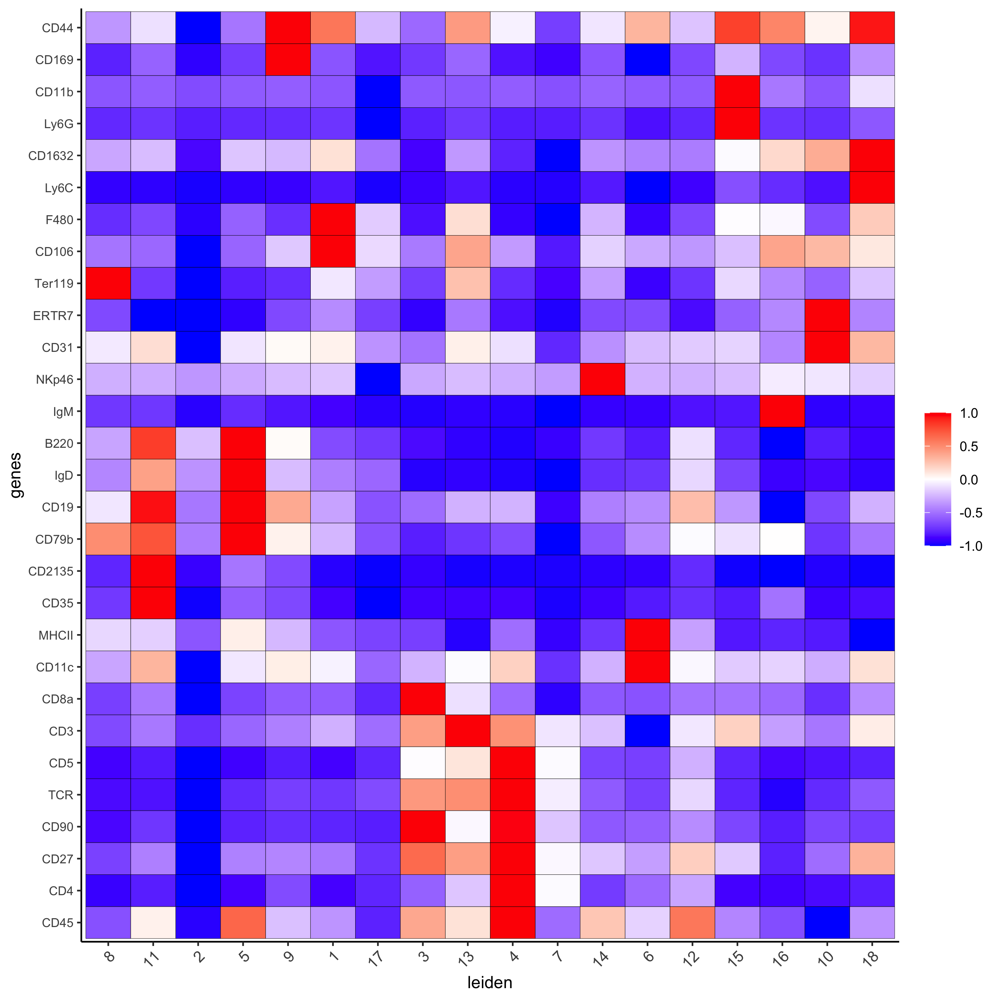{ width=50% }

```{r eval=FALSE}
topgenes_scran = markers_scran[, head(.SD, 1), by = 'cluster']$genes
violinPlot(codex_test, genes = unique(topgenes_scran)[1:8], cluster_column = cluster_column,
           strip_text = 8, strip_position = 'right',
           save_param = list(save_name = '6_b_violinplot'))
```

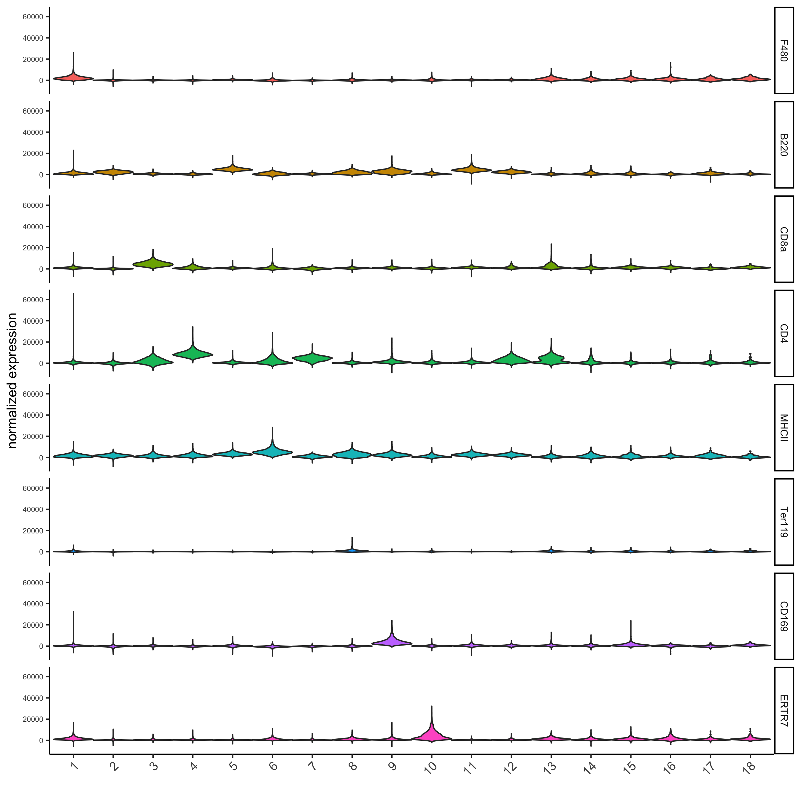{ width=50% }

```{r eval=FALSE}
# gini
markers_gini = findMarkers_one_vs_all(gobject=codex_test, method="gini", expression_values="norm",
                                      cluster_column=cluster_column, min_genes=5)
markergenes_gini = unique(markers_gini[, head(.SD, 5), by="cluster"][["genes"]])
plotMetaDataHeatmap(codex_test, expression_values = "norm", 
                    metadata_cols = c(cluster_column), selected_genes = markergenes_gini,
                    show_values = 'zscores_rescaled',
                    save_param = list(save_name = '6_c_metaheatmap'))
```

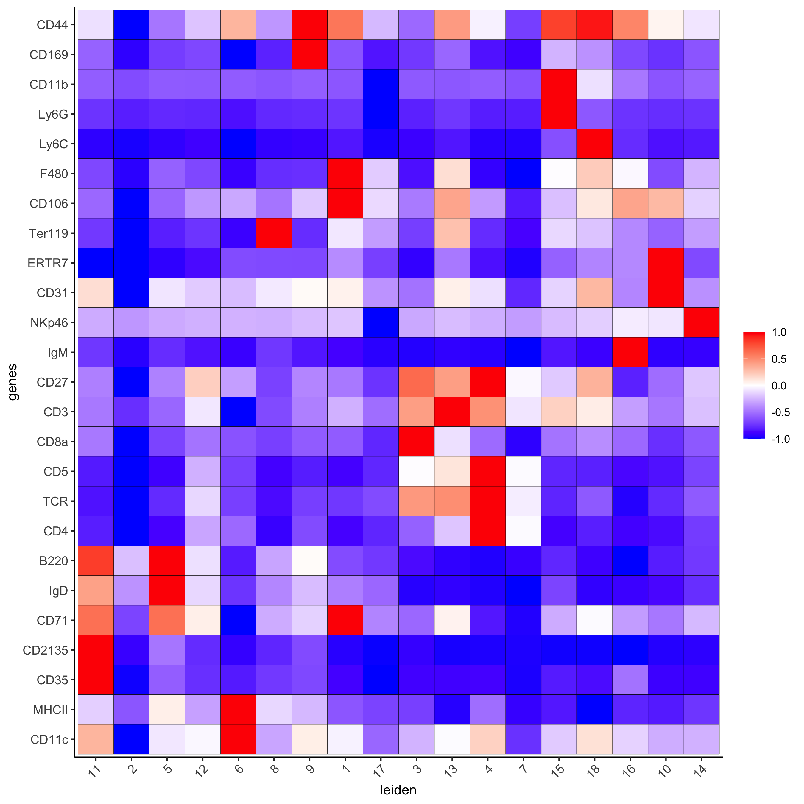{ width=50% }

```{r eval=FALSE}
topgenes_gini = markers_gini[, head(.SD, 1), by = 'cluster']$genes
violinPlot(codex_test, genes = unique(topgenes_gini), cluster_column = cluster_column,
           strip_text = 8, strip_position = 'right',
           save_param = list(save_name = '6_d_violinplot'))
```

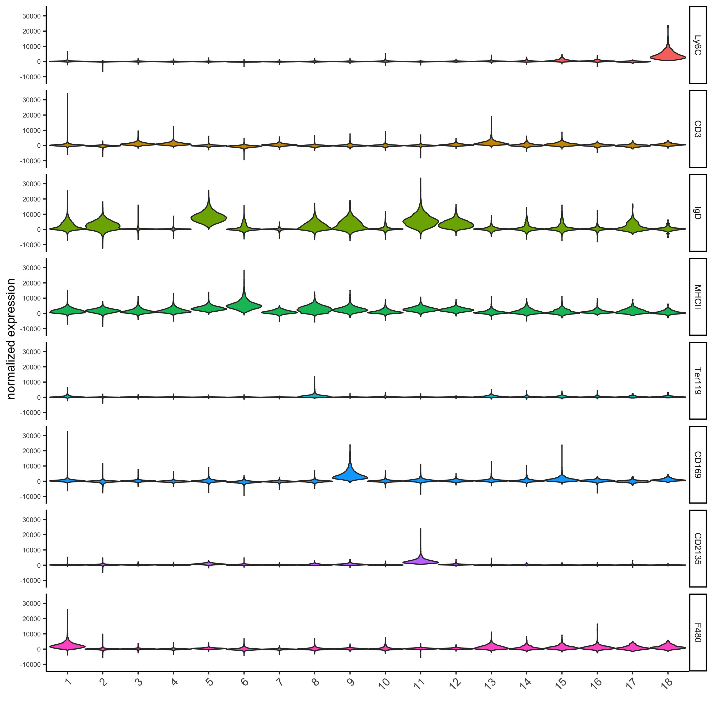{ width=50% }

## Part 7: Cell type annotation

```{r eval=FALSE}

clusters_cell_types = c('erythroblasts-F4/80(+) mphs','B cells','CD8(+) T cells', 
                        'CD4(+) T cells', 'B cells','CD11c(+)MHCII(+) cells',
                        'CD4(+) T cells','Ter119(+)', 'marginal zone mphs', 
                        'CD31(+)ERTR7(+)', 'FDCs', 'B220(+) DN T cells',
                        'CD3(+) other markers','NK cells','granulocytes',
                        'plasma cells','ambiguous','CD44(+)CD1632(+)Ly6C(+) cells')

names(clusters_cell_types) = c(1:18)
codex_test = annotateGiotto(gobject = codex_test, annotation_vector = clusters_cell_types,
                            cluster_column = 'leiden', name = 'cell_types')

plotMetaDataHeatmap(codex_test, expression_values = 'scaled',
                    metadata_cols = c('cell_types'),y_text_size = 6,
                    save_param = list(save_name = '7_a_metaheatmap'))
```

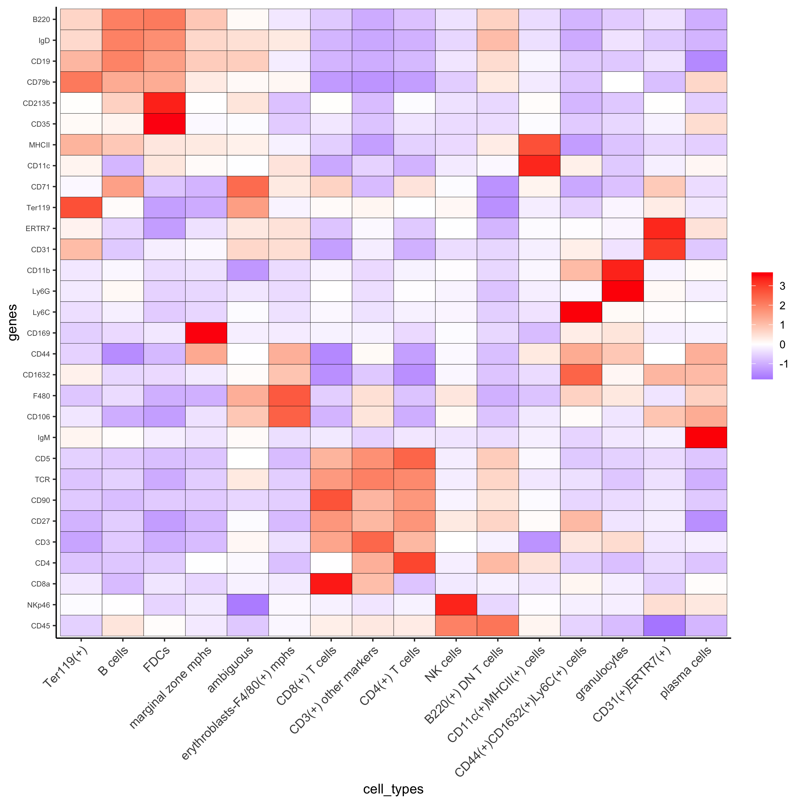{ width=50% }

```{r eval=FALSE}
# create consistent color code
mynames = unique(pDataDT(codex_test)$cell_types)
mycolorcode = Giotto:::getDistinctColors(n = length(mynames))
names(mycolorcode) = mynames

plotUMAP(gobject = codex_test, cell_color = 'cell_types',point_shape = 'no_border',   point_size = 0.2,
         cell_color_code = mycolorcode,
         show_center_label = F,
         label_size =2,
         legend_text = 5,
         legend_symbol_size = 2,
         save_param = list(save_name = '7_b_umap'))
```

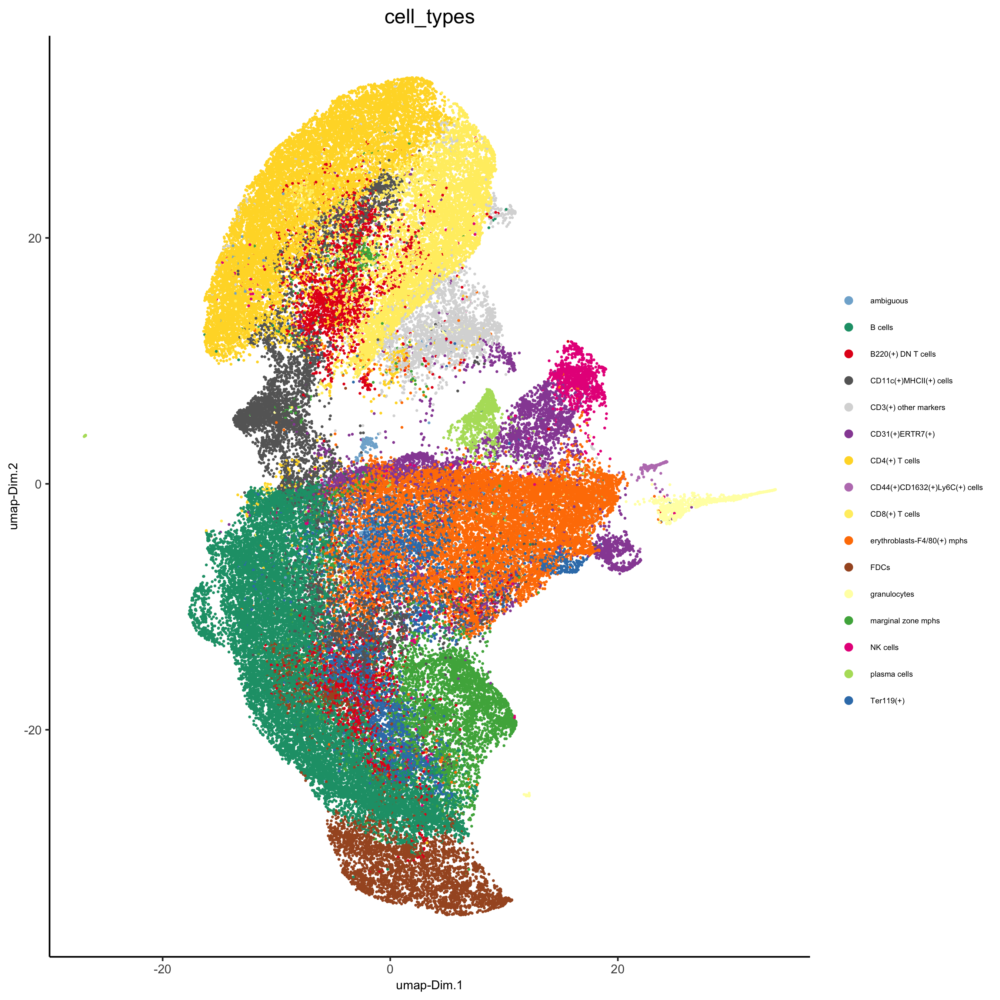{ width=50% }

```{r eval=FALSE}
spatPlot(gobject = codex_test, cell_color = 'cell_types', point_shape = 'no_border', point_size = 0.2, 
         cell_color_code = mycolorcode,
         coord_fix_ratio = 1,
         label_size =2,
         legend_text = 5,
         legend_symbol_size = 2,
         save_param = list(save_name = '7_c_spatplot'))

```

{ width=50% }

## part 8: Visualize cell types and gene expression in selected zones

```{r eval=FALSE}

cell_metadata = pDataDT(codex_test)
subset_cell_ids = cell_metadata[sample_Xtile_Ytile=="BALBc-3_X04_Y08"]$cell_ID

codex_test_zone1 = subsetGiotto(codex_test, cell_ids = subset_cell_ids)

plotUMAP(gobject = codex_test_zone1, 
         cell_color = 'cell_types', point_shape = 'no_border',   point_size = 1,
         cell_color_code = mycolorcode,
         show_center_label = F,
         label_size =2,
         legend_text = 5,
         legend_symbol_size = 2,
         save_param = list(save_name = '8_a_umap'))
```

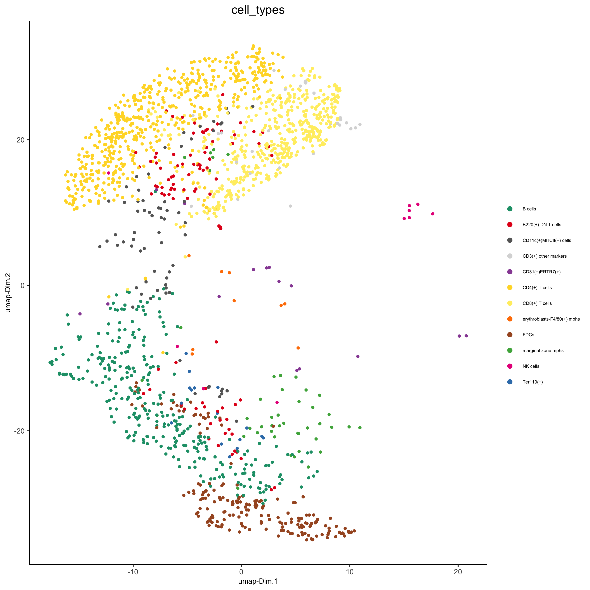{ width=50% }

```{r eval=FALSE}
spatPlot(gobject = codex_test_zone1, 
         cell_color = 'cell_types', point_shape = 'no_border', point_size = 1, 
         cell_color_code = mycolorcode,
         coord_fix_ratio = 1,
         label_size =2,
         legend_text = 5,
         legend_symbol_size = 2,
         save_param = list(save_name = '8_b_spatplot'))
```

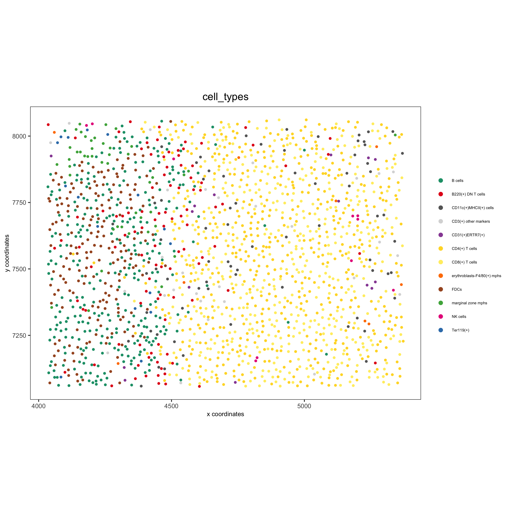{ width=50% }

```{r eval=FALSE}
spatDimGenePlot(codex_test_zone1, 
                expression_values = 'scaled',
                genes = c("CD8a","CD19"),
                spat_point_shape = 'no_border',
                dim_point_shape = 'no_border',
                cell_color_gradient = c("darkblue", "white", "red"),
                save_param = list(save_name = '8_c_spatdimplot'))
```

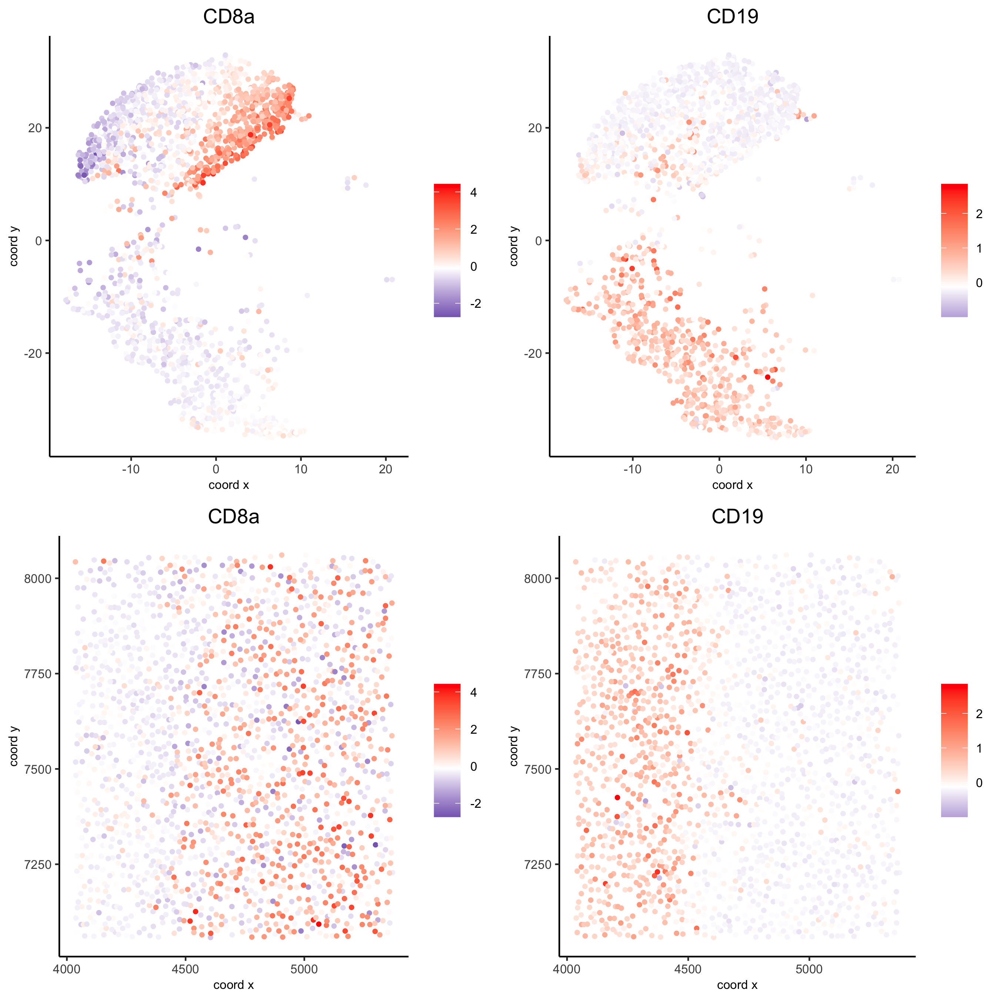{ width=50% }

```{r eval=FALSE}

cell_metadata = pDataDT(codex_test)
subset_cell_ids = cell_metadata[sample_Xtile_Ytile=="BALBc-3_X04_Y03"]$cell_ID

codex_test_zone2 = subsetGiotto(codex_test, cell_ids = subset_cell_ids)

plotUMAP(gobject = codex_test_zone2, cell_color = 'cell_types',point_shape = 'no_border',   point_size = 1,
         cell_color_code = mycolorcode,
         show_center_label = F,
         label_size =2,
         legend_text = 5,
         legend_symbol_size = 2,
         save_param = list(save_name = '8_d_umap'))
```

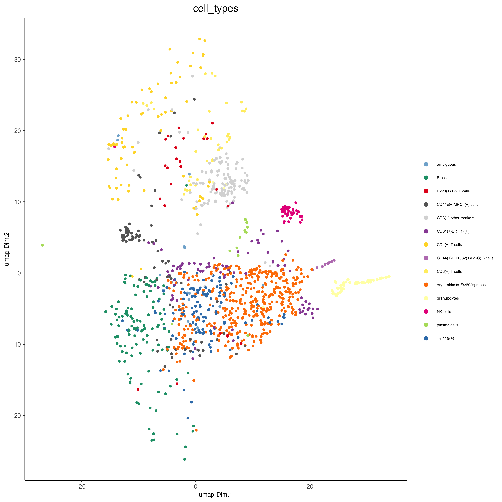{ width=50% }

```{r eval=FALSE}
spatPlot(gobject = codex_test_zone2, cell_color = 'cell_types', point_shape = 'no_border', point_size = 1, 
         cell_color_code = mycolorcode,
         coord_fix_ratio = 1,
         label_size =2,
         legend_text = 5,
         legend_symbol_size = 2,
         save_param = list(save_name = '8_e_spatPlot'))
```

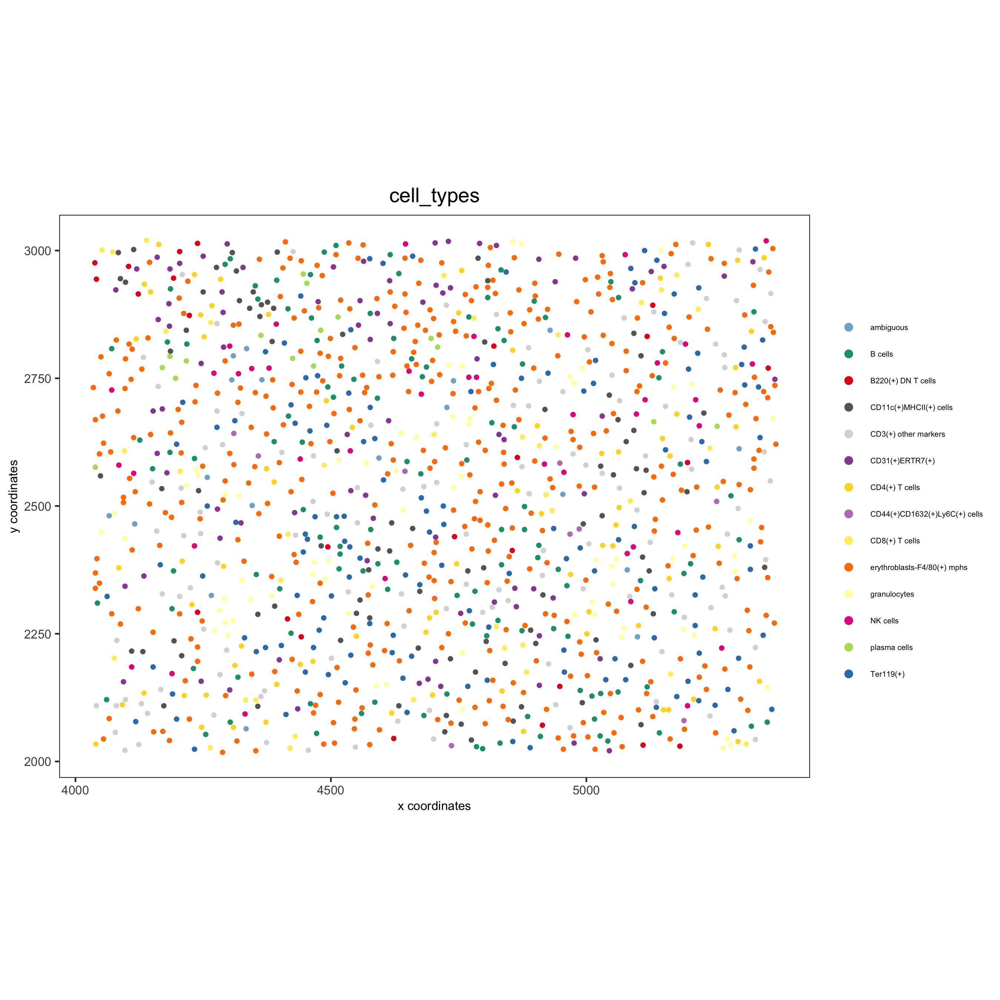{ width=50% }

```{r eval=FALSE}
spatDimGenePlot(codex_test_zone2, 
                expression_values = 'scaled',
                genes = c("CD4", "CD106"),
                spat_point_shape = 'no_border',
                dim_point_shape = 'no_border',
                cell_color_gradient = c("darkblue", "white", "red"),
                save_param = list(save_name = '8_f_spatdimgeneplot'))
```

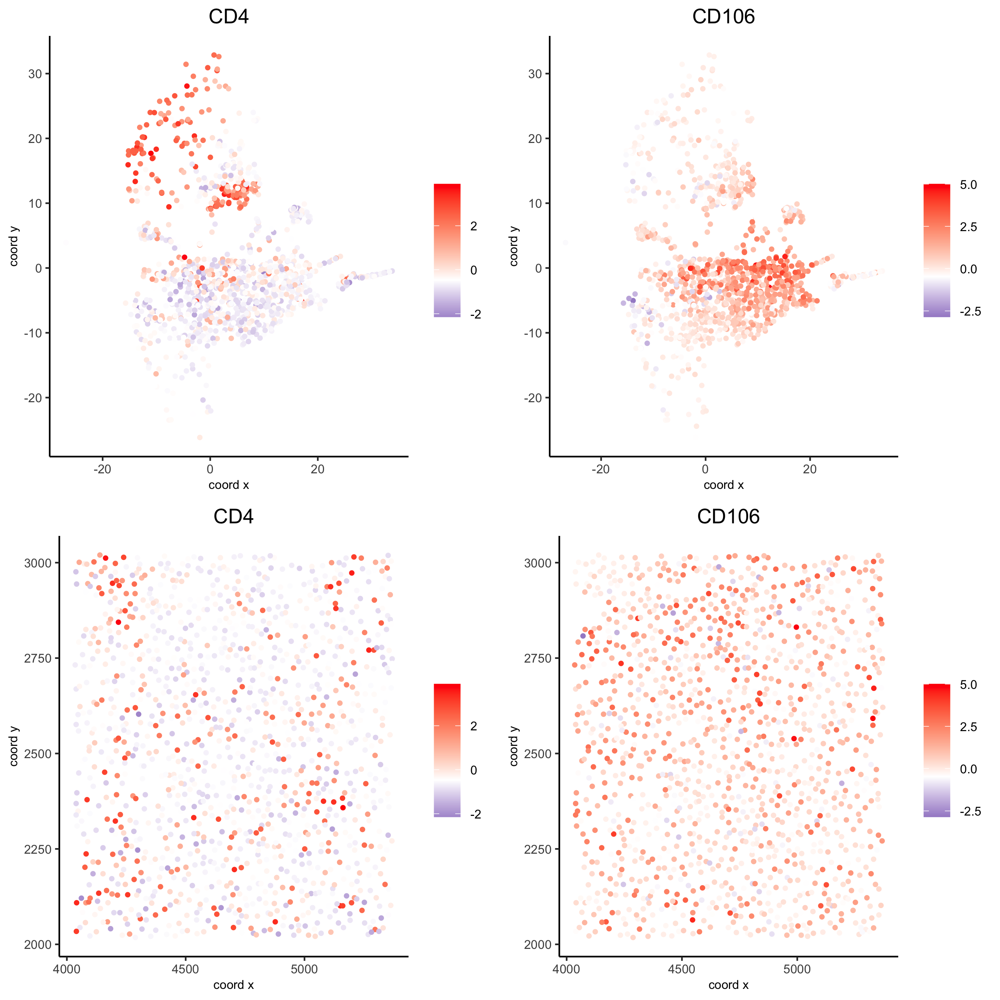{ width=50% }
