<!-- mouse_cortex_1_simple.md is generated from mouse_cortex_1_simple.Rmd Please edit that file -->

```{r, include = FALSE}
knitr::opts_chunk$set(
  collapse = TRUE,
  comment = "#>",
  fig.path = "man/figures/README-",
  out.width = "100%"
)
```

```{r eval=TRUE, echo=FALSE}
giotto_version = utils::packageVersion(pkg = 'Giotto')

if(giotto_version == '0.3.6.9038') {
  NULL
} else if(giotto_version > '0.3.6.9038'){
  warning('This tutorial was written with Giotto version 0.3.6.9038, your version is ', giotto_version, '.', 
  'This is a more recent version and results should be reproducible')
} else {
  warning('This tutorial was written with Giotto version 0.3.6.9038, your version is ', giotto_version, '.', 
  'This is an older version and results could be slightly different')
}
```

## Start Giotto

```{r eval=FALSE, message=FALSE, warning=FALSE}
library(Giotto)

# 1. set working directory
my_working_dir = '/path/to/directory/'

# 2. set giotto python path
# set python path to your preferred python version path
# set python path to NULL if you want to automatically install (only the 1st time) and use the giotto miniconda environment
python_path = NULL 
if(is.null(python_path)) {
  installGiottoEnvironment()
}

```


## Dataset explanation
[Moffitt et al.](https://science.sciencemag.org/content/362/6416/eaau5324) created a 3D spatial expression dataset consisting of 155 genes from ~1 million single cells acquired over the mouse hypothalamic preoptic regions.
 

## Dataset download
The merFISH data to run this tutorial can be found [here](https://github.com/RubD/spatial-datasets/tree/master/data/2018_merFISH_science_hypo_preoptic). Alternatively you can use the **getSpatialDataset** to automatically download this dataset like we do in this example.

```{r eval=FALSE, message=FALSE, warning=FALSE}
# download data to working directory 
# if wget is installed, set method = 'wget'
# if you run into authentication issues with wget, then add " extra = '--no-check-certificate' "
getSpatialDataset(dataset = 'merfish_preoptic', directory = my_working_dir, method = 'wget')
```


## Part 1: Giotto global instructions and preparations

```{r eval=FALSE, message=FALSE, warning=FALSE}
# 1. (optional) set Giotto instructions
instrs = createGiottoInstructions(save_plot = TRUE, 
                                  save_dir = my_working_dir, 
                                  python_path = python_path)

# 2. create giotto object from provided paths ####
expr_path = paste0(my_working_dir, "merFISH_3D_data_expression.txt.gz")
loc_path = paste0(my_working_dir, "merFISH_3D_data_cell_locations.txt")
meta_path = paste0(my_working_dir, "merFISH_3D_metadata.txt")
```


## part 2: Create Giotto object & process data
```{r eval=FALSE, message=FALSE, warning=FALSE}
## create Giotto object
merFISH_test <- createGiottoObject(raw_exprs = expr_path,
                                   spatial_locs = loc_path,
                                   instructions = instrs)


## add additional metadata if wanted
metadata = data.table::fread(meta_path)
merFISH_test = addCellMetadata(merFISH_test, new_metadata = metadata$layer_ID, vector_name = 'layer_ID')
merFISH_test = addCellMetadata(merFISH_test, new_metadata = metadata$orig_cell_types, vector_name = 'orig_cell_types')

## filter raw data
# 1. pre-test filter parameters
filterDistributions(merFISH_test, detection = 'genes',
                    save_param = list(save_name = '2_a_distribution_genes'))

```

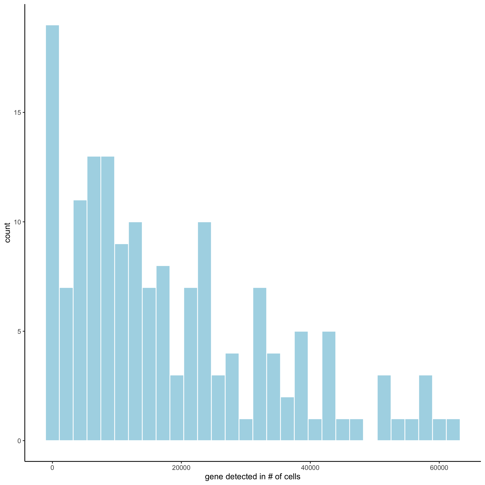{ width=50% } 

```{r, eval=FALSE}
filterDistributions(merFISH_test, detection = 'cells',
                    save_param = list(save_name = '2_b_distribution_cells'))
```


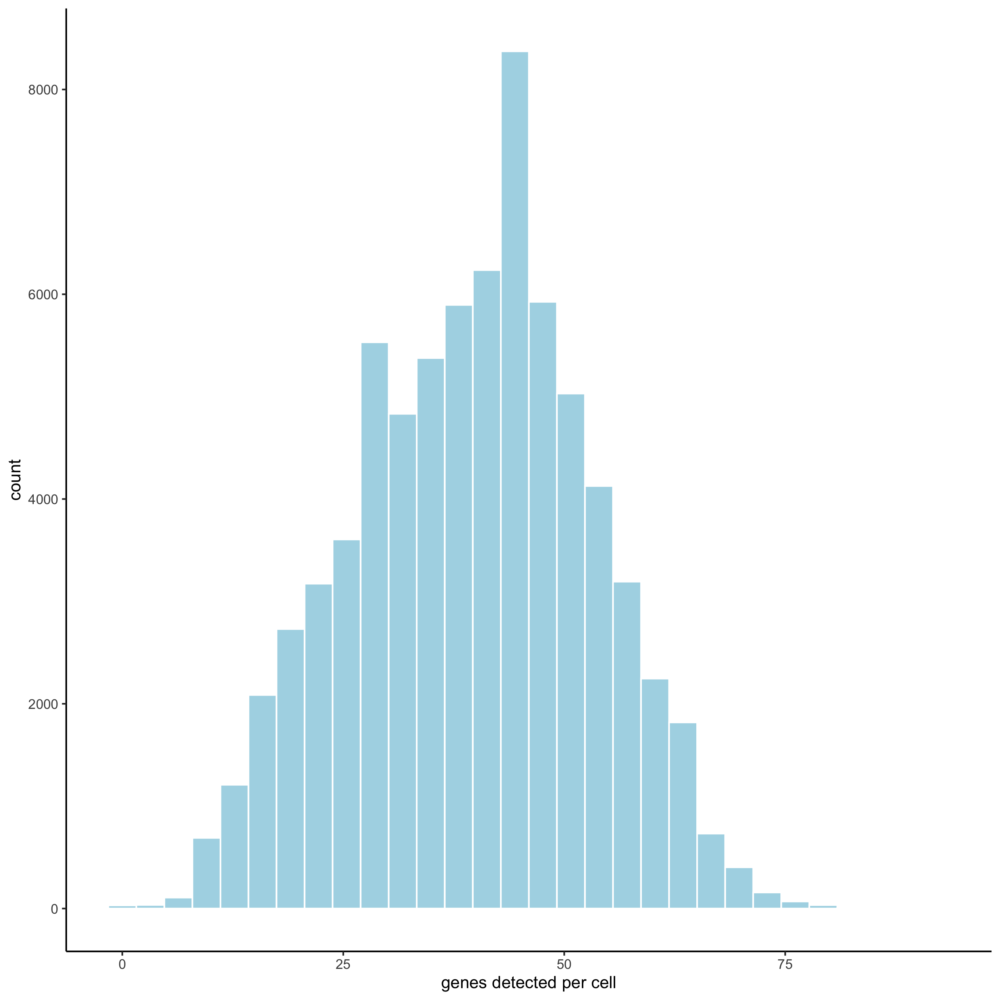{ width=50% } 

```{r, eval=FALSE}
filterCombinations(merFISH_test,
                   expression_thresholds = c(0,1e-6,1e-5),
                   gene_det_in_min_cells = c(500, 1000, 1500),
                   min_det_genes_per_cell = c(1, 5, 10), 
                   save_param = list(save_name = '2_c_filter_combos'))
```


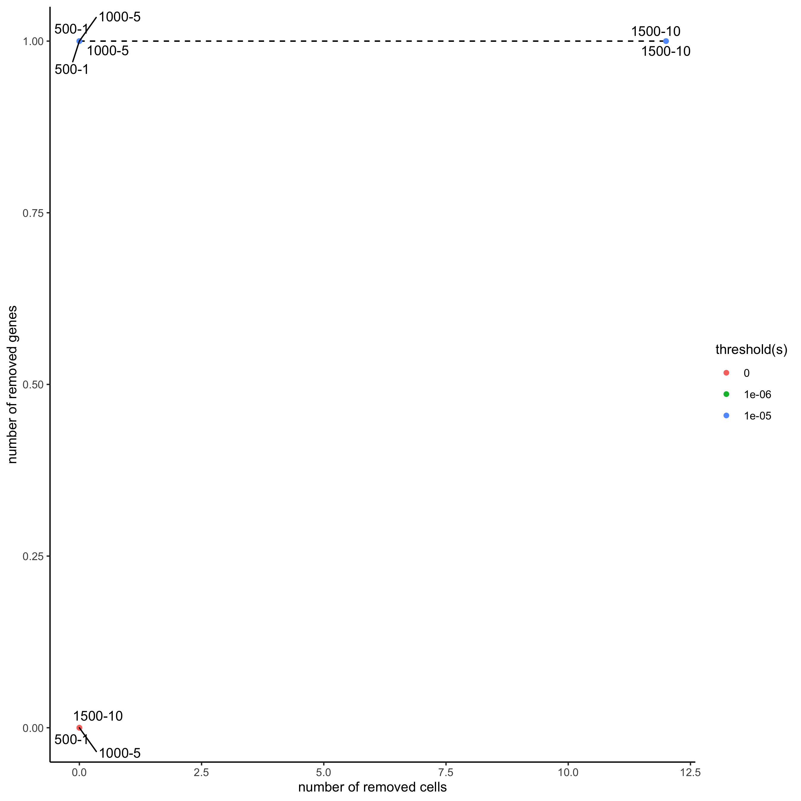{ width=50% } 

```{r, eval=FALSE}
# 2. filter data
merFISH_test <- filterGiotto(gobject = merFISH_test,
                             gene_det_in_min_cells = 0,
                             min_det_genes_per_cell = 0)
## normalize
merFISH_test <- normalizeGiotto(gobject = merFISH_test, scalefactor = 10000, verbose = T)
merFISH_test <- addStatistics(gobject = merFISH_test)
merFISH_test <- adjustGiottoMatrix(gobject = merFISH_test, expression_values = c('normalized'),
                                   batch_columns = NULL, covariate_columns = c('nr_genes', 'total_expr'),
                                   return_gobject = TRUE,
                                   update_slot = c('custom'))

# save according to giotto instructions
# 2D
spatPlot(gobject = merFISH_test, point_size = 1.5, 
         save_param = list(save_name = '2_d_spatial_locations2D'))
```


{ width=50% } 

```{r, eval=FALSE}
# 3D
spatPlot3D(gobject = merFISH_test, point_size = 2.0, axis_scale = 'real',
           save_param = list(save_name = '2_e_spatial_locations3D'))
```


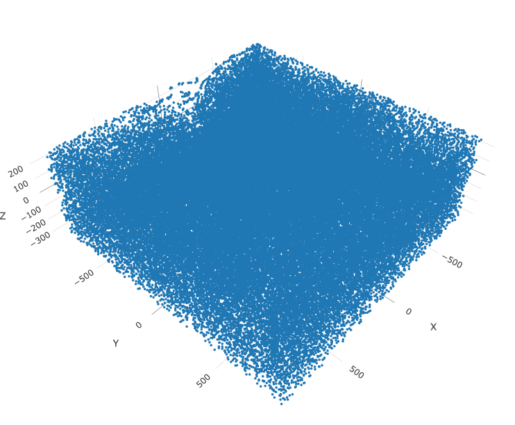{ width=50% } 

## part 3: dimension reduction

```{r, eval=FALSE}
# only 155 genes, use them all (default)
merFISH_test <- runPCA(gobject = merFISH_test, genes_to_use = NULL, scale_unit = FALSE, center = TRUE)
screePlot(merFISH_test, save_param = list(save_name = '3_a_screeplot'))
```


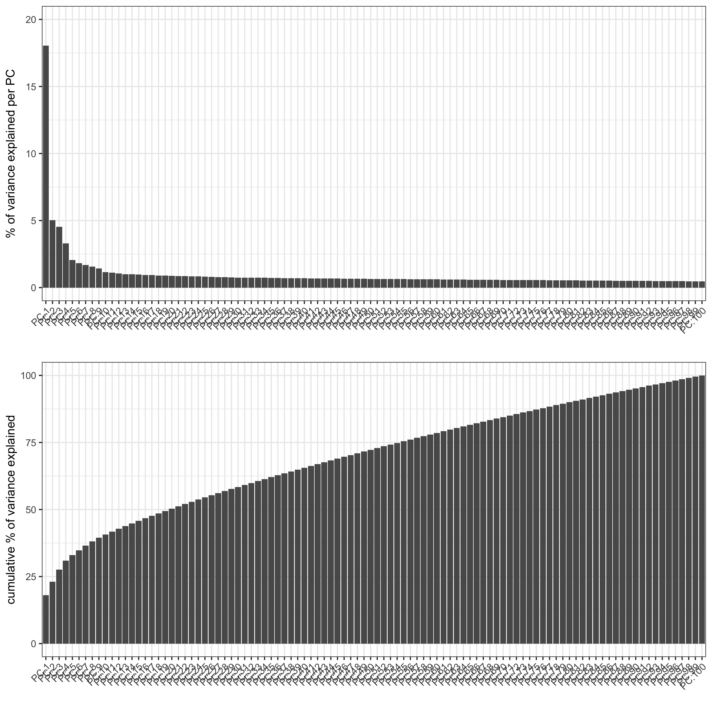{ width=50% } 

```{r, eval=FALSE}
merFISH_test <- runUMAP(merFISH_test, dimensions_to_use = 1:8, n_components = 3, n_threads = 4)

plotUMAP_3D(gobject = merFISH_test, point_size = 1.5,
            save_param = list(save_name = '3_b_UMAP_reduction'))
```


{ width=50% } 

## part 4:  cluster

```{r, eval=FALSE}
## sNN network (default)
merFISH_test <- createNearestNetwork(gobject = merFISH_test, dimensions_to_use = 1:8, k = 15)
## Leiden clustering
merFISH_test <- doLeidenCluster(gobject = merFISH_test, resolution = 0.2, n_iterations = 200,
                                name = 'leiden_0.2')
plotUMAP_3D(gobject = merFISH_test, cell_color = 'leiden_0.2', point_size = 1.5, show_center_label = F,
            save_param = list(save_name = '4_a_UMAP_leiden'))
```

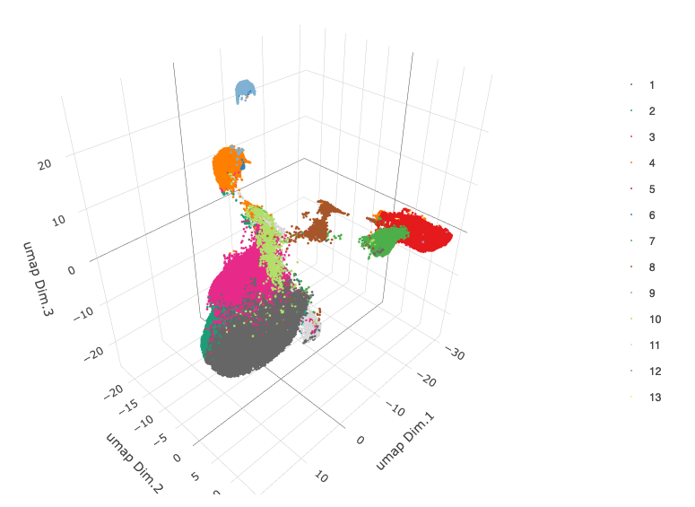{ width=50% } 

## part 5: co-visualize

```{r, eval=FALSE}

spatDimPlot3D(gobject = merFISH_test, show_center_label = F,
              cell_color = 'leiden_0.2', dim3_to_use = 3,
              axis_scale = 'real', spatial_point_size = 2.0,
              save_param = list(save_name = '5_a_covis_leiden'))
```


```{r, eval=FALSE}
spatPlot2D(gobject = merFISH_test, point_size = 1.5, 
           cell_color = 'leiden_0.2', 
           group_by = 'layer_ID', cow_n_col = 2, group_by_subset = c(260, 160, 60, -40, -140, -240),
           save_param = list(save_name = '5_b_leiden_2D'))
```

{ width=50% } 

## part 6: cell type marker gene detection

```{r, eval=FALSE}
markers = findMarkers_one_vs_all(gobject = merFISH_test,
                                 method = 'gini',
                                 expression_values = 'normalized',
                                 cluster_column = 'leiden_0.2',
                                 min_genes = 1, rank_score = 2)
markers[, head(.SD, 2), by = 'cluster']

# violinplot
topgini_genes = unique(markers[, head(.SD, 2), by = 'cluster']$genes)
violinPlot(merFISH_test, genes = topgini_genes, cluster_column = 'leiden_0.2', strip_position = 'right',
           save_param = c(save_name = '6_a_violinplot'))
```

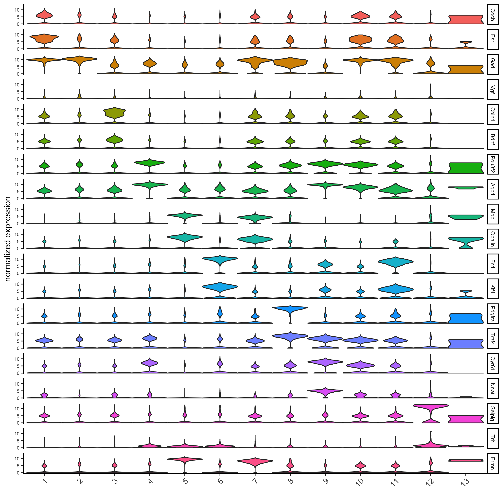{ width=50% } 

```{r, eval=FALSE}
topgini_genes = unique(markers[, head(.SD, 6), by = 'cluster']$genes)
plotMetaDataHeatmap(merFISH_test, expression_values = 'scaled',
                    metadata_cols = c('leiden_0.2'),
                    selected_genes = topgini_genes,
                    save_param = c(save_name = '6_b_clusterheatmap_markers'))
```


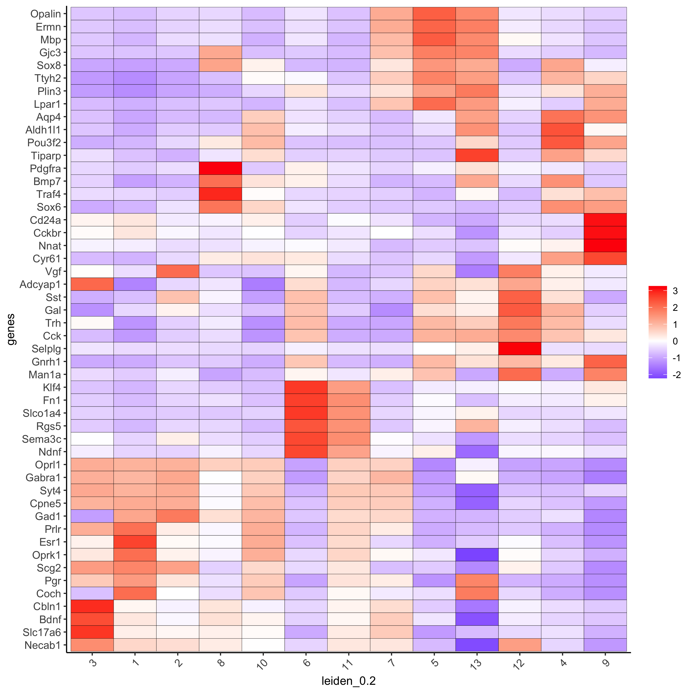{ width=50% } 


## part 7: cell-type annotation

### Annotation
```{r, eval=FALSE}

# known markers and DEGs
selected_genes = c('Myh11', 'Klf4', 'Fn1', 'Cd24a', 'Cyr61', 'Nnat', 'Trh', 'Selplg', 'Pou3f2', 'Aqp4', 'Traf4',
                   'Pdgfra', 'Opalin', 'Mbp', 'Ttyh2', 'Fezf1', 'Cbln1', 'Slc17a6', 'Scg2', 'Isl1', 'Gad1')
cluster_order = c(6, 11, 9, 12, 4, 8, 7, 5, 13, 3, 1, 2, 10)

plotMetaDataHeatmap(merFISH_test, expression_values = 'scaled',
                    metadata_cols = c('leiden_0.2'),
                    selected_genes = selected_genes,
                    custom_gene_order = rev(selected_genes),
                    custom_cluster_order = cluster_order,
                    save_param = c(save_name = '7_a_clusterheatmap_markers'))
```


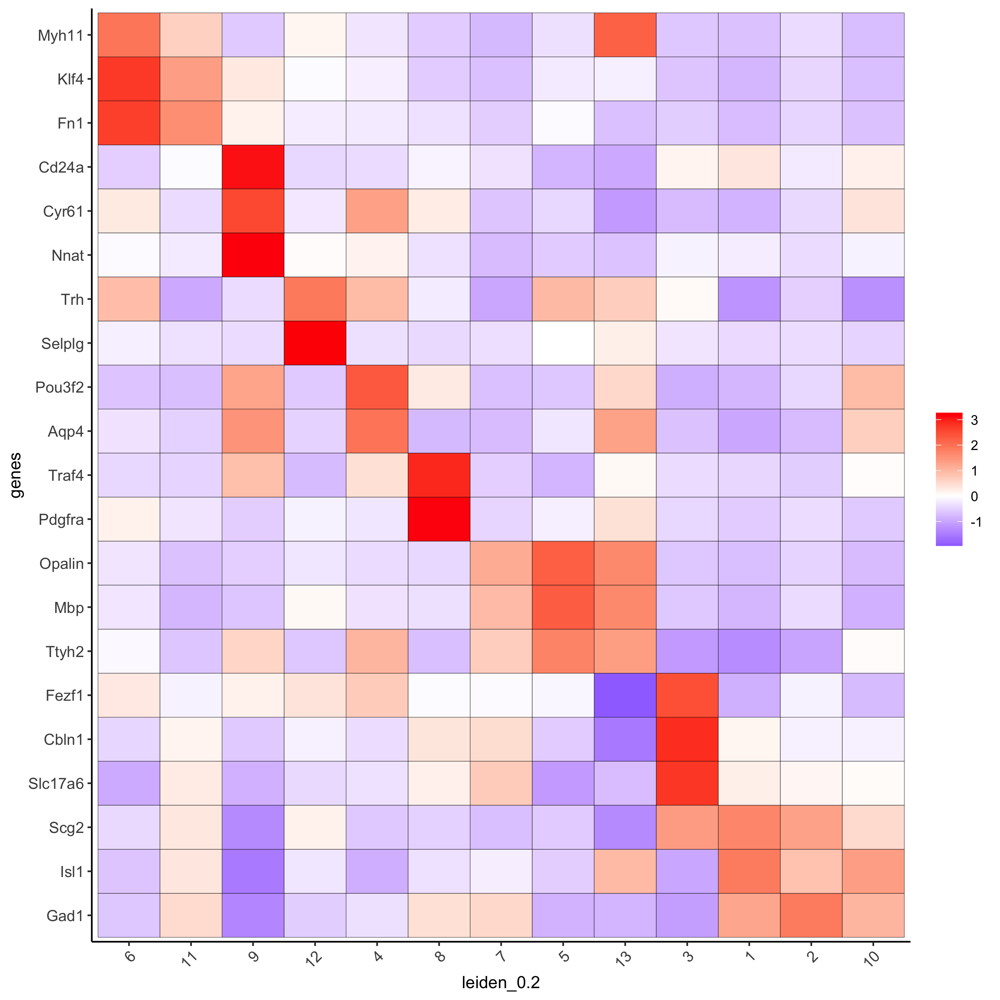{ width=50% } 

```{r, eval=FALSE}
## name clusters
clusters_cell_types_hypo = c('Inhibitory', 'Inhibitory', 'Excitatory', 'Astrocyte','OD Mature', 'Endothelial',
                             'OD Mature', 'OD Immature', 'Ependymal', 'Ambiguous', 'Endothelial', 'Microglia', 'OD Mature')
names(clusters_cell_types_hypo) = as.character(sort(cluster_order))
merFISH_test = annotateGiotto(gobject = merFISH_test, annotation_vector = clusters_cell_types_hypo,
                              cluster_column = 'leiden_0.2', name = 'cell_types')

## show heatmap
plotMetaDataHeatmap(merFISH_test, expression_values = 'scaled',
                    metadata_cols = c('cell_types'),
                    selected_genes = selected_genes,
                    custom_gene_order = rev(selected_genes),
                    custom_cluster_order = clusters_cell_types_hypo,
                    save_param = c(save_name = '7_b_clusterheatmap_markers_celltypes'))
```


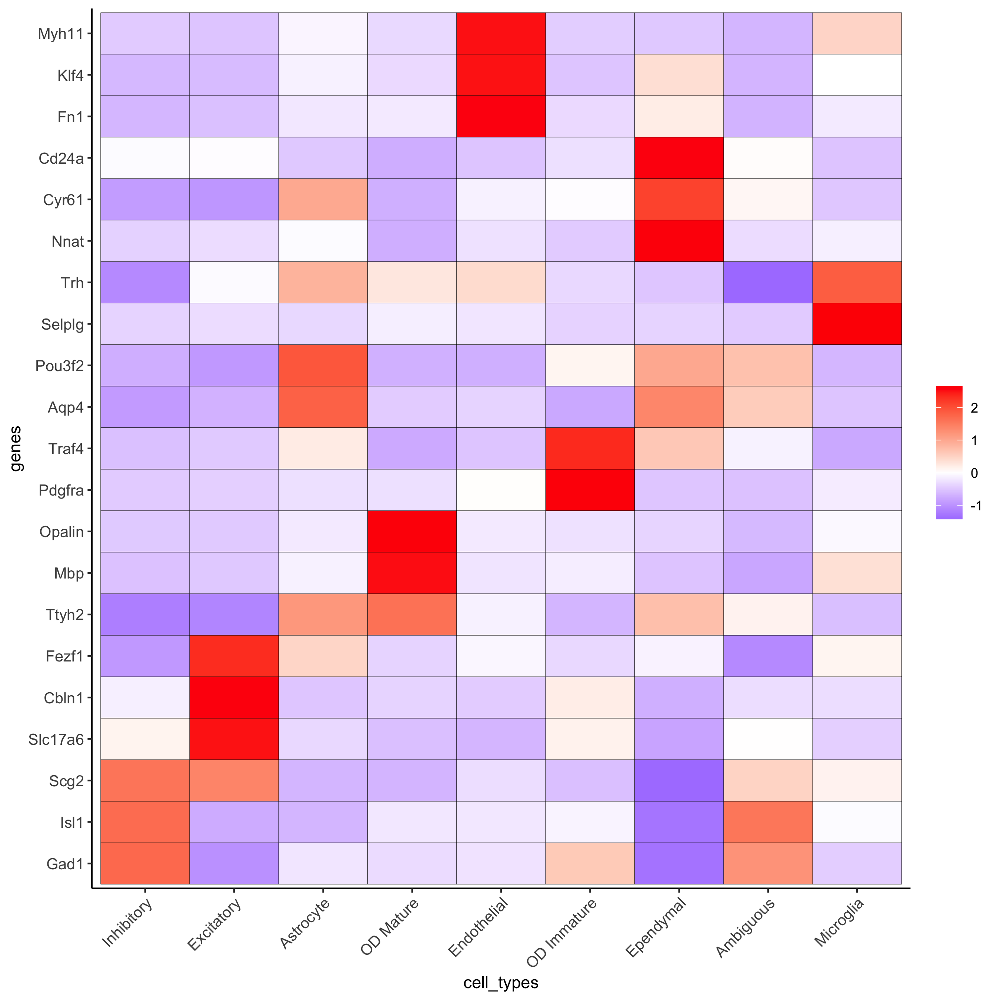{ width=50% } 

### Visualization

```{r, eval=FALSE}
## visualize ##
mycolorcode = c('red', 'lightblue', 'yellowgreen','purple', 'darkred', 'magenta', 'mediumblue', 'yellow', 'gray')
names(mycolorcode) = c('Inhibitory', 'Excitatory','OD Mature', 'OD Immature', 'Astrocyte', 'Microglia', 'Ependymal','Endothelial', 'Ambiguous')

plotUMAP_3D(merFISH_test, cell_color = 'cell_types', point_size = 1.5, cell_color_code = mycolorcode,
            save_param = c(save_name = '7_c_umap_cell_types'))
```

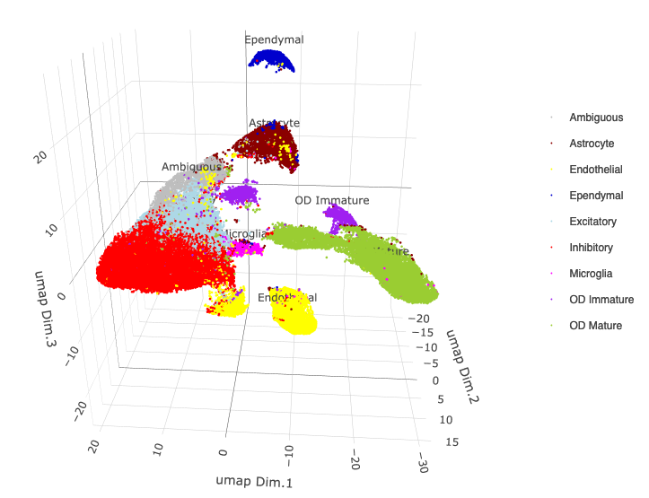{ width=50% } 

```{r, eval=FALSE}
spatPlot3D(merFISH_test,
           cell_color = 'cell_types', axis_scale = 'real',
           sdimx = 'sdimx', sdimy = 'sdimy', sdimz = 'sdimz',
           show_grid = F, cell_color_code = mycolorcode,
           save_param = c(save_name = '7_d_spatPlot_cell_types_all'))
```

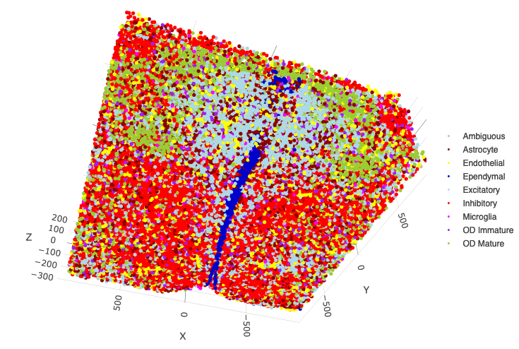{ width=50% } 

```{r, eval=FALSE}
spatPlot2D(gobject = merFISH_test, point_size = 1.0,
           cell_color = 'cell_types', cell_color_code = mycolorcode,
           group_by = 'layer_ID', cow_n_col = 2, group_by_subset = c(seq(260, -290, -100)),
           save_param = c(save_name = '7_e_spatPlot2D_cell_types_all'))

```

{ width=50% } 


### Excitatory cells only
```{r, eval=FALSE}
spatPlot3D(merFISH_test,
           cell_color = 'cell_types', axis_scale = 'real',
           sdimx = 'sdimx', sdimy = 'sdimy', sdimz = 'sdimz',
           show_grid = F, cell_color_code = mycolorcode,
           select_cell_groups = 'Excitatory', show_other_cells = F,
           save_param = c(save_name = '7_f_spatPlot_cell_types_excit'))
```

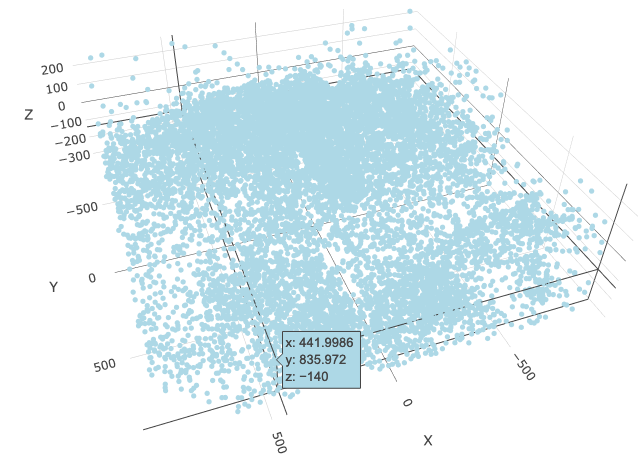{ width=50% } 

```{r, eval=FALSE}
spatPlot2D(gobject = merFISH_test, point_size = 1.0, 
           cell_color = 'cell_types', cell_color_code = mycolorcode,
           select_cell_groups = 'Excitatory', show_other_cells = F,
           group_by = 'layer_ID', cow_n_col = 2, group_by_subset = c(seq(260, -290, -100)),
           save_param = c(save_name = '7_g_spatPlot2D_cell_types_excit'))
```

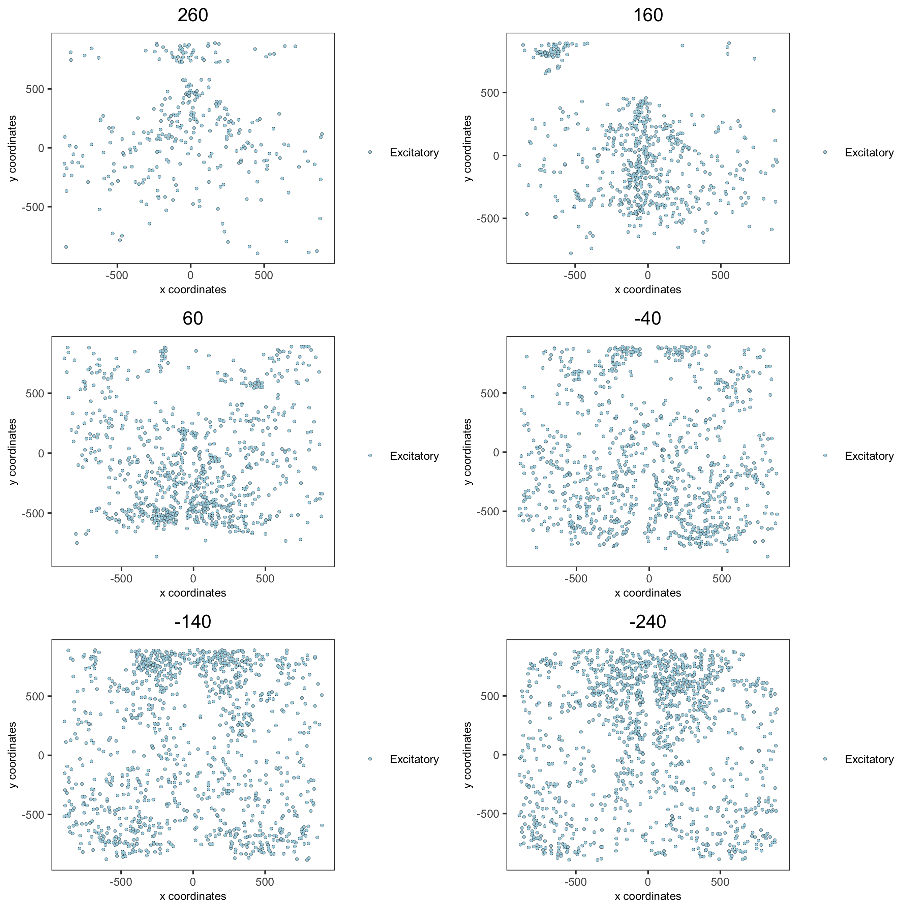{ width=50% } 

### Inhibitory cells only
```{r, eval=FALSE}
# inhibitory
spatPlot3D(merFISH_test,
           cell_color = 'cell_types', axis_scale = 'real',
           sdimx = 'sdimx', sdimy = 'sdimy', sdimz = 'sdimz',
           show_grid = F, cell_color_code = mycolorcode,
           select_cell_groups = 'Inhibitory', show_other_cells = F,
           save_param = c(save_name = '7_h_spatPlot_cell_types_inhib'))
```

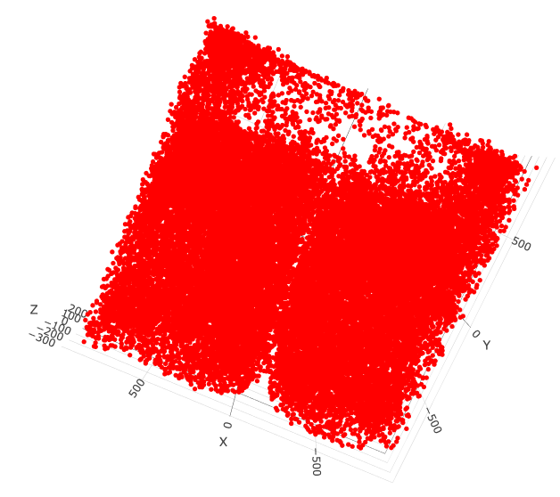{ width=50% } 

```{r, eval=FALSE}
spatPlot2D(gobject = merFISH_test, point_size = 1.0, 
           cell_color = 'cell_types', cell_color_code = mycolorcode,
           select_cell_groups = 'Inhibitory', show_other_cells = F,
           group_by = 'layer_ID', cow_n_col = 2, group_by_subset = c(seq(260, -290, -100)),
           save_param = c(save_name = '7_i_spatPlot2D_cell_types_inhib'))
```

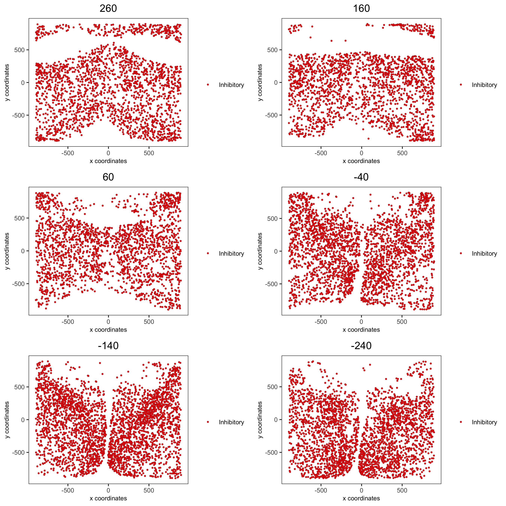{ width=50% } 

### OD and astrocytes only
```{r, eval=FALSE}
spatPlot3D(merFISH_test,
           cell_color = 'cell_types', axis_scale = 'real',
           sdimx = 'sdimx', sdimy = 'sdimy', sdimz = 'sdimz',
           show_grid = F, cell_color_code = mycolorcode,
           select_cell_groups = c('Astrocyte', 'OD Mature', 'OD Immature'), show_other_cells = F,
           save_param = c(save_name = '7_j_spatPlot_cell_types_ODandAstro'))
```

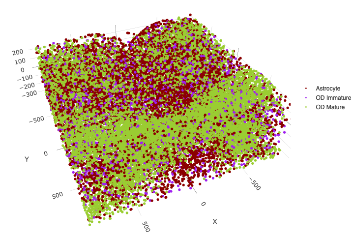{ width=50% } 

```{r, eval=FALSE}
spatPlot2D(gobject = merFISH_test, point_size = 1.0, 
           cell_color = 'cell_types', cell_color_code = mycolorcode,
           select_cell_groups = c('Astrocyte', 'OD Mature', 'OD Immature'), show_other_cells = F,
           group_by = 'layer_ID', cow_n_col = 2, group_by_subset = c(seq(260, -290, -100)),
           save_param = c(save_name = '7_k_spatPlot2D_cell_types_ODandAstro'))
```

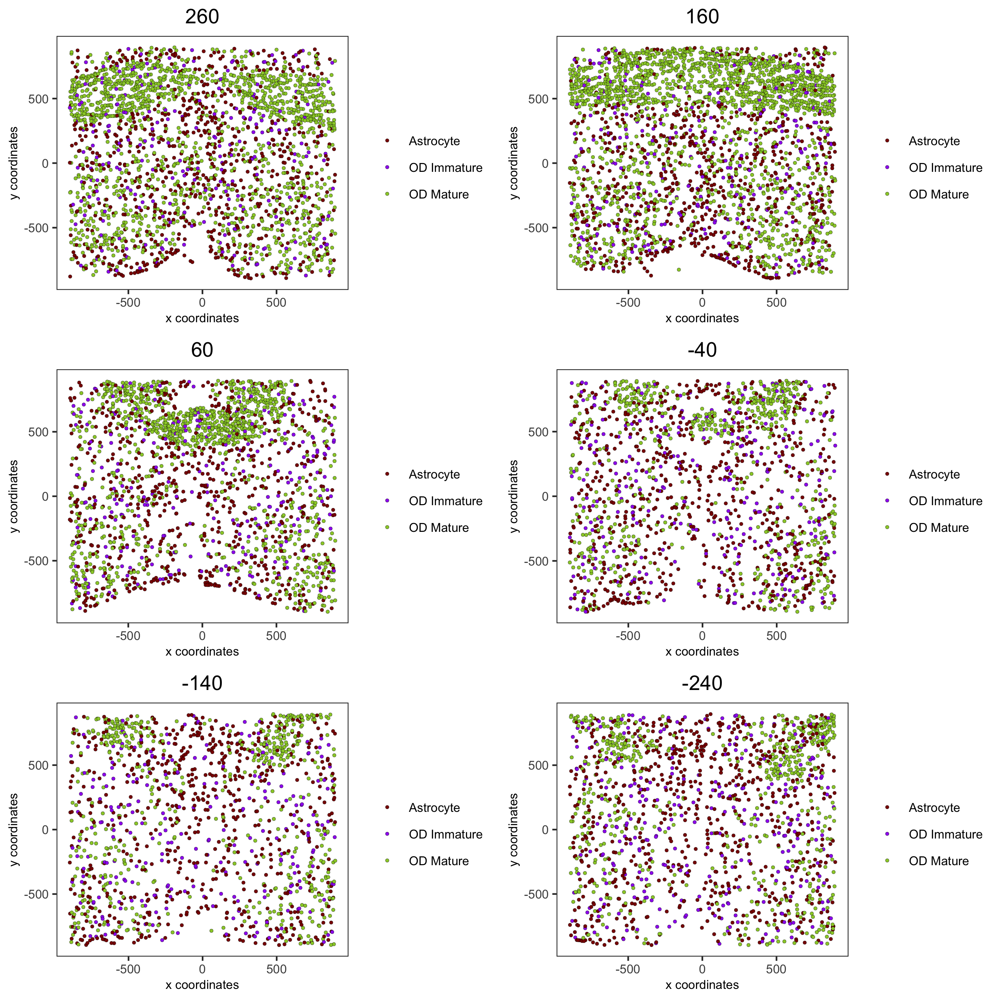{ width=50% } 

### Other cells only
```{r, eval=FALSE}
spatPlot3D(merFISH_test,
           cell_color = 'cell_types', axis_scale = 'real',
           sdimx = 'sdimx', sdimy = 'sdimy', sdimz = 'sdimz',
           show_grid = F, cell_color_code = mycolorcode,
           select_cell_groups = c('Microglia', 'Ependymal', 'Endothelial'), show_other_cells = F,
           save_param = c(save_name = '7_l_spatPlot_cell_types_other'))
```

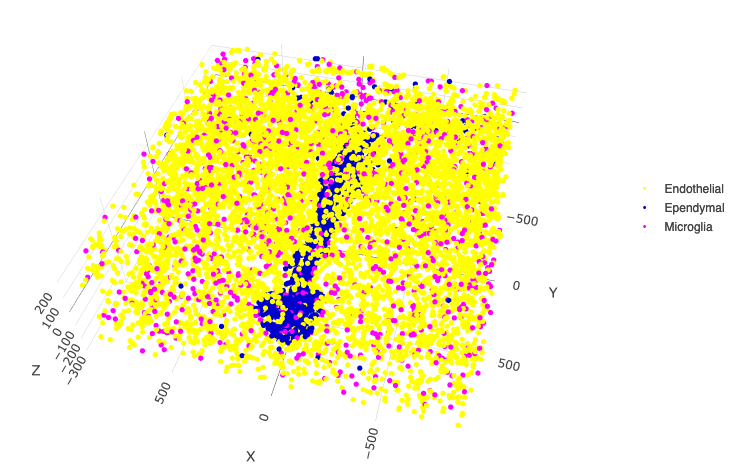{ width=50% } 

```{r, eval=FALSE}
spatPlot2D(gobject = merFISH_test, point_size = 1.0, 
           cell_color = 'cell_types', cell_color_code = mycolorcode,
           select_cell_groups = c('Microglia', 'Ependymal', 'Endothelial'), show_other_cells = F,
           group_by = 'layer_ID', cow_n_col = 2, group_by_subset = c(seq(260, -290, -100)),
           save_param = c(save_name = '7_m_spatPlot2D_cell_types_other'))
```

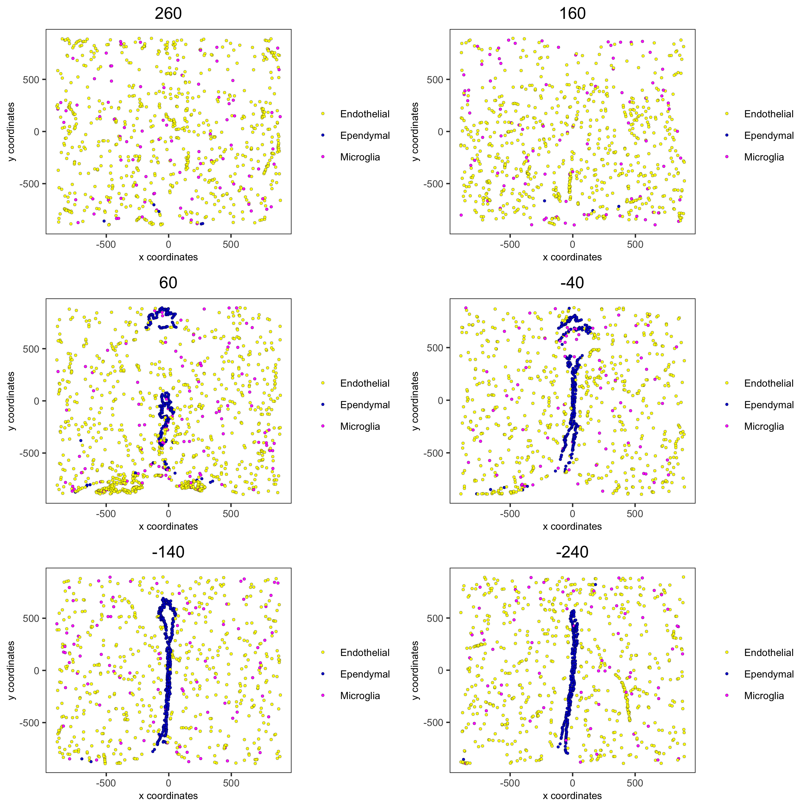{ width=50% } 


