```{r, include = FALSE}
knitr::opts_chunk$set(
  collapse = TRUE,
  comment = "#>",
  fig.path = "man/figures/README-",
  out.width = "100%"
)
```


```{r eval=TRUE, echo=FALSE}
giotto_version = utils::packageVersion(pkg = 'Giotto')

if(giotto_version == '0.3.6.9042') {
  cat('You are using the same Giotto version with which this tutorial was written')
} else if(giotto_version > '0.3.6.9042'){
  warning('This tutorial was written with Giotto version 0.3.6.9042, your version is ', giotto_version, '.', 
  'This is a more recent version and results should be reproducible')
} else {
  warning('This tutorial was written with Giotto version 0.3.6.9042, your version is ', giotto_version, '.', 
  'This is an older version and results could be slightly different')
}
```


```{r eval=FALSE, message=FALSE, warning=FALSE}
library(Giotto)

# 1. set working directory
results_folder = '/path/to/directory/'

# 2. set giotto python path
# set python path to your preferred python version path
# set python path to NULL if you want to automatically install (only the 1st time) and use the giotto miniconda environment
python_path = NULL 
if(is.null(python_path)) {
  installGiottoEnvironment()
}
```


## Dataset explanation
[Codeluppi et al.](https://www.nature.com/articles/s41592-018-0175-z) created a cyclic single-molecule fluorescence in situ hybridization (osmFISH) technology and define the cellular organization of the somatosensory cortex with the expression of 33 genes in 5,328 cells.

{ width=50% }


## Dataset download
The osmFISH data to run this tutorial can be found [here](https://github.com/RubD/spatial-datasets/tree/master/data/2018_osmFISH_SScortex). Alternatively you can use the **getSpatialDataset** to automatically download this dataset like we do in this example.


```{r eval=FALSE, message=FALSE, warning=FALSE}
# download data to working directory ####
# if wget is installed, set method = 'wget'
getSpatialDataset(dataset = 'osmfish_SS_cortex', directory = results_folder, method = 'wget')
```


## Part 1: Giotto global instructions and preparations
```{r eval=FALSE, message=FALSE, warning=FALSE}
## instructions allow us to automatically save all plots into a chosen results folder
instrs = createGiottoInstructions(save_plot = TRUE, 
                                  show_plot = FALSE,
                                  save_dir = results_folder)

expr_path = paste0(results_folder, "osmFISH_prep_expression.txt")
loc_path = paste0(results_folder, "osmFISH_prep_cell_coordinates.txt")
meta_path = paste0(results_folder, "osmFISH_prep_cell_metadata.txt")
```


## part 2: Create Giotto object & process data

```{r eval=FALSE}
## create
osm_test <- createGiottoObject(raw_exprs = expr_path,
                              spatial_locs = loc_path,
                              instructions = instrs)

showGiottoInstructions(osm_test)

## add field annotation
metadata = data.table::fread(file = meta_path)
osm_test = addCellMetadata(osm_test, new_metadata = metadata,
                           by_column = T, column_cell_ID = 'CellID')
## filter
osm_test <- filterGiotto(gobject = osm_test,
                         expression_threshold = 1,
                         gene_det_in_min_cells = 10,
                         min_det_genes_per_cell = 10,
                         expression_values = c('raw'),
                         verbose = T)

## normalize
# 1. standard z-score way
osm_test <- normalizeGiotto(gobject = osm_test)

# 2. osmFISH way
raw_expr_matrix = osm_test@raw_exprs
norm_genes = (raw_expr_matrix/rowSums_giotto(raw_expr_matrix)) * nrow(raw_expr_matrix)
norm_genes_cells = t_giotto((t_giotto(norm_genes)/colSums_giotto(norm_genes)) * ncol(raw_expr_matrix))
osm_test@custom_expr = norm_genes_cells

## add gene & cell statistics
osm_test <- addStatistics(gobject = osm_test)

## add gene & cell statistics
osm_test <- addStatistics(gobject = osm_test)

# save according to giotto instructions
spatPlot(gobject = osm_test, cell_color = 'ClusterName', point_size = 1.5,
         save_param = list(save_name = '2_a_original_clusters'))
```

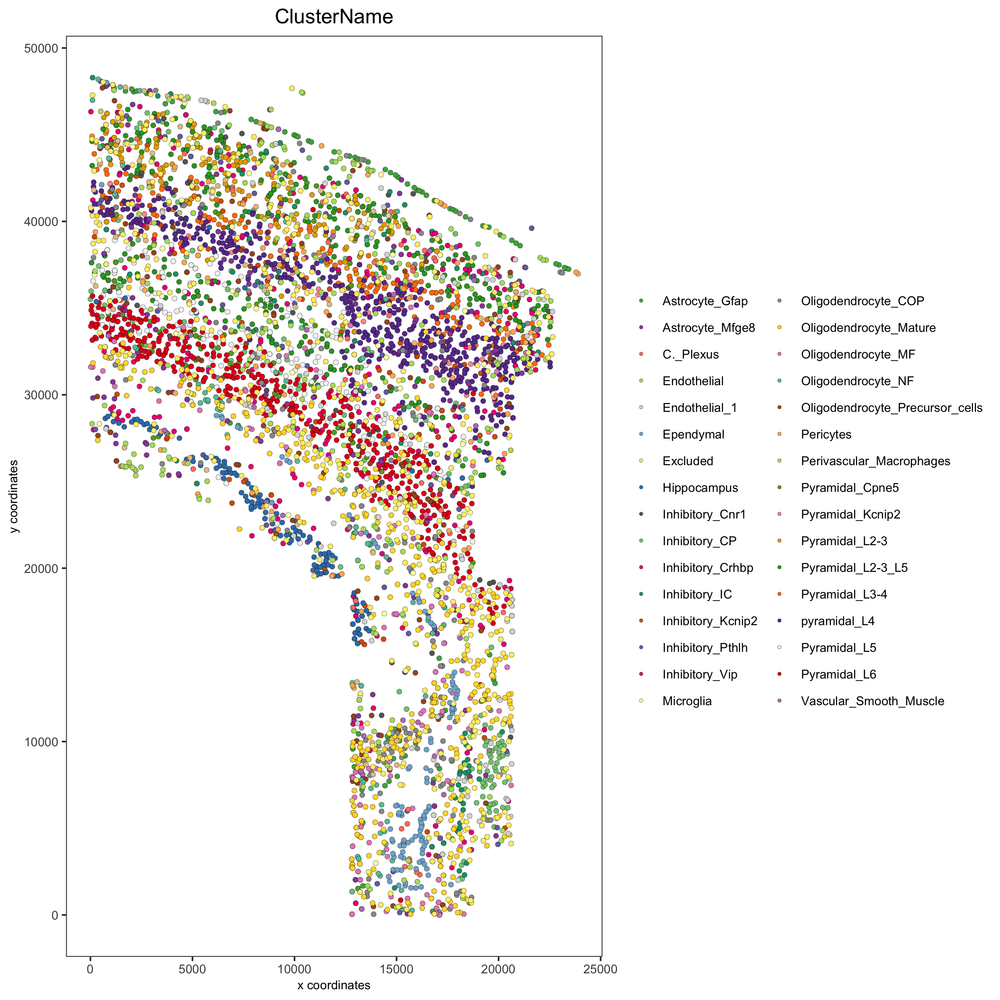{ width=50% } 


```{r eval=FALSE}
spatPlot(gobject = osm_test, cell_color = 'Region',
         save_param = list(save_name = '2_b_original_regions'))
```


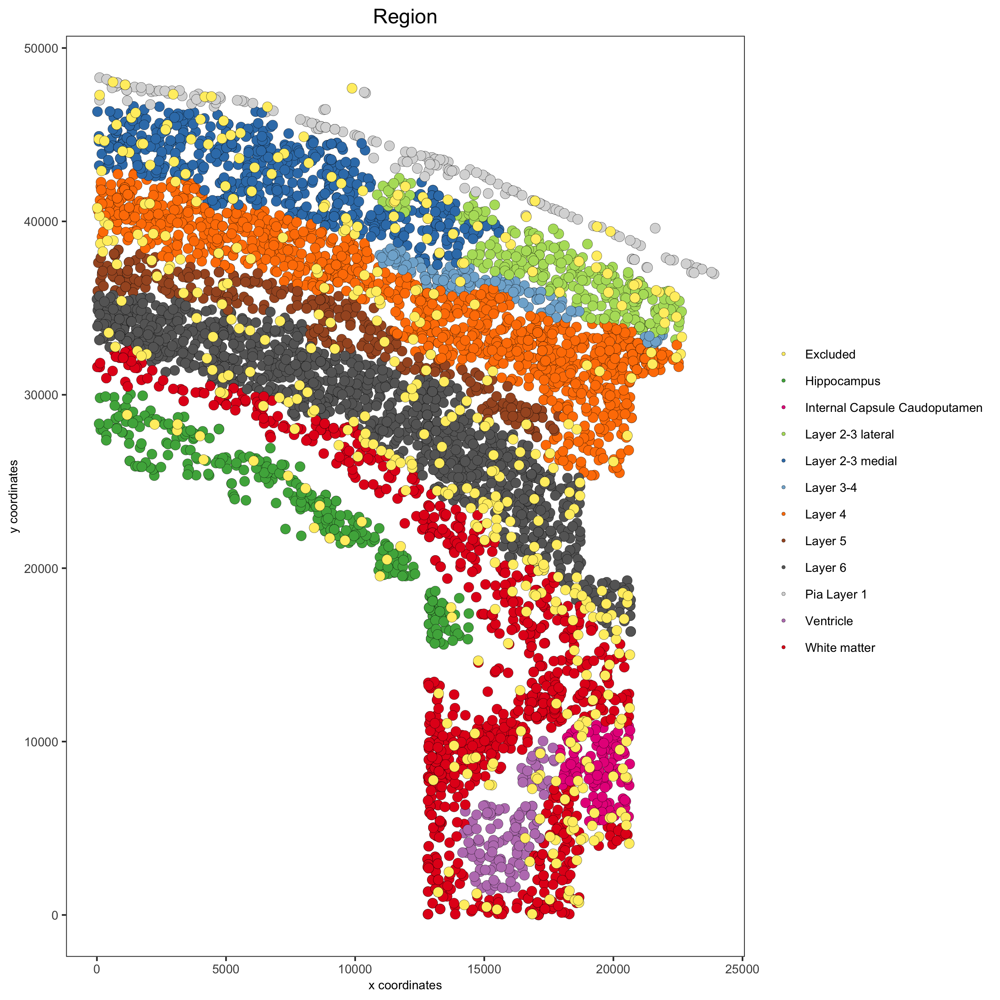{ width=50% }

```{r eval=FALSE}
spatPlot(gobject = osm_test, cell_color = 'ClusterID',
         save_param = list(save_name = '2_c_clusterID'))
```

{ width=50% }

```{r eval=FALSE}
spatPlot(gobject = osm_test, cell_color = 'total_expr', color_as_factor = F, gradient_midpoint = 160,
         gradient_limits = c(120,220),
         save_param = list(save_name = '2_d_total_expr_limits'))
```

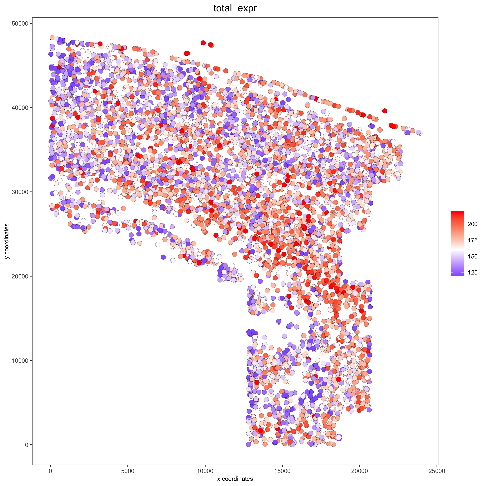{ width=50% }

## Part 3: Dimension reduction

```{r eval=FALSE}

## highly variable genes (HVG)
# only 33 genes so use all genes

## run PCA on expression values (default)
osm_test <- runPCA(gobject = osm_test, expression_values = 'custom', scale_unit = F, center = F)
screePlot(osm_test, ncp = 30,
          save_param = list(save_name = '3_a_screeplot'))
```

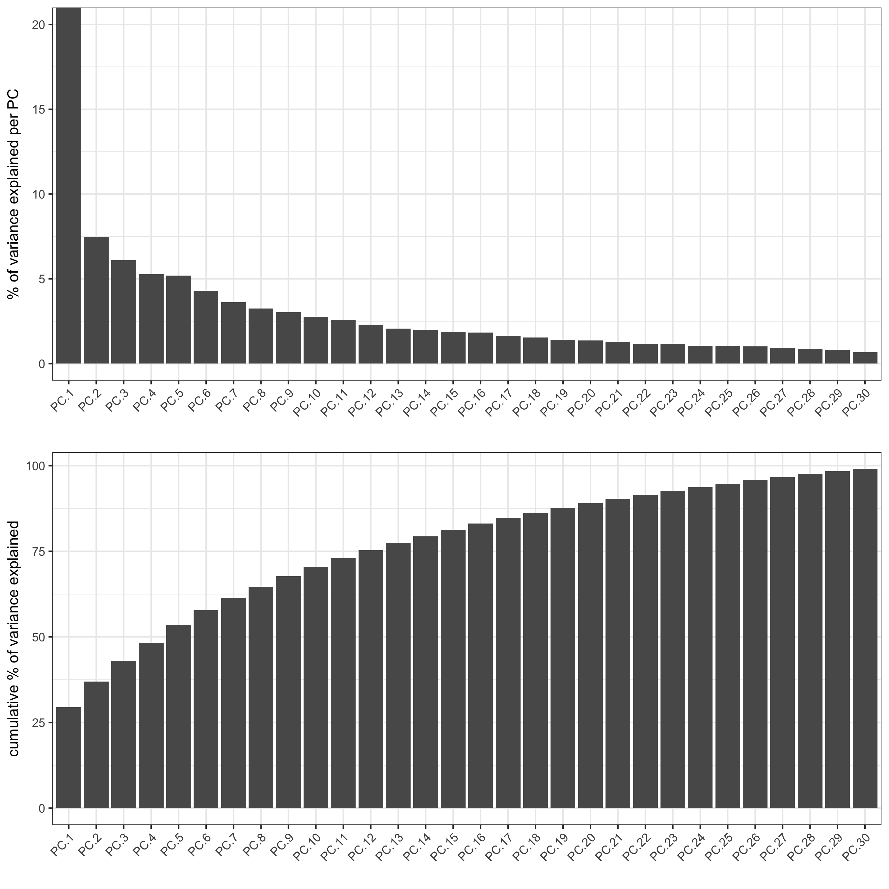{ width=50% }

```{r eval=FALSE}
plotPCA(osm_test,
        save_param = list(save_name = '3_b_PCA_reduction'))
```

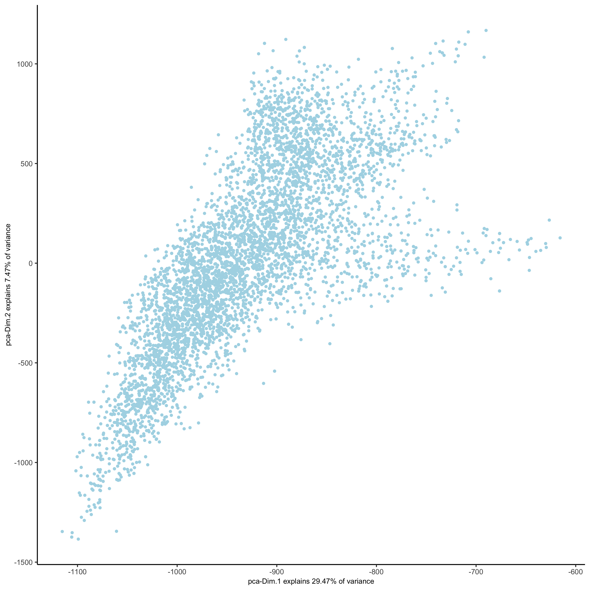{ width=50% }

```{r eval=FALSE}
## run UMAP and tSNE on PCA space (default)
osm_test <- runUMAP(osm_test, dimensions_to_use = 1:31, n_threads = 4)
plotUMAP(gobject = osm_test,
         save_param = list(save_name = '3_c_UMAP_reduction.png'))
```

{ width=50% }

```{r eval=FALSE}
plotUMAP(gobject = osm_test,
         cell_color = 'total_expr', color_as_factor = F, gradient_midpoint = 180, gradient_limits = c(120, 220),
         save_param = list(save_name = '3_d_UMAP_reduction_expression.png'))
```

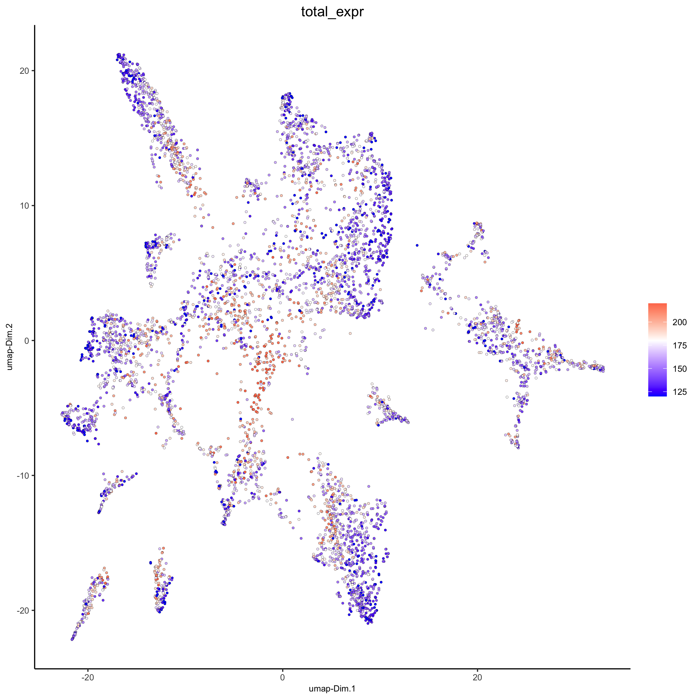{ width=50% }

```{r eval=FALSE}
osm_test <- runtSNE(osm_test, dimensions_to_use = 1:31, perplexity = 70, check_duplicates = F)
plotTSNE(gobject = osm_test,  save_param = list(save_name = '3_e_tSNE_reduction'))
```

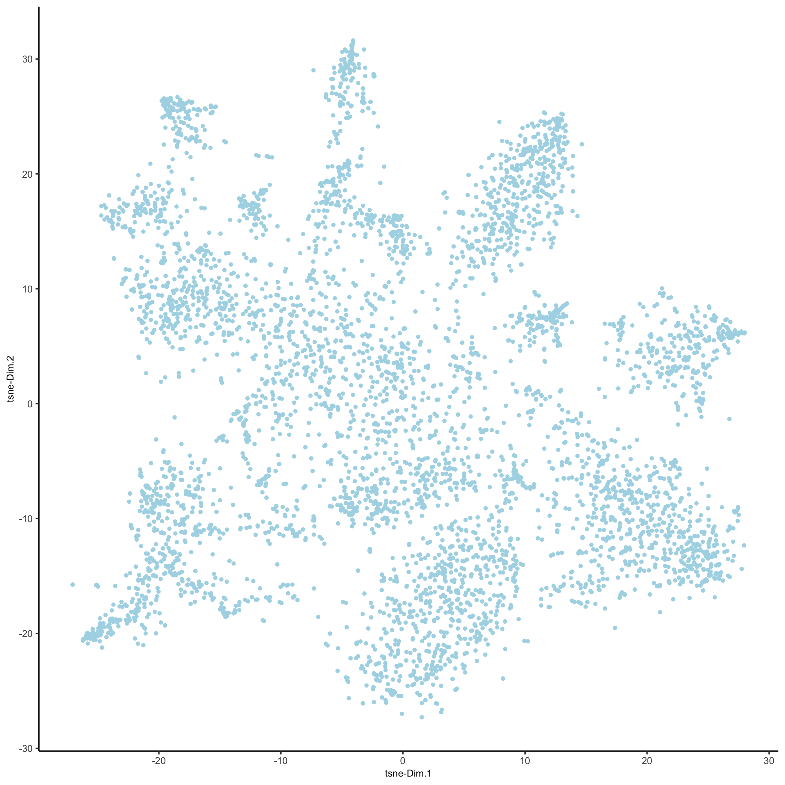{ width=50% }


## Part 4: Cluster

```{r eval=FALSE}

## hierarchical clustering
osm_test = doHclust(gobject = osm_test, expression_values = 'custom', k = 36)
plotUMAP(gobject = osm_test, cell_color = 'hclust', point_size = 2.5,
         show_NN_network = F, edge_alpha = 0.05,
         save_param = list(save_name = '4_a_UMAP_hclust'))
```

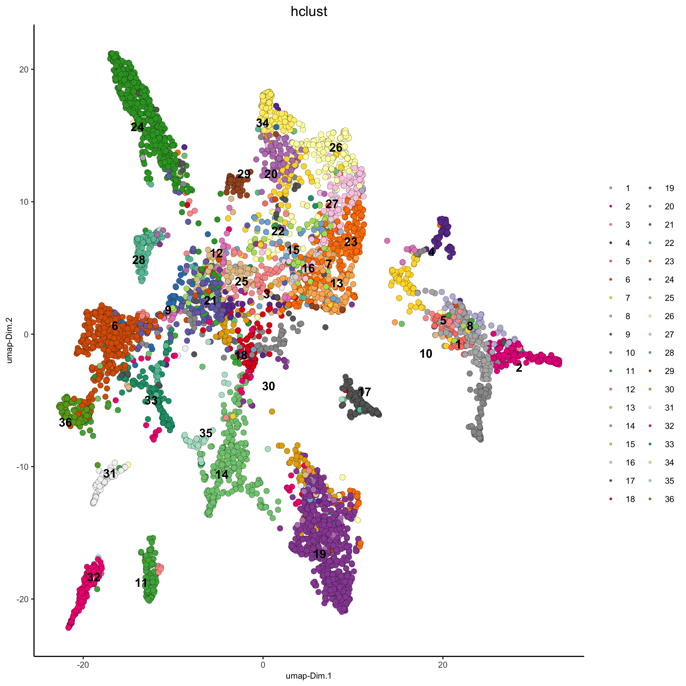{ width=50% }

```{r eval=FALSE}
## kmeans clustering
osm_test = doKmeans(gobject = osm_test, dim_reduction_to_use = 'pca', dimensions_to_use = 1:20, centers = 36, nstart = 2000)
plotUMAP(gobject = osm_test, cell_color = 'kmeans',
         point_size = 2.5, show_NN_network = F, edge_alpha = 0.05, 
         save_param =  list(save_name = '4_b_UMAP_kmeans'))
```

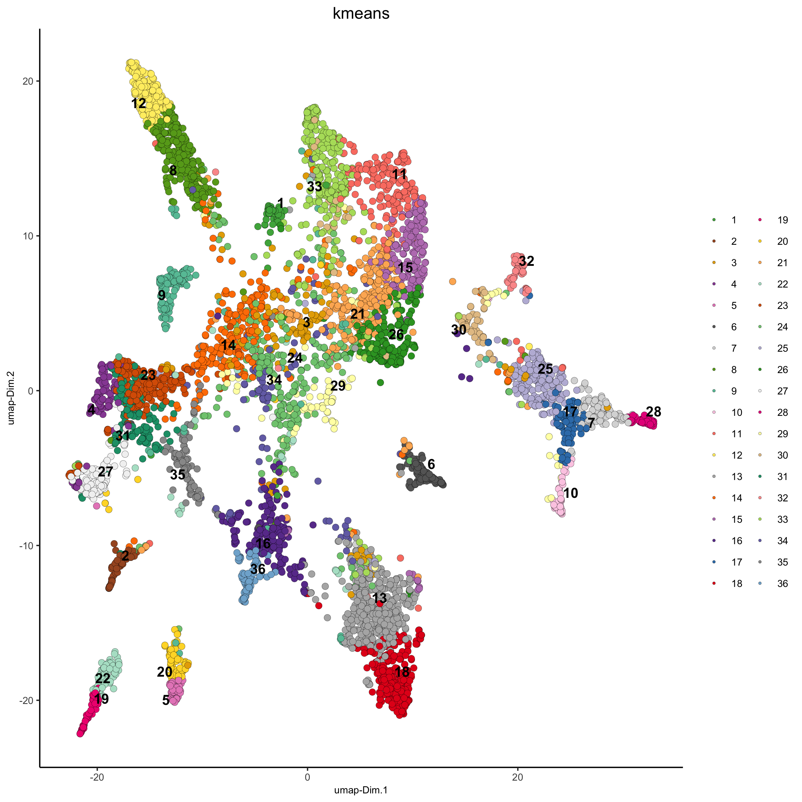{ width=50% }

```{r eval=FALSE}
## Leiden clustering strategy:
# 1. overcluster
# 2. merge small clusters that are highly similar

# sNN network (default)
osm_test <- createNearestNetwork(gobject = osm_test, dimensions_to_use = 1:31, k = 12)

osm_test <- doLeidenCluster(gobject = osm_test, resolution = 0.09, n_iterations = 1000)
plotUMAP(gobject = osm_test, cell_color = 'leiden_clus', point_size = 2.5,
         show_NN_network = F, edge_alpha = 0.05,
         save_param = list(save_name = '4_c_UMAP_leiden'))
```

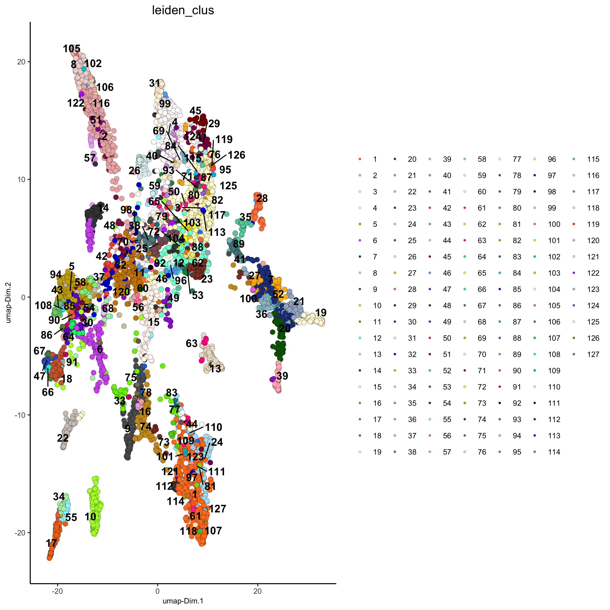{ width=50% }

```{r eval=FALSE}
# merge small groups based on similarity
leiden_similarities = getClusterSimilarity(osm_test,
                                           expression_values = 'custom',
                                           cluster_column = 'leiden_clus')

osm_test = mergeClusters(osm_test,
                         expression_values = 'custom',
                         cluster_column = 'leiden_clus',
                         new_cluster_name = 'leiden_clus_m',
                         max_group_size = 30,
                         force_min_group_size = 25,
                         max_sim_clusters = 10,
                         min_cor_score = 0.7)

plotUMAP(gobject = osm_test, cell_color = 'leiden_clus_m', point_size = 2.5,
         show_NN_network = F, edge_alpha = 0.05,
         save_param = list(save_name = '4_d_UMAP_leiden_merged'))
```

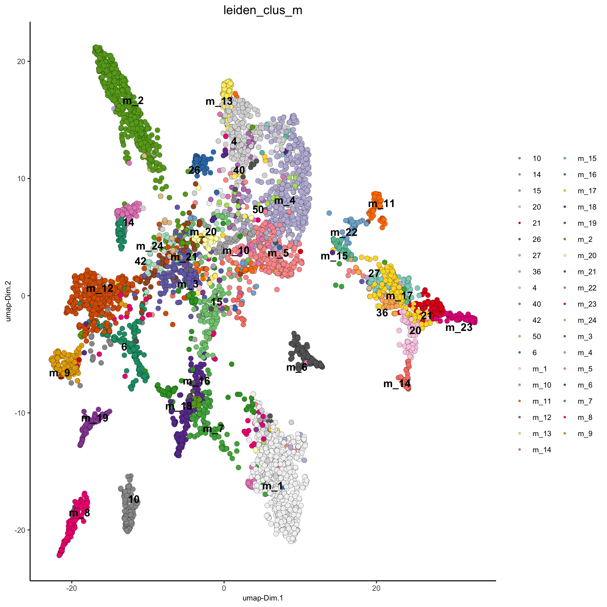{ width=50% }


```{r eval=FALSE}
## show cluster relationships
showClusterHeatmap(gobject = osm_test, expression_values = 'custom', cluster_column = 'leiden_clus_m',
                   save_param = list(save_name = '4_e_heatmap', units = 'cm'),
                   row_names_gp = grid::gpar(fontsize = 6), column_names_gp = grid::gpar(fontsize = 6))
```

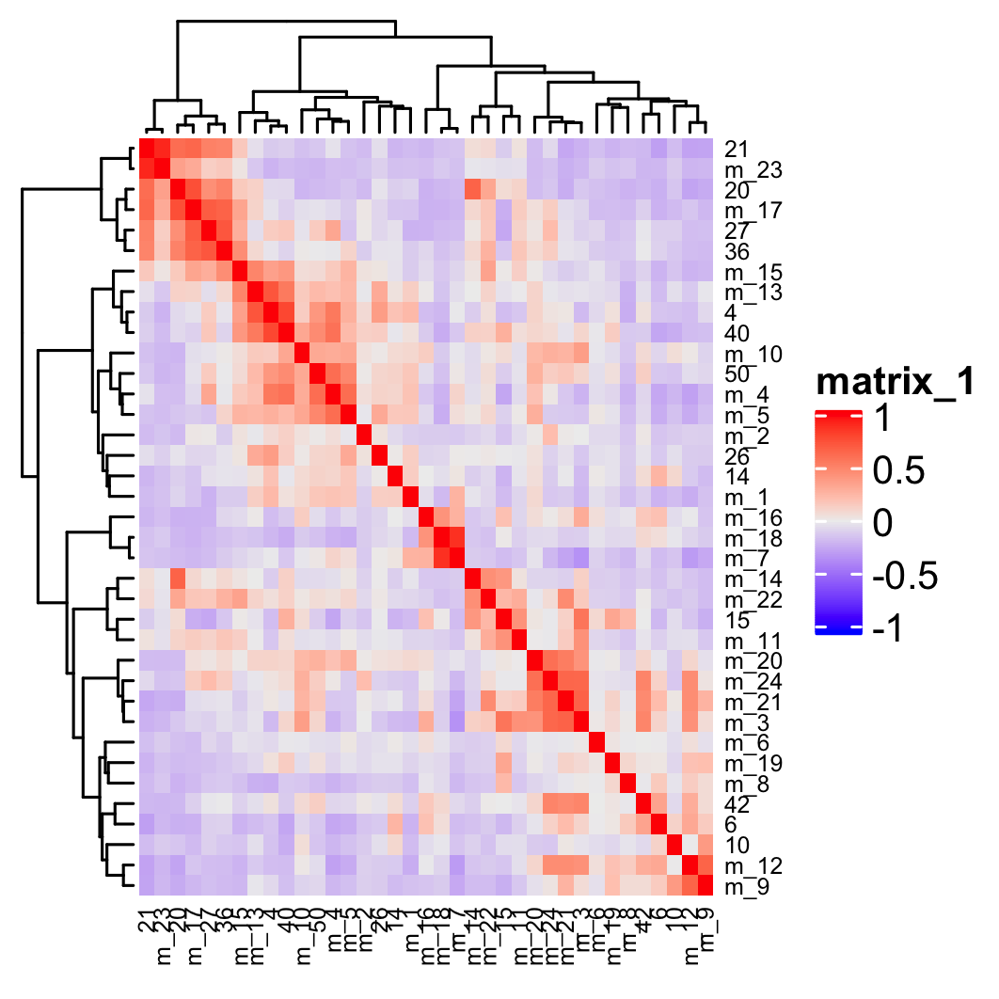{ width=50% }

```{r eval=FALSE}
showClusterDendrogram(osm_test, cluster_column = 'leiden_clus_m', h = 1, rotate = T,
                      save_param = list(save_name = '4_f_dendro', units = 'cm'))

```

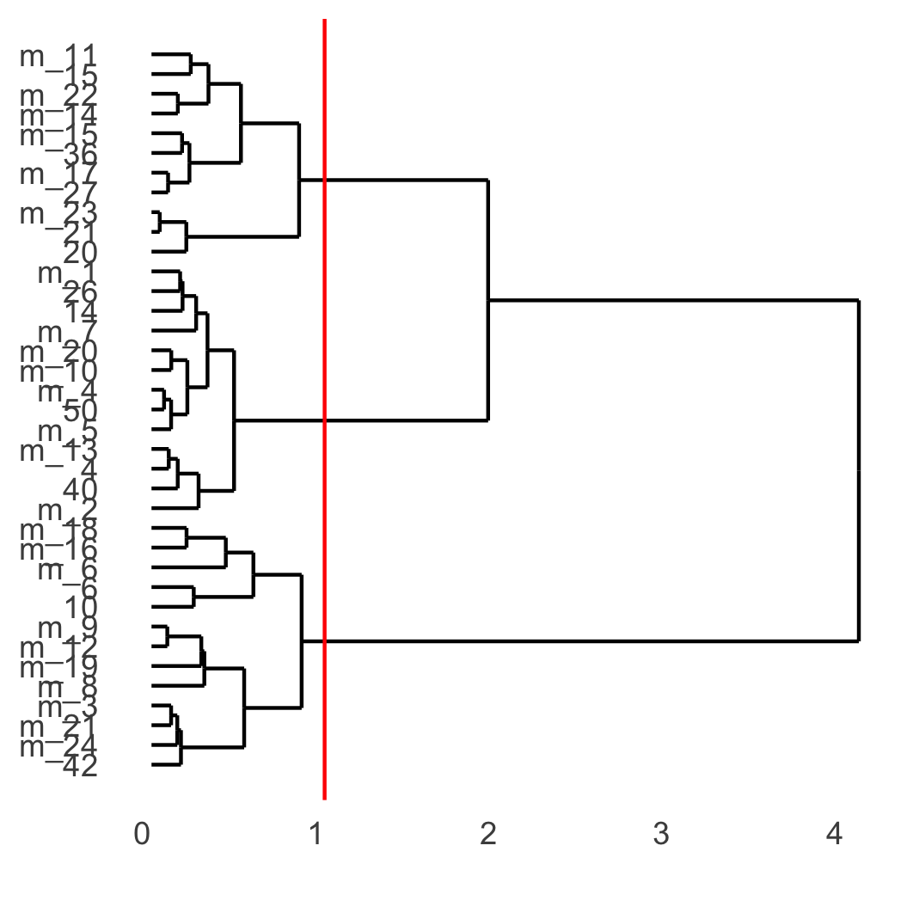{ width=50% }


## Part 5: Co-visualize

```{r eval=FALSE}
# expression and spatial
spatDimPlot2D(gobject = osm_test, cell_color = 'leiden_clus', spat_point_size = 2,
              save_param = list(save_name = '5_a_covis_leiden'))
```

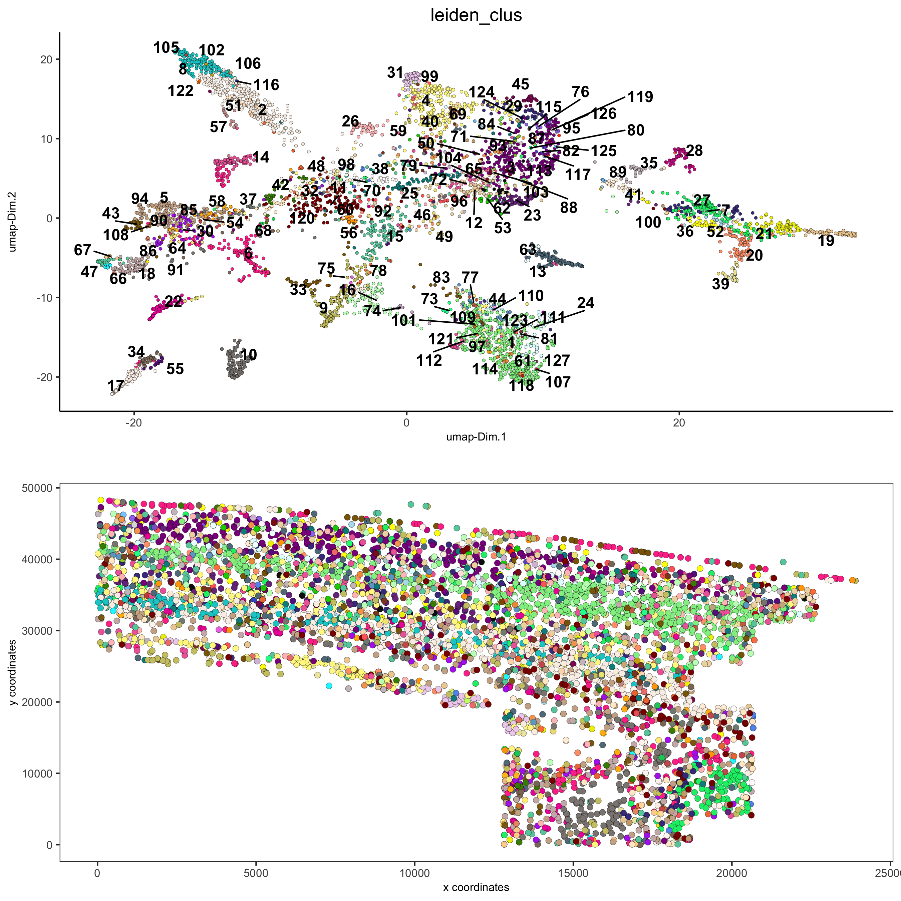{ width=50% }

```{r eval=FALSE}
spatDimPlot2D(gobject = osm_test, cell_color = 'leiden_clus_m', spat_point_size = 2,
              save_param = list(save_name = '5_b_covis_leiden_m'))
```

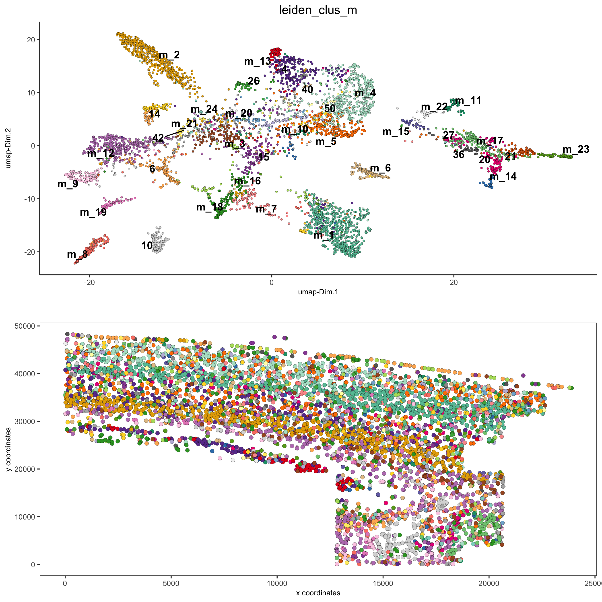{ width=50% }

```{r eval=FALSE}
spatDimPlot2D(gobject = osm_test, cell_color = 'leiden_clus_m', 
              dim_point_size = 2, spat_point_size = 2, select_cell_groups = 'm_8',
              save_param = list(save_name = '5_c_covis_leiden_merged_selected'))
```

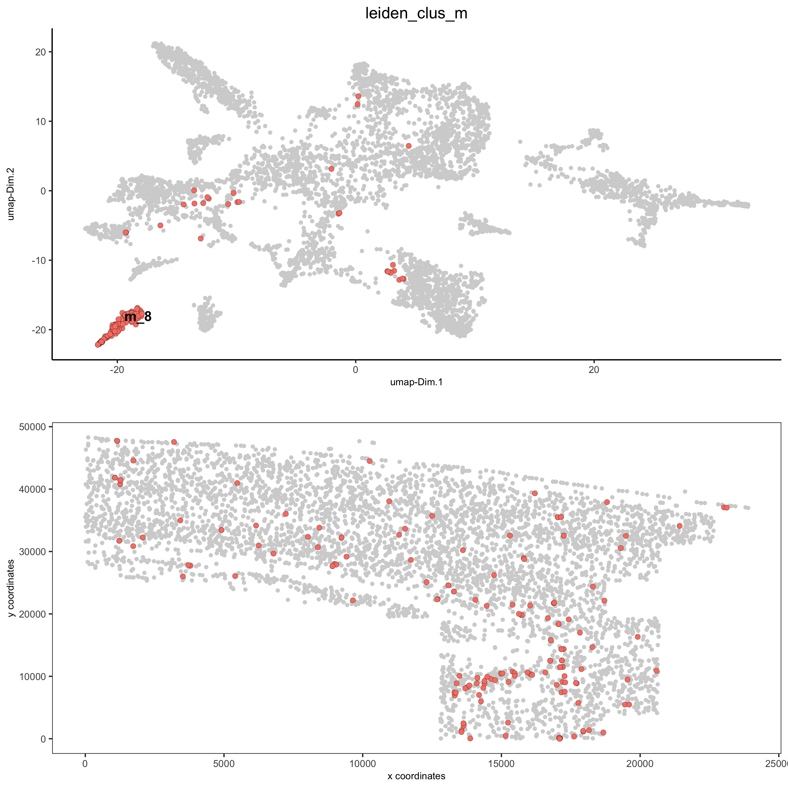{ width=50% }

```{r eval=FALSE}
spatDimPlot2D(gobject = osm_test, cell_color = 'total_expr', color_as_factor = F,
              gradient_midpoint = 160, gradient_limits = c(120,220),
              save_param = list(save_name = '5_d_total_expr'))
```

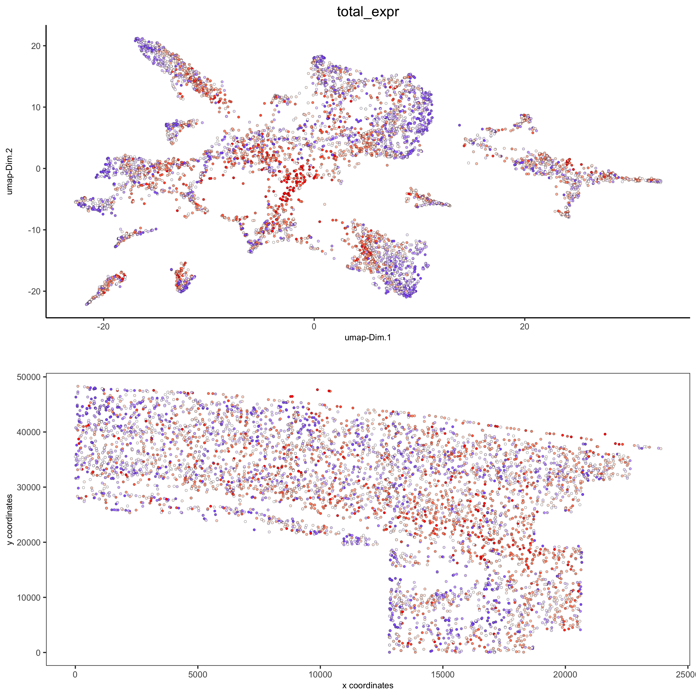{ width=50% }


## Part 6: Differential expression

```{r eval=FALSE}

## split dendrogram nodes ##
dendsplits = getDendrogramSplits(gobject = osm_test,
                                 expression_values = 'custom',
                                 cluster_column = 'leiden_clus_m')
split_3_markers = findGiniMarkers(gobject = osm_test, expression_values = 'custom', cluster_column = 'leiden_clus_m',
                                  group_1 = unlist(dendsplits[3]$tree_1), group_2 = unlist(dendsplits[3]$tree_2))
```


```{r eval=FALSE}
## Individual populations ##
markers = findMarkers_one_vs_all(gobject = osm_test,
                                 method = 'scran',
                                 expression_values = 'custom',
                                 cluster_column = 'leiden_clus_m',
                                 min_genes = 2, rank_score = 2)
## violinplot
topgenes = markers[, head(.SD, 1), by = 'cluster']$genes
violinPlot(osm_test, genes = unique(topgenes), cluster_column = 'leiden_clus_m', expression_values = 'custom',
           strip_text = 5, strip_position = 'right',
           save_param = c(save_name = '6_a_violinplot'))
```


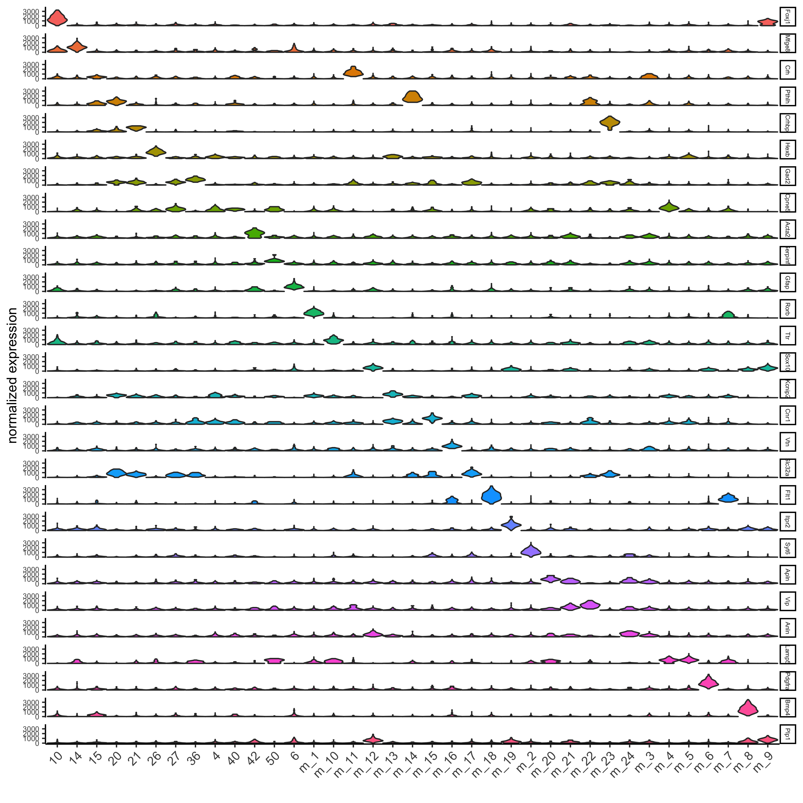{ width=50% }

```{r eval=FALSE}
plotMetaDataHeatmap(osm_test, expression_values = 'custom',
                    metadata_cols = c('leiden_clus_m'), 
                    save_param = c(save_name = '6_b_metaheatmap'))

```


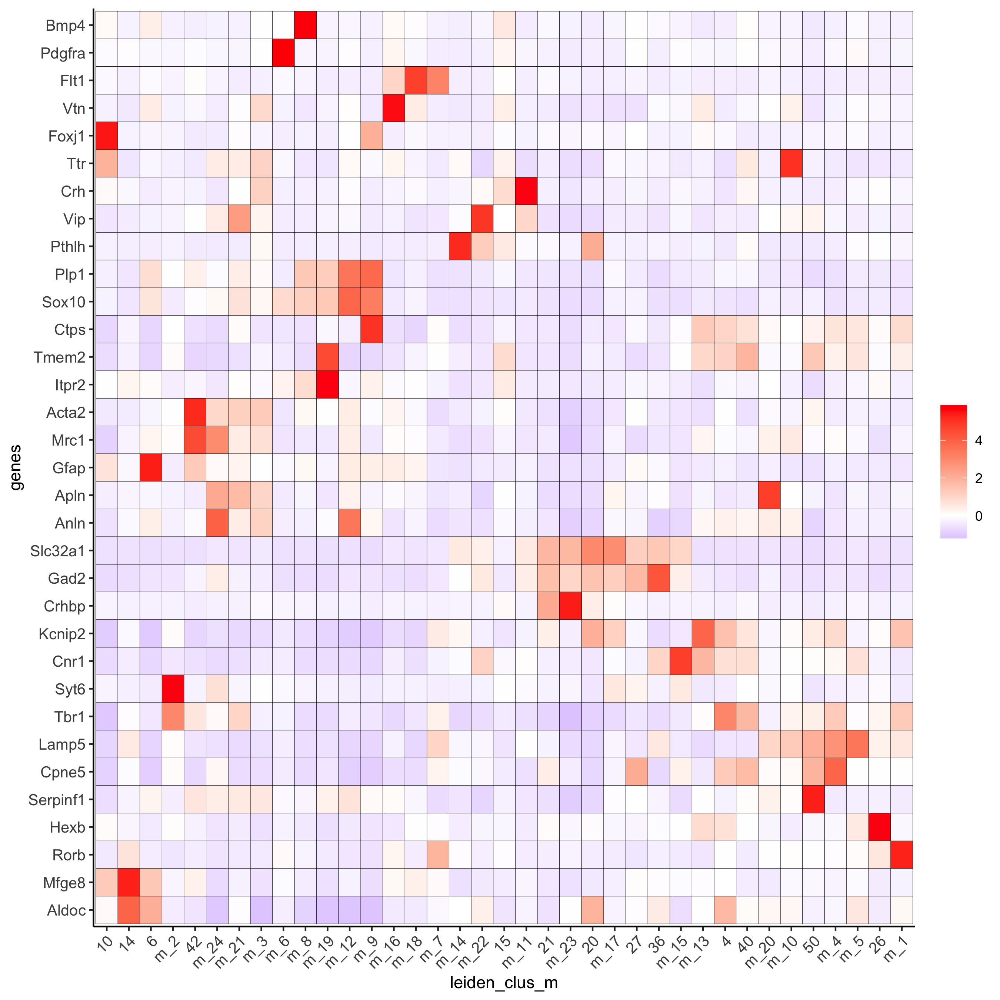{ width=50% }

```{r eval=FALSE}
plotMetaDataHeatmap(osm_test, expression_values = 'custom',
                    metadata_cols = c('leiden_clus_m'), 
                    save_param = c(save_name = '6_e_metaheatmap_all_genes'))
```


{ width=50% }

```{r eval=FALSE}
plotMetaDataHeatmap(osm_test, expression_values = 'custom',
                    metadata_cols = c('ClusterName'), 
                    save_param = c(save_name = '6_f_metaheatmap_all_genes_names'))
```


{ width=50% }

## Part 7: Cell type annotation

```{r eval=FALSE}

## create vector with names

## compare clusters with osmFISH paper
clusters_det_SS_cortex = c('Ependymal', 'Astro_Mfge8', 'Astro_Gfap', 'Pyr_L6', 'vSMC',
                           'Anln', 'Anln', 'Anln', 'OPC', 'Olig_COP',
                           'Olig_NF', 'Olig_mature', 'Olig_MF', 'Pericytes', 'Endothelial_Flt1',
                           'Endothelial_Flt1', 'Inh_Kcnip2', 'Inh_Vip', 'unknown', 'Inh_Crh',
                           'Inh', 'Inh_Crhbp', 'Inh_CP','Inh_CP', 'Inh_IC', 
                           'Inh_IC', 'Inh_Cnr1', 'Inh_Kcnip2', 'Pyr_L5', 'Pyr_L5',
                           'Endothelial_Apln', 'C.Plexus', 'Serpinf', 'Pyr_Cpne5', 'Pyr_L2-3-5',
                           'Microglia', 'Pyr_L4')

names(clusters_det_SS_cortex) = c('10', '14', '6', 'm_2', '42', 'm_24', 'm_21', 'm_3', 'm_6', 'm_8',
                                  'm_19', 'm_12', 'm_9', 'm_16', 'm_18', 'm_7', 'm_14', 'm_22', '15', 'm_11',
                                  '21', 'm_23', '20', 'm_17', '27', '36', 'm_15', 'm_13', '4', '40',
                                  'm_20', 'm_10',  '50', 'm_4', 'm_5', '26', 'm_1')

osm_test = annotateGiotto(gobject = osm_test, annotation_vector = clusters_det_SS_cortex,
                          cluster_column = 'leiden_clus_m', name = 'det_cell_types')

spatDimPlot2D(gobject = osm_test, cell_color = 'det_cell_types',dim_point_size = 2, spat_point_size = 2,
              save_param = c(save_name = '7_a_annotation_leiden_merged_detailed'))

```

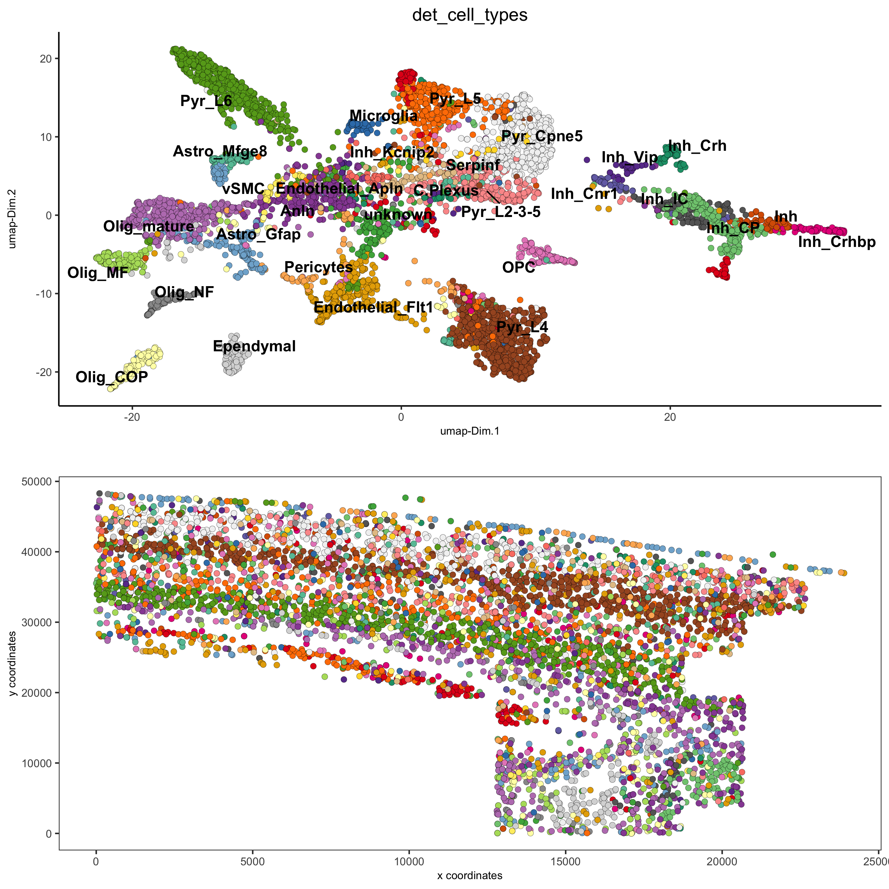{ width=50% }


```{r eval=FALSE}
## coarse cell types
clusters_coarse_SS_cortex = c('Ependymal', 'Astro', 'Astro', 'Pyr', 'vSMC',
                              'Anln', 'Anln', 'Anln', 'OPC', 'Olig',
                              'Olig', 'Olig', 'Olig', 'Pericytes', 'Endothelial', 
                              'Endothelial', 'Inh', 'Inh', 'unknown', 'Inh',
                              'Inh', 'Inh', 'Inh', 'Inh', 'Inh',
                              'Inh', 'Inh', 'Inh', 'Pyr', 'Pyr',
                              'Endothelial', 'C.Plexus', 'Serpinf', 'Pyr', 'Pyr',
                              'Microglia', 'Pyr')

names(clusters_coarse_SS_cortex) = c('Ependymal', 'Astro_Mfge8', 'Astro_Gfap', 'Pyr_L6', 'vSMC',
                                     'Anln', 'Anln', 'Anln', 'OPC', 'Olig_COP',
                                     'Olig_NF', 'Olig_mature', 'Olig_MF', 'Pericytes', 'Endothelial_Flt1',
                                     'Endothelial_Flt1', 'Inh_Kcnip2', 'Inh_Vip', 'unknown', 'Inh_Crh',
                                     'Inh', 'Inh_Crhbp', 'Inh_CP','Inh_CP', 'Inh_IC', 
                                     'Inh_IC', 'Inh_Cnr1', 'Inh_Kcnip2', 'Pyr_L5', 'Pyr_L5',
                                     'Endothelial_Apln', 'C.Plexus', 'Serpinf', 'Pyr_Cpne5', 'Pyr_L2-3-5',
                                     'Microglia', 'Pyr_L4')

osm_test = annotateGiotto(gobject = osm_test, annotation_vector = clusters_coarse_SS_cortex,
                          cluster_column = 'det_cell_types', name = 'coarse_cell_types')
spatDimPlot2D(gobject = osm_test, cell_color = 'coarse_cell_types',dim_point_size = 1.5, spat_point_size = 1.5,
              save_param = c(save_name = '7_b_annotation_leiden_merged_coarse'))

```

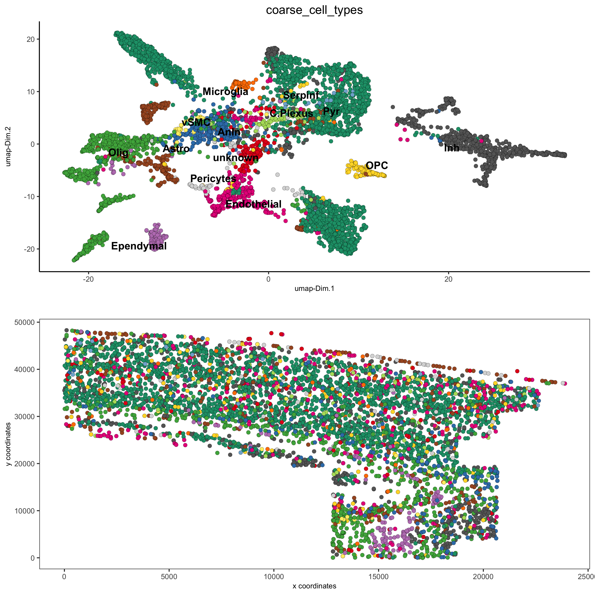{ width=50% }

```{r eval=FALSE}
# heatmaps #
showClusterHeatmap(gobject = osm_test, cluster_column = 'det_cell_types',
                   save_param = c(save_name = '7_c_clusterHeatmap_det_cell_types', units = 'in'))
```

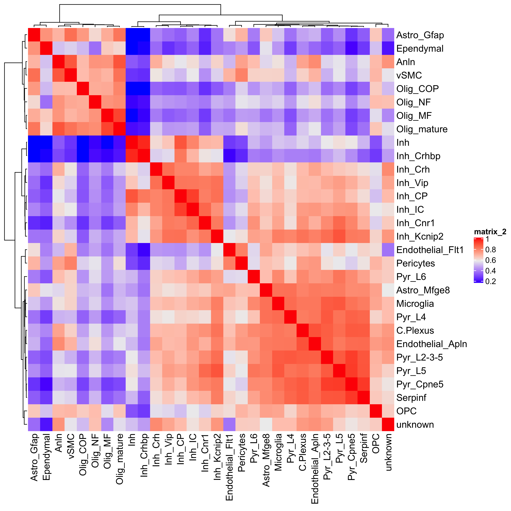{ width=50% }

```{r eval=FALSE}
plotHeatmap(osm_test, genes = osm_test@gene_ID, cluster_column = 'det_cell_types',
            legend_nrows = 2, expression_values = 'custom',
            gene_order = 'correlation', cluster_order = 'correlation',
            save_param = c(save_name = '7_d_heatamp_det_cell_types'))
```

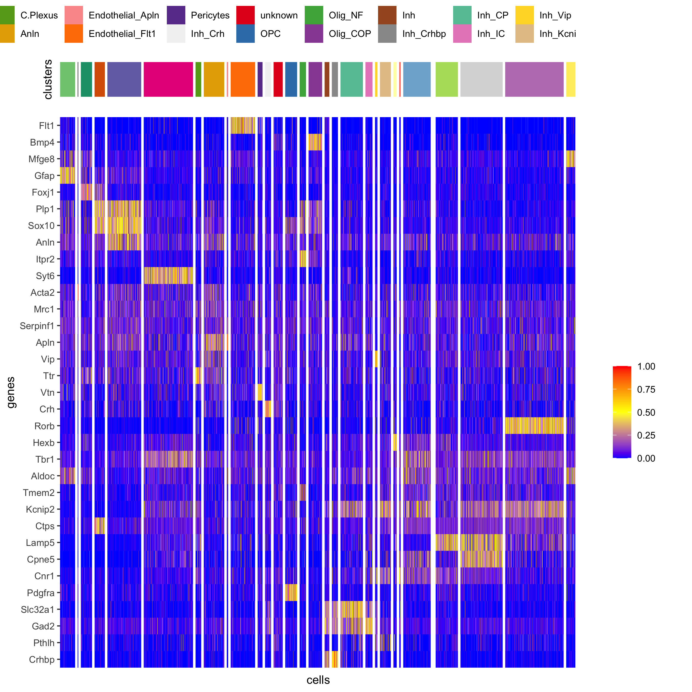{ width=50% }

```{r eval=FALSE}
plotMetaDataHeatmap(osm_test, expression_values = 'custom',
                    metadata_cols = c('det_cell_types'), 
                    save_param = c(save_name = '7_e_metaheatmap'))

```

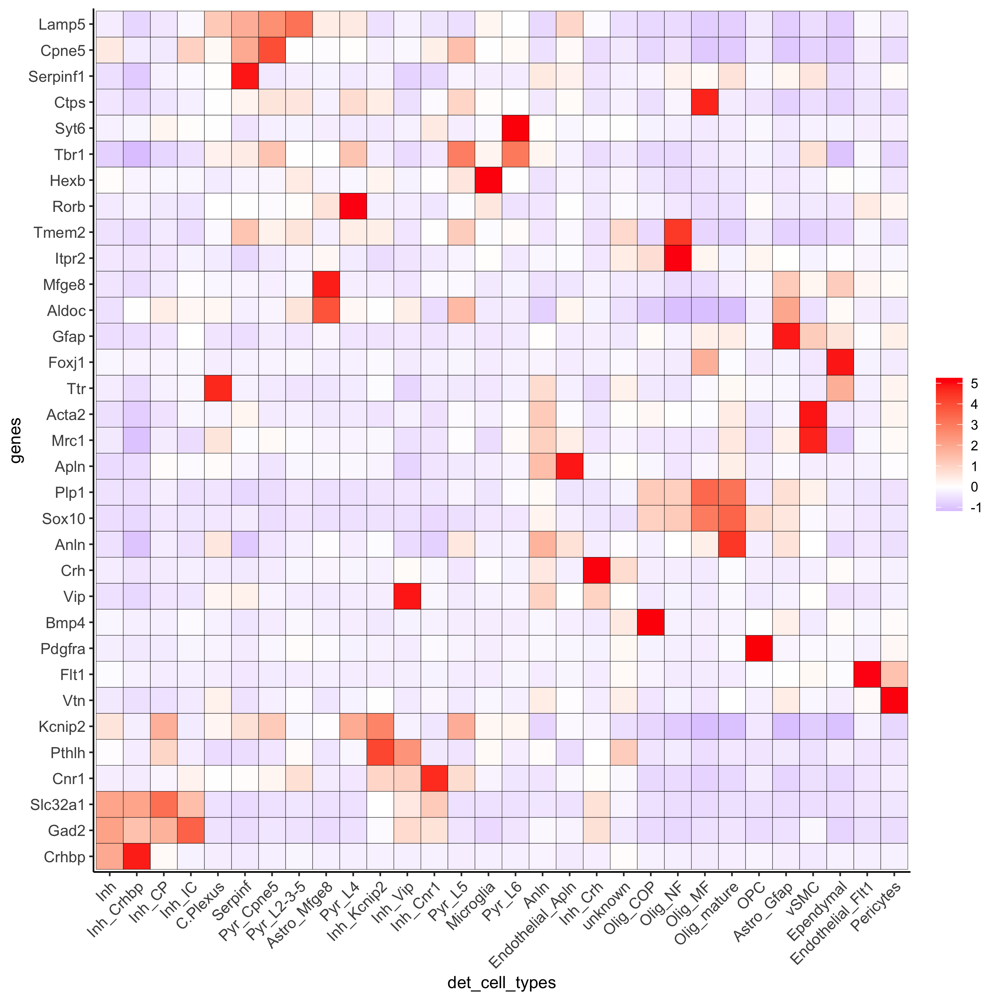{ width=50% }


## Part 8: Spatial grid

```{r eval=FALSE}
osm_test <- createSpatialGrid(gobject = osm_test,
                              sdimx_stepsize = 2000,
                              sdimy_stepsize = 2000,
                              minimum_padding = 0)
spatPlot2D(osm_test, cell_color = 'det_cell_types', show_grid = T,
           grid_color = 'lightblue', spatial_grid_name = 'spatial_grid',
           point_size = 1.5,
           save_param = c(save_name = '8_grid_det_cell_types'))
```

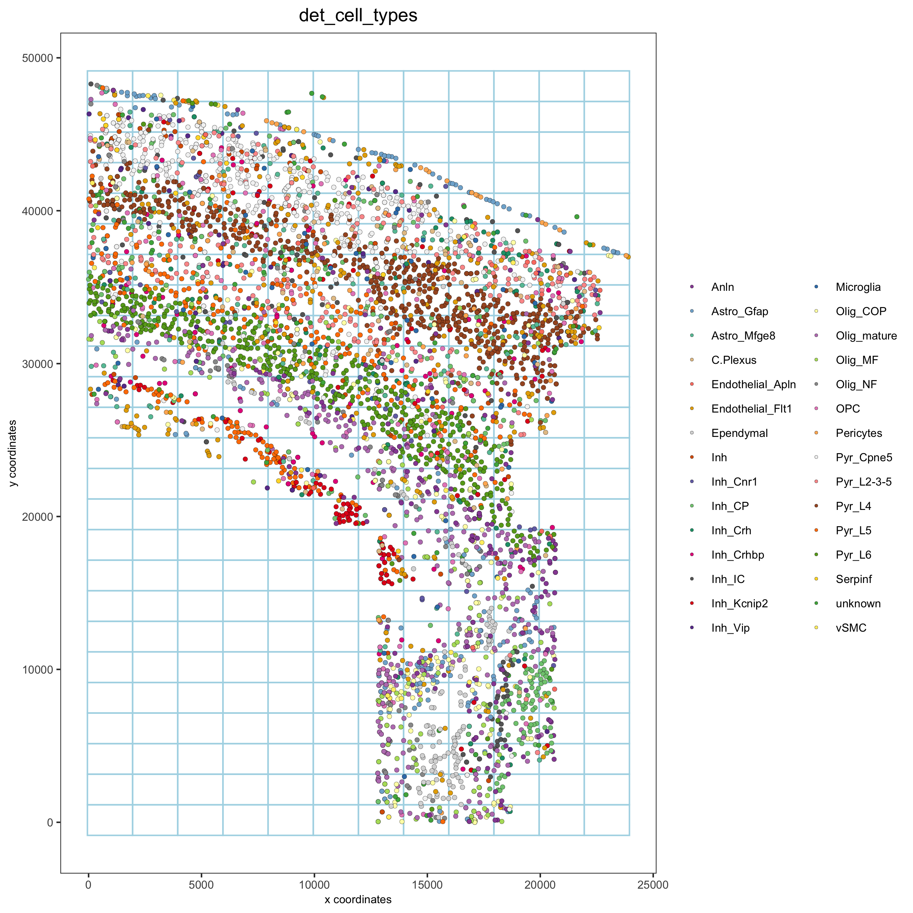{ width=50% }

## Part 9: Spatial network

```{r eval=FALSE}
osm_test <- createSpatialNetwork(gobject = osm_test)
spatPlot2D(gobject = osm_test, show_network = T,
           network_color = 'blue',
           point_size = 1.5, cell_color = 'det_cell_types', legend_symbol_size = 2,
           save_param = c(save_name = '9_spatial_network_k10'))
```

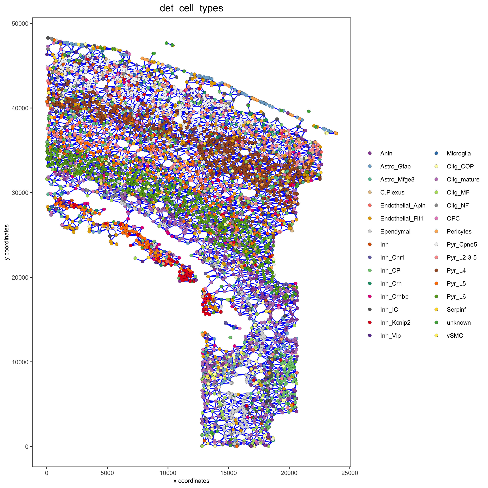{ width=50% }

## Part 10: Spatial genes

```{r eval=FALSE}
# km binarization
kmtest = binSpect(osm_test, bin_method = 'kmeans')

spatDimGenePlot2D(osm_test, expression_values = 'scaled',
                  genes = kmtest$genes[1:4],
                  plot_alignment = 'vertical', cow_n_col = 4,
                  save_param = c(save_name = '10_a_spatial_genes_km', base_height = 5, base_width = 10))
```


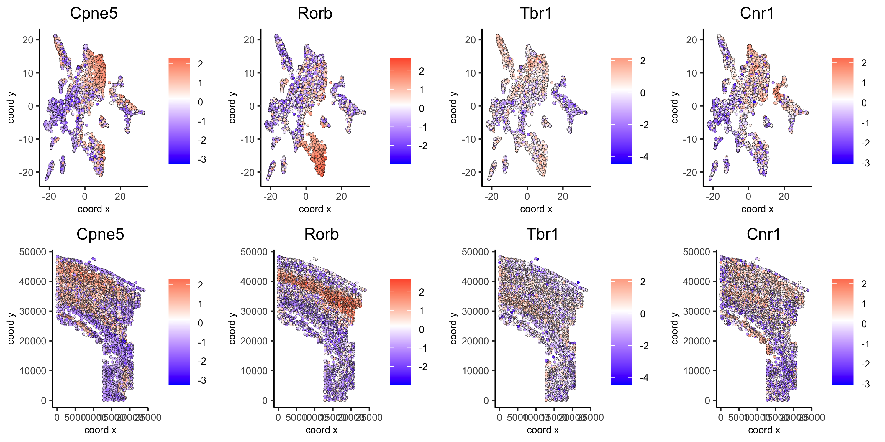{ width=50% }

## Part 12. cell-cell preferential proximity ####

```{r eval=FALSE}
## calculate frequently seen proximities
cell_proximities = cellProximityEnrichment(gobject = osm_test,
                                           cluster_column = 'det_cell_types',
                                           number_of_simulations = 1000)
## barplot
cellProximityBarplot(gobject = osm_test, CPscore = cell_proximities, min_orig_ints = 25, min_sim_ints = 25,
                     save_param = c(save_name = '12_a_barplot_cell_cell_enrichment'))
```

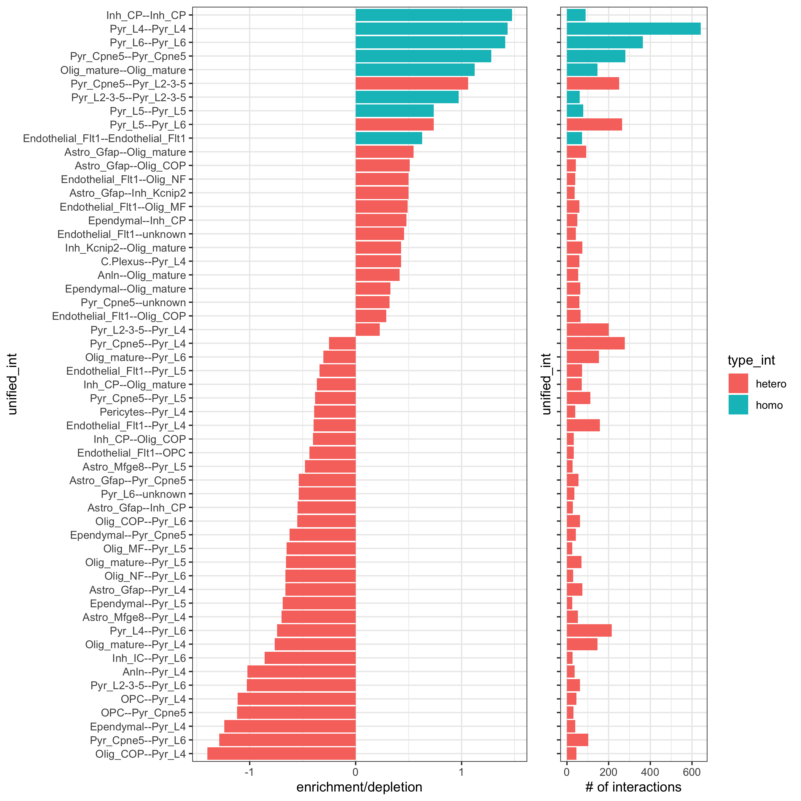{ width=50% }

```{r eval=FALSE}
## heatmap
cellProximityHeatmap(gobject = osm_test, CPscore = cell_proximities, order_cell_types = T, scale = T,
                     color_breaks = c(-1.5, 0, 1.5), color_names = c('blue', 'white', 'red'),
                     save_param = c(save_name = '12_b_heatmap_cell_cell_enrichment', unit = 'in'))
```

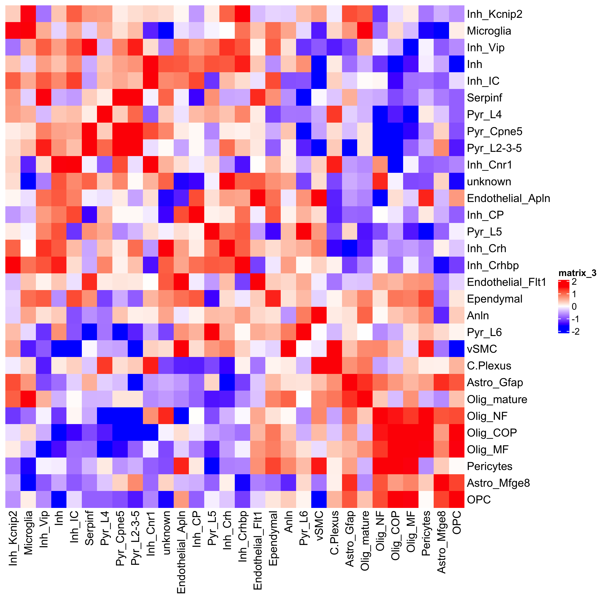{ width=50% }

```{r eval=FALSE}
## network
cellProximityNetwork(gobject = osm_test, CPscore = cell_proximities, remove_self_edges = T, only_show_enrichment_edges = T,
                     save_param = c(save_name = '12_c_network_cell_cell_enrichment'))
```

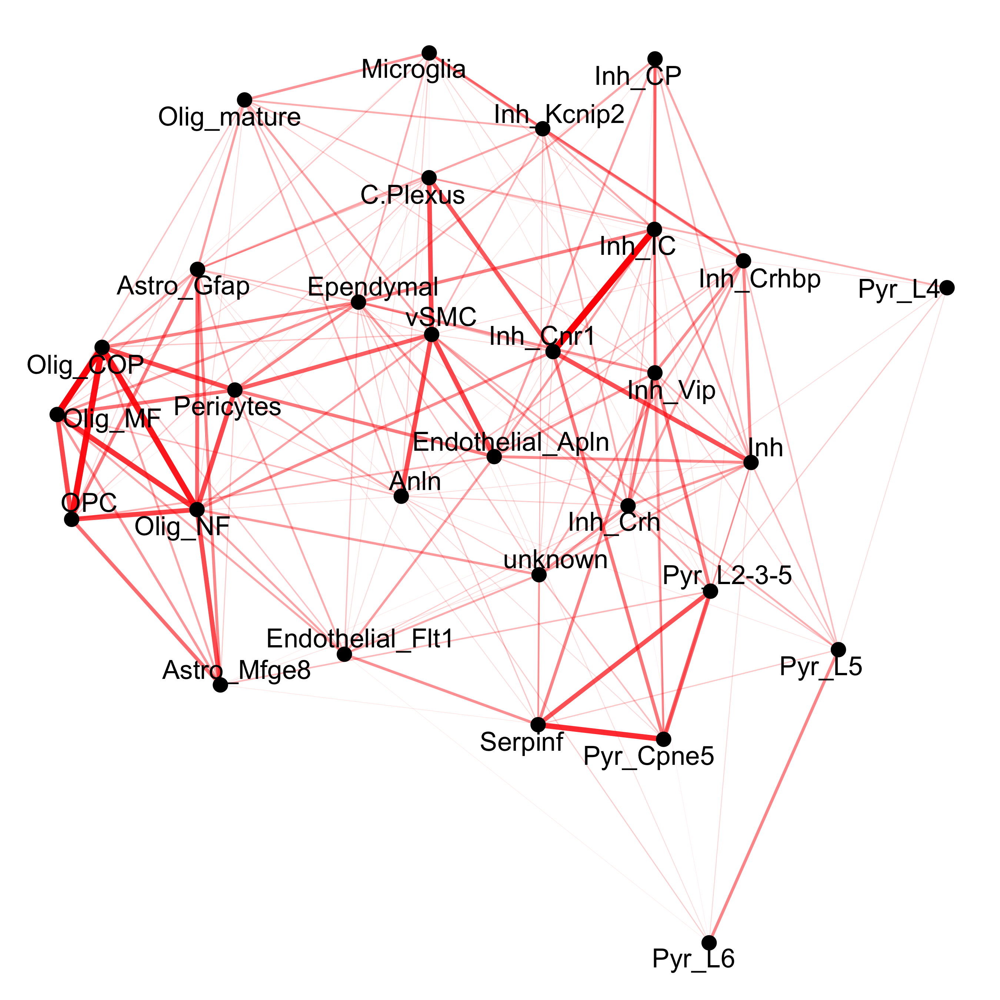{ width=50% }

```{r eval=FALSE}
## visualization
spec_interaction = "Astro_Mfge8--OPC"
cellProximitySpatPlot(gobject = osm_test,
                      interaction_name = spec_interaction,
                      cluster_column = 'det_cell_types', 
                      cell_color = 'det_cell_types', cell_color_code = c('Astro_Mfge8' = 'blue', 'OPC' = 'red'),
                      coord_fix_ratio = 0.5,  point_size_select = 3, point_size_other = 1.5,
                      save_param = c(save_name = '12_d_cell_cell_enrichment_selected'))
```

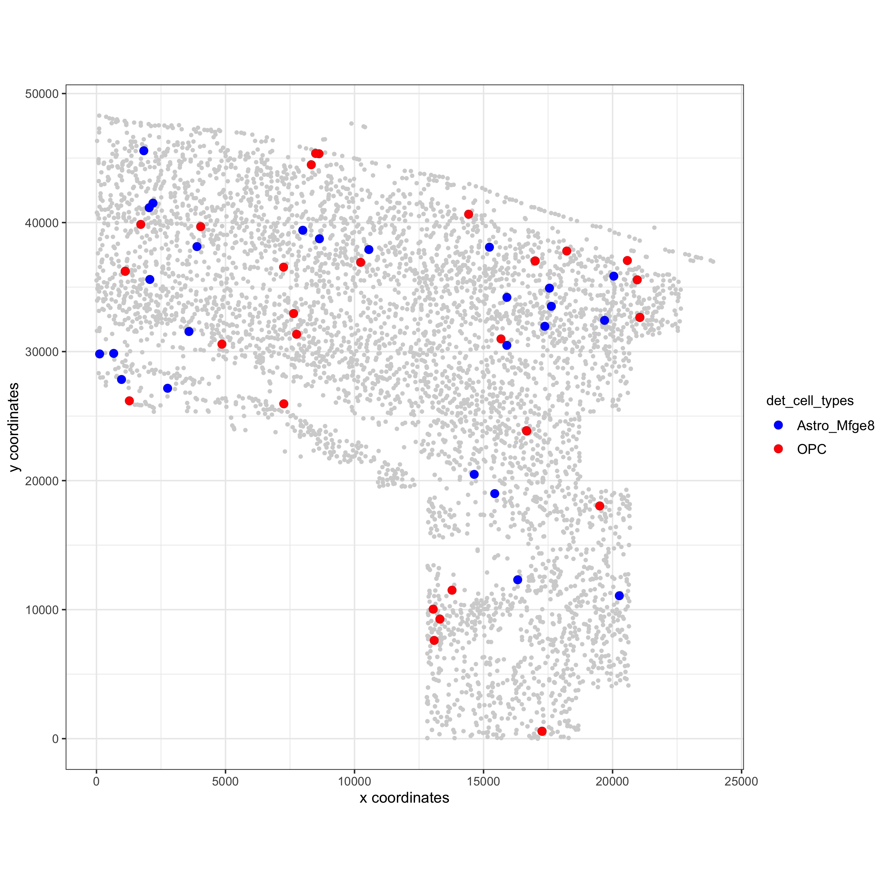{ width=50% }
