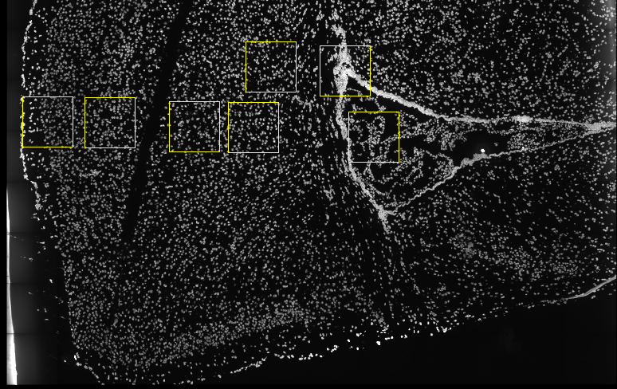
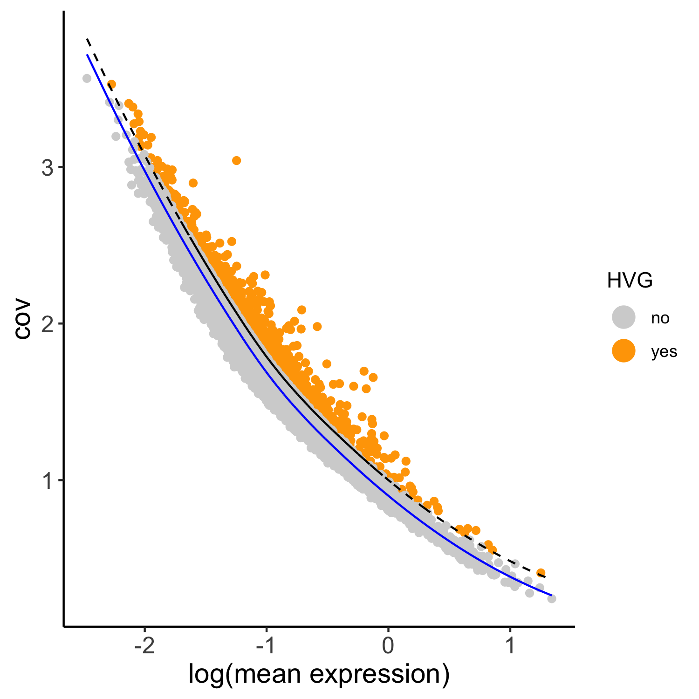
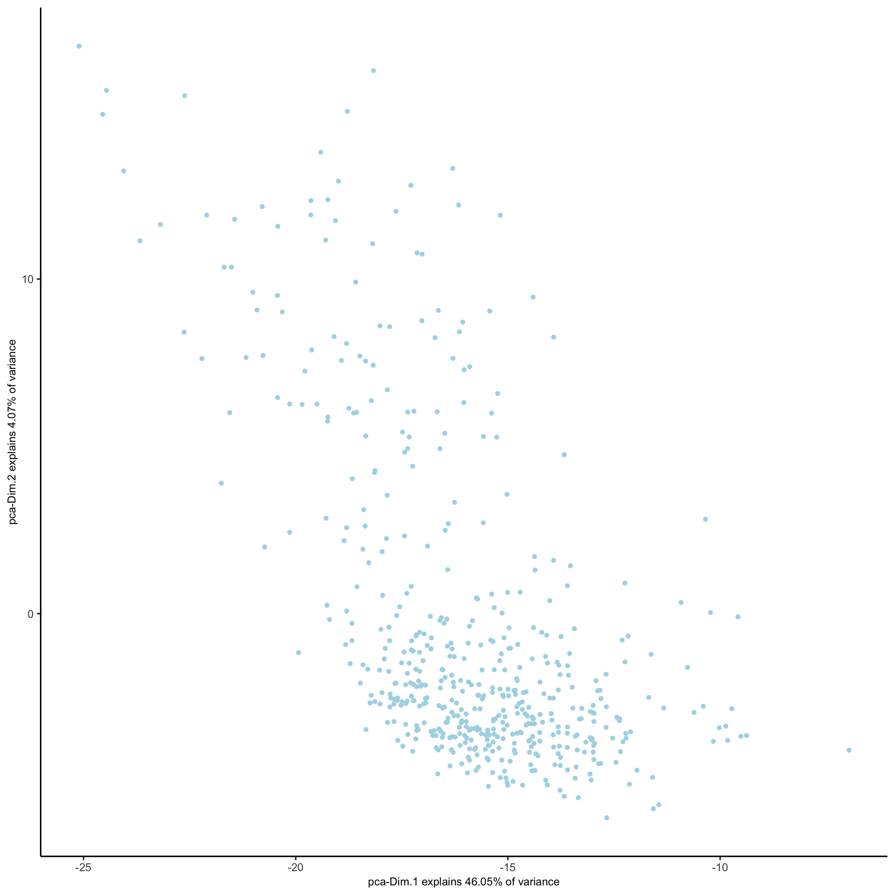
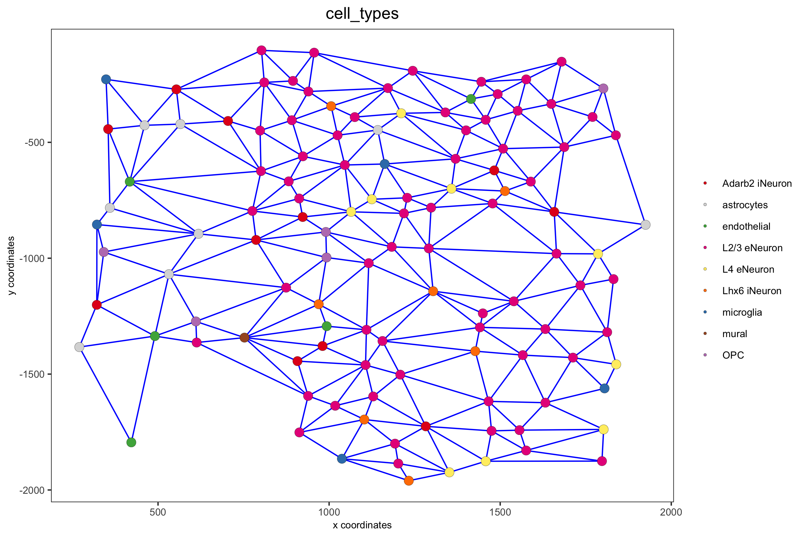

```{r, include = FALSE}
knitr::opts_chunk$set(
  collapse = TRUE,
  comment = "#>",
  fig.path = "man/figures/README-",
  out.width = "100%"
)
```

```{r eval=FALSE, echo=FALSE}
giotto_version = utils::packageVersion(pkg = 'Giotto')

if(giotto_version == '0.3.6.9042') {
  cat('You are using the same Giotto version with which this tutorial was written')
} else if(giotto_version > '0.3.6.9042'){
  warning('This tutorial was written with Giotto version 0.3.6.9042, your version is ', giotto_version, '.', 
  'This is a more recent version and results should be reproducible')
} else {
  warning('This tutorial was written with Giotto version 0.3.6.9042, your version is ', giotto_version, '.', 
  'This is an older version and results could be slightly different')
}
```


## Start Giotto

```{r eval=FALSE, message=FALSE, warning=FALSE}
library(Giotto)

# 1. set working directory
my_working_dir = '/path/to/directory/'

# 2. set giotto python path
# set python path to your preferred python version path
# set python path to NULL if you want to automatically install (only the 1st time) and use the giotto miniconda environment
python_path = NULL 
if(is.null(python_path)) {
  installGiottoEnvironment()
}

```


## Dataset explanation

Several fields - containing 100's of cells - in the mouse cortex and subventricular zone were imaged for seqFISH+. The coordinates of the cells within each field are independent of each other, so in order to visualize and process all cells together imaging fields will be stitched together by providing x and y-offset values specific to each field. These offset values are known or estimates based on the original raw image:  
{ width=50% }


- load somatosensory (SS) cortex and subventricular zone (SVZ) gene expression matrix  
- load cell coordinates and field of view (FOV) information in order to stitch imaging fields  


## Dataset download

The seqFISH+ data to run this tutorial can be downloaded directly using the **getSpatialDataset** function or can also be found [here](https://github.com/RubD/spatial-datasets/tree/master/data/2019_seqfish_plus_SScortex). 

```{r eval=FALSE, echo=TRUE, message=FALSE, warning=FALSE}
# download data to working directory ####
getSpatialDataset(dataset = 'seqfish_SS_cortex', directory = my_working_dir)
```


## Part 1: Giotto global instructions and preparations

```{r eval=FALSE, echo=TRUE, message=FALSE, warning=FALSE}
# 1. (optional) set Giotto instructions
instrs = createGiottoInstructions(save_plot = TRUE, 
                                  show_plot = FALSE,
                                  save_dir = my_working_dir, 
                                  python_path = python_path)

# 2. create giotto object from provided paths ####
expr_path = paste0(my_working_dir, "cortex_svz_expression.txt")
loc_path = paste0(my_working_dir, "cortex_svz_centroids_coord.txt")
meta_path = paste0(my_working_dir, "cortex_svz_centroids_annot.txt")


# 3. This dataset contains multiple field of views which need to be stitched together

## first merge location and additional metadata
SS_locations = data.table::fread(loc_path)
cortex_fields = data.table::fread(meta_path)
SS_loc_annot = data.table::merge.data.table(SS_locations, cortex_fields, by = 'ID')
SS_loc_annot[, ID := factor(ID, levels = paste0('cell_',1:913))]
data.table::setorder(SS_loc_annot, ID)

## create file with offset information
my_offset_file = data.table::data.table(field = c(0, 1, 2, 3, 4, 5, 6),
                            x_offset = c(0, 1654.97, 1750.75, 1674.35, 675.5, 2048, 675),
                            y_offset = c(0, 0, 0, 0, -1438.02, -1438.02, 0))

## create a stitch file
stitch_file = stitchFieldCoordinates(location_file = SS_loc_annot,
                                     offset_file = my_offset_file,
                                     cumulate_offset_x = T,
                                     cumulate_offset_y = F,
                                     field_col = 'FOV',
                                     reverse_final_x = F,
                                     reverse_final_y = T)
stitch_file    = stitch_file[,.(ID, X_final, Y_final)]
my_offset_file = my_offset_file[,.(field, x_offset_final, y_offset_final)]

```


## part 2: Create Giotto object & process data

```{r eval=FALSE, echo=TRUE, message=FALSE, warning=FALSE}
## create Giotto object
SS_seqfish <- createGiottoObject(raw_exprs = expr_path,
                                 spatial_locs = stitch_file,
                                 offset_file = my_offset_file,
                                 instructions = instrs)

## add additional annotation if wanted
SS_seqfish = addCellMetadata(SS_seqfish,
                             new_metadata = cortex_fields,
                             by_column = T,
                             column_cell_ID = 'ID')

## subset data to the cortex field of views
cell_metadata = pDataDT(SS_seqfish)
cortex_cell_ids = cell_metadata[FOV %in% 0:4]$cell_ID
SS_seqfish = subsetGiotto(SS_seqfish, cell_ids = cortex_cell_ids)

## filter
SS_seqfish <- filterGiotto(gobject = SS_seqfish,
                        expression_threshold = 1,
                        gene_det_in_min_cells = 10,
                        min_det_genes_per_cell = 10,
                        expression_values = c('raw'),
                        verbose = T)

## normalize
SS_seqfish <- normalizeGiotto(gobject = SS_seqfish, scalefactor = 6000, verbose = T)

## add gene & cell statistics
SS_seqfish <- addStatistics(gobject = SS_seqfish)

## adjust expression matrix for technical or known variables
SS_seqfish <- adjustGiottoMatrix(gobject = SS_seqfish, expression_values = c('normalized'),
                              batch_columns = NULL, covariate_columns = c('nr_genes', 'total_expr'),
                              return_gobject = TRUE,
                              update_slot = c('custom'))

## visualize
spatPlot(gobject = SS_seqfish,
         save_param = list(save_name = '2_a_spatplot'))

```

{ width=50% } 
  
## part 3: dimension reduction

```{r eval=FALSE}
## highly variable genes (HVG)
SS_seqfish <- calculateHVG(gobject = SS_seqfish, method = 'cov_loess', difference_in_cov = 0.1,
                           save_param = list(save_name = '3_a_HVGplot', base_height = 5, base_width = 5))

```

{ width=50% } 

```{r eval=FALSE}
## select genes based on HVG and gene statistics, both found in gene metadata
gene_metadata = fDataDT(SS_seqfish)
featgenes = gene_metadata[hvg == 'yes' & perc_cells > 4 & mean_expr_det > 0.5]$gene_ID

## run PCA on expression values (default)
SS_seqfish <- runPCA(gobject = SS_seqfish, genes_to_use = featgenes, scale_unit = F, center = F)
screePlot(SS_seqfish, save_param = list(save_name = '3_b_screeplot'))
```

{ width=50% } 

```{r eval=FALSE}
plotPCA(gobject = SS_seqfish,
        save_param = list(save_name = '3_c_PCA_reduction'))
```

{ width=50% } 

```{r eval=FALSE}
## run UMAP and tSNE on PCA space (default)
SS_seqfish <- runUMAP(SS_seqfish, dimensions_to_use = 1:15, n_threads = 10)
plotUMAP(gobject = SS_seqfish,
         save_param = list(save_name = '3_d_UMAP_reduction'))
```

{ width=50% } 

```{r eval=FALSE}
SS_seqfish <- runtSNE(SS_seqfish, dimensions_to_use = 1:15)
plotTSNE(gobject = SS_seqfish,
         save_param = list(save_name = '3_e_tSNE_reduction'))
```

{ width=50% } 

## part 4: cluster
```{r eval=FALSE}

## sNN network (default)
SS_seqfish <- createNearestNetwork(gobject = SS_seqfish, dimensions_to_use = 1:15, k = 15)
## Leiden clustering
SS_seqfish <- doLeidenCluster(gobject = SS_seqfish, resolution = 0.4, n_iterations = 1000)
plotUMAP(gobject = SS_seqfish,
         cell_color = 'leiden_clus', show_NN_network = T, point_size = 2.5,
         save_param = list(save_name = '4_a_UMAP_leiden'))

```

{ width=50% } 


```{r eval=FALSE}
## Leiden subclustering for specified clusters
SS_seqfish = doLeidenSubCluster(gobject = SS_seqfish, cluster_column = 'leiden_clus',
                             resolution = 0.2, k_neighbors = 10,
                             hvg_param = list(method = 'cov_loess', difference_in_cov = 0.1),
                             pca_param = list(expression_values = 'normalized', scale_unit = F),
                             nn_param = list(dimensions_to_use = 1:5),
                             selected_clusters = c(5, 6, 7),
                             name = 'sub_leiden_clus_select')

## set colors for clusters
subleiden_order = c( 1.1, 5.1, 5.2,  2.1, 3.1,
                     4.1, 6.2, 6.1,
                     7.1,  7.2, 9.1, 8.1)
subleiden_colors = Giotto:::getDistinctColors(length(subleiden_order)) 
names(subleiden_colors) = subleiden_order

plotUMAP(gobject = SS_seqfish,
         cell_color = 'sub_leiden_clus_select', cell_color_code = subleiden_colors,
         show_NN_network = T, point_size = 2.5, show_center_label = F, 
         legend_text = 12, legend_symbol_size = 3,
         save_param = list(save_name = '4_b_UMAP_leiden_subcluster'))
```

{ width=50% } 

```{r eval=FALSE}
## show cluster relationships
showClusterHeatmap(gobject = SS_seqfish, cluster_column = 'sub_leiden_clus_select',
                   save_param = list(save_name = '4_c_heatmap', units = 'cm'),
                   row_names_gp = grid::gpar(fontsize = 9), column_names_gp = grid::gpar(fontsize = 9))

```

{ width=50% } 

```{r eval=FALSE}
showClusterDendrogram(SS_seqfish, h = 0.5, rotate = T, cluster_column = 'sub_leiden_clus_select',
                      save_param = list(save_name = '4_d_dendro', units = 'cm'))
```

{ width=50% } 


## part 5: visualize spatial and expression space

```{r eval=FALSE}
# expression and spatial
spatDimPlot(gobject = SS_seqfish, cell_color = 'sub_leiden_clus_select', 
            cell_color_code = subleiden_colors,
            dim_point_size = 2, spat_point_size = 2,
            save_param = list(save_name = '5_a_covis_leiden'))
```

{ width=50% } 

```{r eval=FALSE}
# selected groups and provide new colors
groups_of_interest = c(6.1, 6.2, 7.1, 7.2)
group_colors = c('red', 'green', 'blue', 'purple'); names(group_colors) = groups_of_interest

spatDimPlot(gobject = SS_seqfish, cell_color = 'sub_leiden_clus_select', 
            dim_point_size = 2, spat_point_size = 2,
            select_cell_groups = groups_of_interest, cell_color_code = group_colors,
            save_param = list(save_name = '5_b_covis_leiden_selected'))

```

{ width=50% } 

## part 6: cell type marker gene detection


```{r eval=FALSE}
## gini ##
gini_markers_subclusters = findMarkers_one_vs_all(gobject = SS_seqfish,
                                                  method = 'gini',
                                                  expression_values = 'normalized',
                                                  cluster_column = 'sub_leiden_clus_select',
                                                  min_genes = 20,
                                                  min_expr_gini_score = 0.5,
                                                  min_det_gini_score = 0.5)
topgenes_gini = gini_markers_subclusters[, head(.SD, 2), by = 'cluster']

# violinplot
violinPlot(SS_seqfish, genes = unique(topgenes_gini$genes), cluster_column = 'sub_leiden_clus_select',
           strip_text = 8, strip_position = 'right', cluster_custom_order = unique(topgenes_gini$cluster),
           save_param = c(save_name = '6_a_violinplot_gini', base_width = 5, base_height = 10))

```

{ width=50% } 

```{r eval=FALSE}
# cluster heatmap
topgenes_gini2 = gini_markers_subclusters[, head(.SD, 6), by = 'cluster']
plotMetaDataHeatmap(SS_seqfish, selected_genes = unique(topgenes_gini2$genes), 
                    custom_gene_order = unique(topgenes_gini2$genes),
                    custom_cluster_order = unique(topgenes_gini2$cluster),
                    metadata_cols = c('sub_leiden_clus_select'), x_text_size = 10, y_text_size = 10,
                    save_param = c(save_name = '6_b_metaheatmap_gini'))
```

{ width=50% } 


## part 7: cell type annotation

```{r eval=FALSE}
## general cell types
# create vector with names
clusters_cell_types_cortex = c('L6 eNeuron', 'L4 eNeuron', 'L2/3 eNeuron', 'L5 eNeuron', 
                               'Lhx6 iNeuron', 'Adarb2 iNeuron', 
                               'endothelial', 'mural',
                               'OPC','Olig',
                               'astrocytes', 'microglia')
                              
names(clusters_cell_types_cortex) = c(1.1, 2.1, 3.1, 4.1,
                                      5.1, 5.2,
                                      6.1, 6.2, 
                                      7.1, 7.2,
                                      8.1, 9.1)

SS_seqfish = annotateGiotto(gobject = SS_seqfish, annotation_vector = clusters_cell_types_cortex,
                         cluster_column = 'sub_leiden_clus_select', name = 'cell_types')

# cell type order and colors
cell_type_order = c('L6 eNeuron', 'L5 eNeuron', 'L4 eNeuron', 'L2/3 eNeuron',
                    'astrocytes', 'Olig', 'OPC','Adarb2 iNeuron', 'Lhx6 iNeuron',
                    'endothelial', 'mural', 'microglia')
cell_type_colors = Giotto:::getDistinctColors(length(cell_type_order)) 
names(cell_type_colors) = cell_type_order

## violinplot
violinPlot(gobject = SS_seqfish, genes = unique(topgenes_gini$genes),
           strip_text = 7, strip_position = 'right', 
           cluster_custom_order = cell_type_order,
           cluster_column = 'cell_types', color_violin = 'cluster',
           save_param = c(save_name = '7_a_violinplot', base_width = 5))

```

{ width=50% } 

```{r eval=FALSE}
## co-visualization
spatDimPlot(gobject = SS_seqfish, cell_color = 'cell_types',
            dim_point_size = 2, spat_point_size = 2, dim_show_cluster_center = F, dim_show_center_label = T,
            save_param = c(save_name = '7_b_covisualization'))
```

{ width=50% } 

```{r eval=FALSE}
## heatmap genes vs cells
gini_markers_subclusters[, cell_types := clusters_cell_types_cortex[cluster] ]
gini_markers_subclusters[, cell_types := factor(cell_types, cell_type_order)]
data.table::setorder(gini_markers_subclusters, cell_types)

plotHeatmap(gobject = SS_seqfish,
            genes = gini_markers_subclusters[, head(.SD, 3), by = 'cell_types']$genes, 
            gene_order = 'custom',
            gene_custom_order = unique(gini_markers_subclusters[, head(.SD, 3), by = 'cluster']$genes),
            cluster_column = 'cell_types', cluster_order = 'custom',
            cluster_custom_order = unique(gini_markers_subclusters[, head(.SD, 3), by = 'cell_types']$cell_types), 
            legend_nrows = 2,
            save_param = c(save_name = '7_c_heatmap'))
```

{ width=50% } 

```{r eval=FALSE}
plotHeatmap(gobject = SS_seqfish,
            cluster_color_code = cell_type_colors,
            genes = gini_markers_subclusters[, head(.SD, 6), by = 'cell_types']$genes,
            gene_order = 'custom',
            gene_label_selection = gini_markers_subclusters[, head(.SD, 2), by = 'cluster']$genes,
            gene_custom_order = unique(gini_markers_subclusters[, head(.SD, 6), by = 'cluster']$genes),
            cluster_column = 'cell_types', cluster_order = 'custom',
            cluster_custom_order = unique(gini_markers_subclusters[, head(.SD, 3), by = 'cell_types']$cell_types), 
            legend_nrows = 2,
            save_param = c(save_name = '7_d_heatmap_selected'))

```

{ width=50% } 


## part 8: spatial grid

```{r eval=FALSE}
## spatial grid
SS_seqfish <- createSpatialGrid(gobject = SS_seqfish,
                             sdimx_stepsize = 500,
                             sdimy_stepsize = 500,
                             minimum_padding = 50)

spatPlot(gobject = SS_seqfish, show_grid = T, point_size = 1.5,
         save_param = c(save_name = '8_a_grid'))
```

{ width=50% } 

## part 9: spatial network

```{r eval=FALSE}

## delaunay network: stats + creation
plotStatDelaunayNetwork(gobject = SS_seqfish, maximum_distance = 400, save_plot = F)
SS_seqfish = createSpatialNetwork(gobject = SS_seqfish, minimum_k = 2, maximum_distance_delaunay = 400)

## create spatial networks based on k and/or distance from centroid
SS_seqfish <- createSpatialNetwork(gobject = SS_seqfish, method = 'kNN', k = 5, name = 'spatial_network')
SS_seqfish <- createSpatialNetwork(gobject = SS_seqfish, method = 'kNN', k = 10, name = 'large_network')
SS_seqfish <- createSpatialNetwork(gobject = SS_seqfish, method = 'kNN', k = 100,
                                maximum_distance_knn = 200, minimum_k = 2, name = 'distance_network')

## visualize different spatial networks on first field (~ layer 1)
cell_metadata = pDataDT(SS_seqfish)
field1_ids = cell_metadata[FOV == 0]$cell_ID
subSS_seqfish = subsetGiotto(SS_seqfish, cell_ids = field1_ids)

spatPlot(gobject = subSS_seqfish, show_network = T,
         network_color = 'blue', spatial_network_name = 'Delaunay_network',
         point_size = 2.5, cell_color = 'cell_types', 
         save_param = c(save_name = '9_a_spatial_network_delaunay', base_height = 6))
```

{ width=50% } 

```{r eval=FALSE}
spatPlot(gobject = subSS_seqfish, show_network = T,
         network_color = 'blue', spatial_network_name = 'spatial_network',
         point_size = 2.5, cell_color = 'cell_types',
         save_param = c(save_name = '9_b_spatial_network_k3', base_height = 6))

```

{ width=50% } 

```{r eval=FALSE}
spatPlot(gobject = subSS_seqfish, show_network = T,
         network_color = 'blue', spatial_network_name = 'large_network',
         point_size = 2.5, cell_color = 'cell_types',
         save_param = c(save_name = '9_c_spatial_network_k10', base_height = 6))
```

{ width=50% } 

```{r eval=FALSE}
spatPlot(gobject = subSS_seqfish, show_network = T,
         network_color = 'blue', spatial_network_name = 'distance_network',
         point_size = 2.5, cell_color = 'cell_types',
         save_param = c(save_name = '9_d_spatial_network_dist', base_height = 6))

```

{ width=50% } 

## part 10: spatial genes


### Individual spatial genes  

```{r eval=FALSE}
# 3 new methods to identify spatial genes
km_spatialgenes = binSpect(SS_seqfish)

spatGenePlot(SS_seqfish, expression_values = 'scaled', genes = km_spatialgenes[1:4]$genes,
             point_shape = 'border', point_border_stroke = 0.1,
             show_network = F, network_color = 'lightgrey', point_size = 2.5, 
             cow_n_col = 2,
             save_param = list(save_name = '10_a_spatialgenes_km'))
```

{ width=50% } 

### Spatial genes co-expression modules  

```{r eval=FALSE}
## spatial co-expression patterns ##
ext_spatial_genes = km_spatialgenes[1:500]$genes

# 1. calculate gene spatial correlation and single-cell correlation 
# create spatial correlation object
spat_cor_netw_DT = detectSpatialCorGenes(SS_seqfish, 
                                         method = 'network', spatial_network_name = 'Delaunay_network',
                                         subset_genes = ext_spatial_genes)


# 2. cluster correlated genes & visualize
spat_cor_netw_DT = clusterSpatialCorGenes(spat_cor_netw_DT, name = 'spat_netw_clus', k = 8)

heatmSpatialCorGenes(SS_seqfish, spatCorObject = spat_cor_netw_DT, use_clus_name = 'spat_netw_clus',
                     save_param = c(save_name = '10_b_spatialcoexpression_heatmap',
                                    base_height = 6, base_width = 8, units = 'cm'), 
                     heatmap_legend_param = list(title = NULL))

```

{ width=50% } 

```{r eval=FALSE}
# 3. rank spatial correlated clusters and show genes for selected clusters
netw_ranks = rankSpatialCorGroups(SS_seqfish, spatCorObject = spat_cor_netw_DT, use_clus_name = 'spat_netw_clus',
                                  save_param = c(save_name = '10_c_spatialcoexpression_rank',
                                                 base_height = 3, base_width = 5))

top_netw_spat_cluster = showSpatialCorGenes(spat_cor_netw_DT, use_clus_name = 'spat_netw_clus',
                                            selected_clusters = 6, show_top_genes = 1)
```

{ width=50% } 

```{r eval=FALSE}
# 4. create metagene enrichment score for clusters
cluster_genes_DT = showSpatialCorGenes(spat_cor_netw_DT, use_clus_name = 'spat_netw_clus', show_top_genes = 1)
cluster_genes = cluster_genes_DT$clus; names(cluster_genes) = cluster_genes_DT$gene_ID

SS_seqfish = createMetagenes(SS_seqfish, gene_clusters = cluster_genes, name = 'cluster_metagene')

spatCellPlot(SS_seqfish,
             spat_enr_names = 'cluster_metagene',
             cell_annotation_values = netw_ranks$clusters,
             point_size = 1.5, cow_n_col = 3,
             save_param = c(save_name = '10_d_spatialcoexpression_metagenes',
                            base_width = 11, base_height = 6))

```

{ width=50% } 

## part 11: HMRF spatial domains

```{r eval=FALSE}
hmrf_folder = paste0(my_working_dir,'/','11_HMRF/')
if(!file.exists(hmrf_folder)) dir.create(hmrf_folder, recursive = T)

my_spatial_genes = km_spatialgenes[1:100]$genes

# do HMRF with different betas
HMRF_spatial_genes = doHMRF(gobject = SS_seqfish, 
                            expression_values = 'scaled',
                            spatial_genes = my_spatial_genes,
                            spatial_network_name = 'Delaunay_network',
                            k = 9,
                            betas = c(28,2,3), 
                            output_folder = paste0(hmrf_folder, '/', 'Spatial_genes/SG_top100_k9_scaled'))


## view results of HMRF
for(i in seq(28, 32, by = 2)) {
  viewHMRFresults2D(gobject = SS_seqfish,
                    HMRFoutput = HMRF_spatial_genes,
                    k = 9, betas_to_view = i,
                    point_size = 2)
}


## add HMRF of interest to giotto object
SS_seqfish = addHMRF(gobject = SS_seqfish,
                  HMRFoutput = HMRF_spatial_genes,
                  k = 9, betas_to_add = c(28),
                  hmrf_name = 'HMRF_2')


## visualize
spatPlot(gobject = SS_seqfish, cell_color = 'HMRF_2_k9_b.28', point_size = 3, coord_fix_ratio = 1, 
         save_param = c(save_name = '11_HMRF_2_k9_b.28', base_height = 3, base_width = 9, save_format = 'pdf'))

```


## part 12: cell neighborhood: cell-type/cell-type interactions

```{r eval=FALSE}
cell_proximities = cellProximityEnrichment(gobject = SS_seqfish,
                                           cluster_column = 'cell_types',
                                           spatial_network_name = 'Delaunay_network',
                                           adjust_method = 'fdr',
                                           number_of_simulations = 2000)

## barplot
cellProximityBarplot(gobject = SS_seqfish,
                     CPscore = cell_proximities, min_orig_ints = 5, min_sim_ints = 5, 
                     save_param = c(save_name = '12_a_barplot_cell_cell_enrichment'))
```

{ width=50% } 

```{r eval=FALSE}
## heatmap
cellProximityHeatmap(gobject = SS_seqfish, CPscore = cell_proximities, order_cell_types = T, scale = T,
                     color_breaks = c(-1.5, 0, 1.5), color_names = c('blue', 'white', 'red'),
                     save_param = c(save_name = '12_b_heatmap_cell_cell_enrichment', unit = 'in'))

```

{ width=50% } 

```{r eval=FALSE}
## network
cellProximityNetwork(gobject = SS_seqfish, CPscore = cell_proximities, remove_self_edges = T,
                     only_show_enrichment_edges = T,
                     save_param = c(save_name = '12_c_network_cell_cell_enrichment'))
```

{ width=50% } 

```{r eval=FALSE}
## network with self-edges
cellProximityNetwork(gobject = SS_seqfish, CPscore = cell_proximities,
                     remove_self_edges = F, self_loop_strength = 0.3,
                     only_show_enrichment_edges = F,
                     rescale_edge_weights = T,
                     node_size = 8,
                     edge_weight_range_depletion = c(1, 2),
                     edge_weight_range_enrichment = c(2,5),
                     save_param = c(save_name = '12_d_network_cell_cell_enrichment_self',
                                    base_height = 5, base_width = 5, save_format = 'pdf'))


```

{ width=50% } 

```{r eval=FALSE}
## visualization of specific cell types
# Option 1
spec_interaction = "astrocytes--Olig"
cellProximitySpatPlot2D(gobject = SS_seqfish,
                        interaction_name = spec_interaction,
                        show_network = T,
                        cluster_column = 'cell_types',
                        cell_color = 'cell_types',
                        cell_color_code = c(astrocytes = 'lightblue', Olig = 'red'),
                        point_size_select = 4, point_size_other = 2,
                        save_param = c(save_name = '12_e_cell_cell_enrichment_selected'))
```

{ width=50% } 

```{r eval=FALSE}
# Option 2: create additional metadata
SS_seqfish = addCellIntMetadata(SS_seqfish, 
                             spatial_network = 'spatial_network',
                             cluster_column = 'cell_types',
                             cell_interaction = spec_interaction,
                             name = 'astro_olig_ints')
spatPlot(SS_seqfish, cell_color = 'astro_olig_ints',
         select_cell_groups =  c('other_astrocytes', 'other_Olig', 'select_astrocytes', 'select_Olig'),
         legend_symbol_size = 3, save_param = c(save_name = '12_f_cell_cell_enrichment_sel_vs_not'))

```

{ width=50% } 


## part 13: cell neighborhood: interaction changed genes


```{r eval=FALSE}
## select top 25th highest expressing genes
gene_metadata = fDataDT(SS_seqfish)
plot(gene_metadata$nr_cells, gene_metadata$mean_expr)
plot(gene_metadata$nr_cells, gene_metadata$mean_expr_det)

quantile(gene_metadata$mean_expr_det)
high_expressed_genes = gene_metadata[mean_expr_det > 1.31]$gene_ID

## identify genes that are associated with proximity to other cell types
CPGscoresHighGenes =  findCPG(gobject = SS_seqfish,
                              selected_genes = high_expressed_genes,
                              spatial_network_name = 'Delaunay_network',
                              cluster_column = 'cell_types',
                              diff_test = 'permutation',
                              adjust_method = 'fdr',
                              nr_permutations = 2000, 
                              do_parallel = T, cores = 4)

## visualize all genes
plotCellProximityGenes(SS_seqfish, cpgObject = CPGscoresHighGenes, method = 'dotplot', 
                       save_param = c(save_name = '13_a_CPG_dotplot', base_width = 5, base_height = 5))

```

{ width=50% } 

```{r eval=FALSE}
## filter genes
CPGscoresFilt = filterCPG(CPGscoresHighGenes)

## visualize subset of interaction changed genes (ICGs)
ICG_genes = c('Jakmip1', 'Golgb1', 'Dact2', 'Ddx27', 'Abl1', 'Zswim8')
ICG_genes_types = c('Lhx6 iNeuron', 'Lhx6 iNeuron', 'L4 eNeuron', 'L4 eNeuron', 'astrocytes', 'astrocytes')
names(ICG_genes) = ICG_genes_types

plotICG(gobject = SS_seqfish,
        cpgObject = CPGscoresHighGenes,
        source_type = 'endothelial',
        source_markers = c('Pltp', 'Cldn5', 'Apcdd1'),
        ICG_genes = ICG_genes,
        save_param = c(save_name = '13_b_ICG_barplot'))


```

{ width=50% } 

## part 14: cell neighborhood: ligand-receptor cell-cell communication

```{r eval=FALSE}
# LR expression
# LR activity changes
LR_data = data.table::fread(system.file("extdata", "mouse_ligand_receptors.txt", package = 'Giotto'))

LR_data[, ligand_det := ifelse(mouseLigand %in% SS_seqfish@gene_ID, T, F)]
LR_data[, receptor_det := ifelse(mouseReceptor %in% SS_seqfish@gene_ID, T, F)]
LR_data_det = LR_data[ligand_det == T & receptor_det == T]
select_ligands = LR_data_det$mouseLigand
select_receptors = LR_data_det$mouseReceptor


## get statistical significance of gene pair expression changes based on expression ##
expr_only_scores = exprCellCellcom(gobject = SS_seqfish,
                                   cluster_column = 'cell_types', 
                                   random_iter = 1000,
                                   gene_set_1 = select_ligands,
                                   gene_set_2 = select_receptors, 
                                   verbose = FALSE)

## get statistical significance of gene pair expression changes upon cell-cell interaction
spatial_all_scores = spatCellCellcom(SS_seqfish,
                                     spatial_network_name = 'spatial_network',
                                     cluster_column = 'cell_types', 
                                     random_iter = 1000,
                                     gene_set_1 = select_ligands,
                                     gene_set_2 = select_receptors,
                                     adjust_method = 'fdr',
                                     do_parallel = T,
                                     cores = 4,
                                     verbose = 'a little')


## select top LR ##
selected_spat = spatial_all_scores[p.adj <= 0.01 & abs(log2fc) > 0.25 & lig_nr >= 4 & rec_nr >= 4]
data.table::setorder(selected_spat, -PI)

top_LR_ints = unique(selected_spat[order(-abs(PI))]$LR_comb)[1:33]
top_LR_cell_ints = unique(selected_spat[order(-abs(PI))]$LR_cell_comb)[1:33]

plotCCcomDotplot(gobject = SS_seqfish,
                 comScores = spatial_all_scores,
                 selected_LR = top_LR_ints,
                 selected_cell_LR = top_LR_cell_ints,
                 cluster_on = 'PI',
                 save_param = c(save_name = '14_a_communication_dotplot', save_format = 'pdf'))

```

{ width=50% } 

```{r eval=FALSE}
## spatial vs rank ####
comb_comm = combCCcom(spatialCC = spatial_all_scores,
                      exprCC = expr_only_scores)


# highest levels of ligand and receptor prediction
# top differential activity levels for ligand receptor pairs
plotRankSpatvsExpr(gobject = SS_seqfish,
                   comb_comm,
                   expr_rnk_column = 'LR_expr_rnk',
                   spat_rnk_column = 'LR_spat_rnk',
                   midpoint = 10,
                   save_param = c(save_name = '14_b_expr_vs_spatial_expression_rank',
                                  base_height = 4, base_width = 4.5, save_format = 'pdf'))
```

{ width=50% } 

```{r eval=FALSE}
# recovery
plotRecovery(gobject = SS_seqfish,
             comb_comm,
             expr_rnk_column = 'LR_expr_rnk',
             spat_rnk_column = 'LR_spat_rnk',
             ground_truth = 'spatial',
             save_param = c(save_name = '14_c_spatial_recovery_expression_rank', 
                            base_height = 3, base_width = 3, save_format = 'pdf'))
```

{ width=50% } 

```{r eval=FALSE}
# highest differential activity of ligand and receptor prediction

# top differential activity levels for ligand receptor pairs
plotRankSpatvsExpr(gobject = SS_seqfish,
                   comb_comm,
                   expr_rnk_column = 'exprPI_rnk',
                   spat_rnk_column = 'spatPI_rnk',
                   midpoint = 10,
                   save_param = c(save_name = '14_d_expr_vs_spatial_activity',
                                  base_height = 4, base_width = 4.5, save_format = 'pdf'))
```

{ width=50% } 

```{r eval=FALSE}
plotRecovery(gobject = SS_seqfish,
             comb_comm,
             expr_rnk_column = 'exprPI_rnk',
             spat_rnk_column = 'spatPI_rnk',
             ground_truth = 'spatial',
             save_param = c(save_name = '14_e_spatial_recovery_activity', 
                            base_height = 3, base_width = 3, save_format = 'pdf'))

```

{ width=50% } 

## part 15: export Giotto Analyzer to Viewer

```{r eval=FALSE}
viewer_folder = paste0(my_working_dir, '/', 'Mouse_cortex_viewer')

# select annotations, reductions and expression values to view in Giotto Viewer
pDataDT(SS_seqfish)
exportGiottoViewer(gobject = SS_seqfish, output_directory = viewer_folder,
                   factor_annotations = c('cell_types',
                                          'leiden_clus',
                                          'sub_leiden_clus_select',
                                          'HMRF_2_k9_b.28'),
                   numeric_annotations = 'total_expr',
                   dim_reductions = c('umap'),
                   dim_reduction_names = c('umap'),
                   expression_values = 'scaled',
                   expression_rounding = 3,
                   overwrite_dir = TRUE)
```


