  
```{r, include = FALSE}
knitr::opts_chunk$set(
  collapse = TRUE,
  comment = "#>",
  fig.path = "man/figures/README-",
  out.width = "100%"
)
```


```{r eval=TRUE, echo=FALSE}
giotto_version = utils::packageVersion(pkg = 'Giotto')

if(giotto_version == '0.3.6.9042') {
  cat('You are using the same Giotto version with which this tutorial was written')
} else if(giotto_version > '0.3.6.9042'){
  warning('This tutorial was written with Giotto version 0.3.6.9042, your version is ', giotto_version, '.', 
  'This is a more recent version and results should be reproducible')
} else {
  warning('This tutorial was written with Giotto version 0.3.6.9042, your version is ', giotto_version, '.', 
  'This is an older version and results could be slightly different')
}
```


```{r eval=FALSE, message=FALSE, warning=FALSE}
library(Giotto)

# 1. set working directory
results_folder = '/path/to/directory/'

# 2. set giotto python path
# set python path to your preferred python version path
# set python path to NULL if you want to automatically install (only the 1st time) and use the giotto miniconda environment
python_path = NULL 
if(is.null(python_path)) {
  installGiottoEnvironment()
}
```


## Dataset explanation
[Wang et al.](https://science.sciencemag.org/content/361/6400/eaat5691) created a 3D spatial expression dataset consisting of 28 genes from 32,845 single cells acquired over multiple rounds in visual cortex STARmap volumes.

The STARmap data to run this tutorial can be found [here](https://github.com/RubD/spatial-datasets/tree/master/data/2018_starmap_3D_cortex). Alternatively you can use the **getSpatialDataset** to automatically download this dataset like we do in this example.


## Dataset download
```{r eval=FALSE, echo=FALSE, message=FALSE, warning=FALSE}
# download data to working directory
# if wget is installed, set method = 'wget'
getSpatialDataset(dataset = 'starmap_3D_cortex', directory = results_folder, method = 'wget')
```


## Part 1: Giotto global instructions and preparations
```{r eval=FALSE, message=FALSE, warning=FALSE}
## instructions allow us to automatically save all plots into a chosen results folder
instrs = createGiottoInstructions(show_plot = FALSE,
                                  save_plot = TRUE, 
                                  save_dir = results_folder,python_path = python_path)

expr_path = paste0(results_folder, "STARmap_3D_data_expression.txt")
loc_path = paste0(results_folder, "STARmap_3D_data_cell_locations.txt")
```

***
  
## part 2: Create Giotto object & process data

```{r eval=FALSE}
## create
STAR_test <- createGiottoObject(raw_exprs = expr_path,
                                spatial_locs = loc_path,
                                instructions = instrs)

## filter raw data
# pre-test filter parameters
filterDistributions(STAR_test, detection = 'genes',
                    save_param = list(save_name = '2_a_distribution_genes'))
```

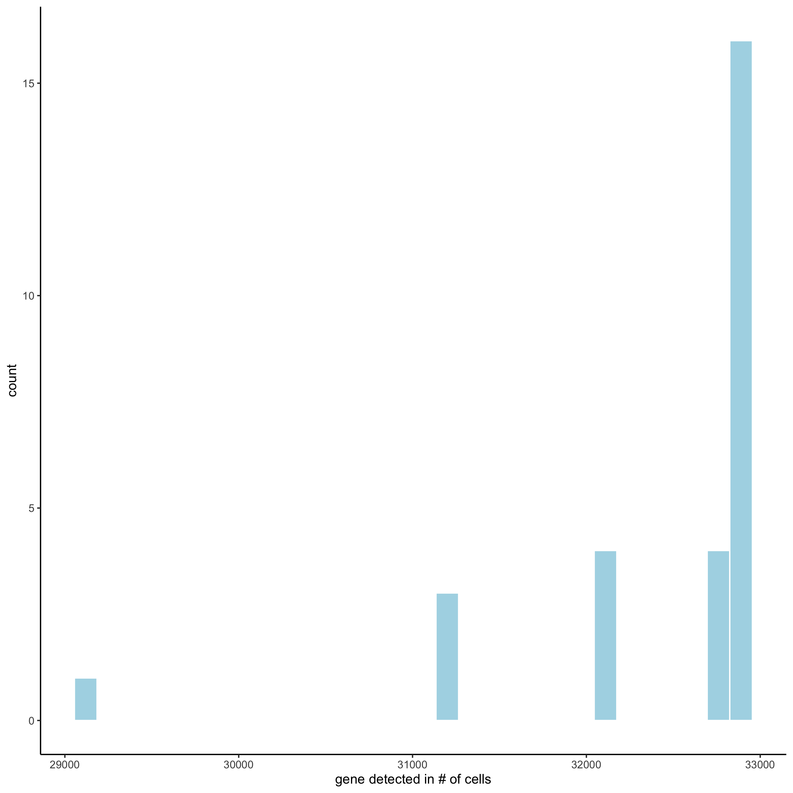{ width=50% } 

```{r eval=FALSE}
filterDistributions(STAR_test, detection = 'cells',
                    save_param = list(save_name = '2_b_distribution_cells'))
```

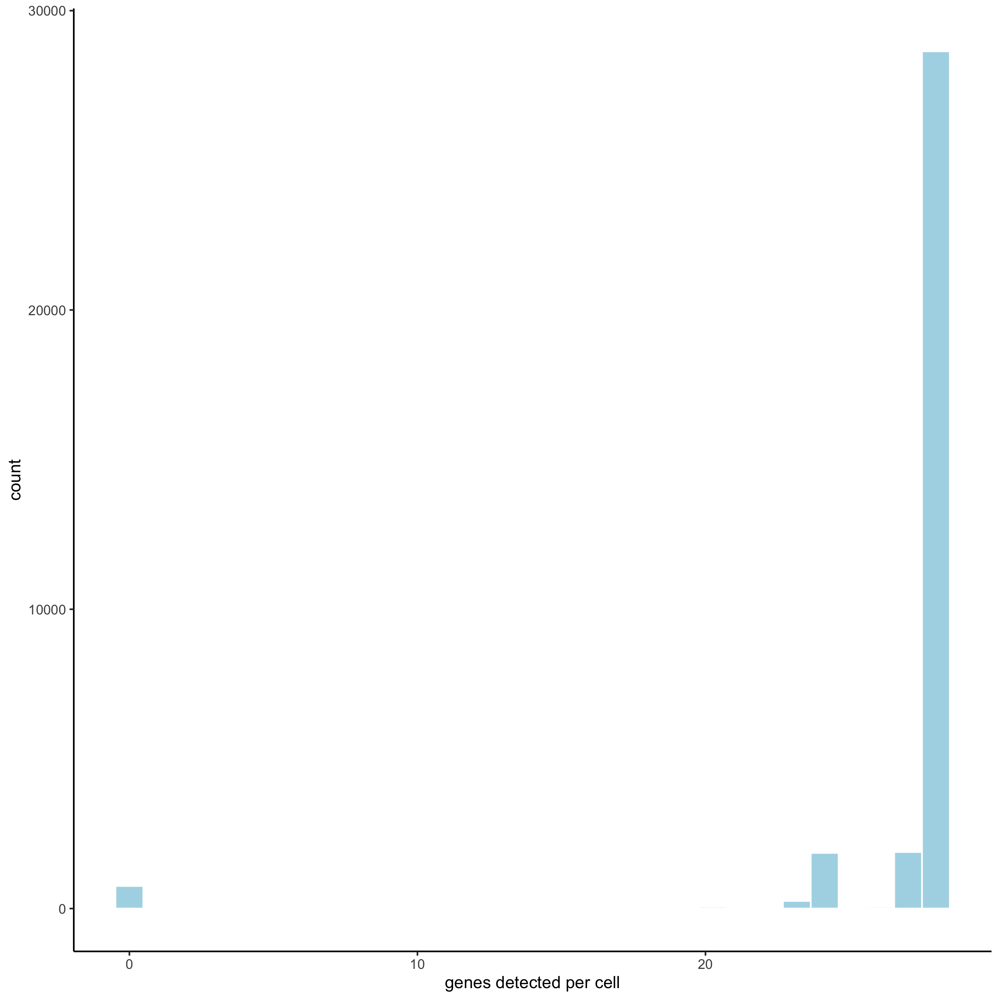{ width=50% } 

```{r eval=FALSE}
filterCombinations(STAR_test, expression_thresholds = c(1, 1,2),
                   gene_det_in_min_cells = c(20000, 20000, 30000),
                   min_det_genes_per_cell = c(10, 20, 25),
                   save_param = list(save_name = '2_c_distribution_filters'))
```

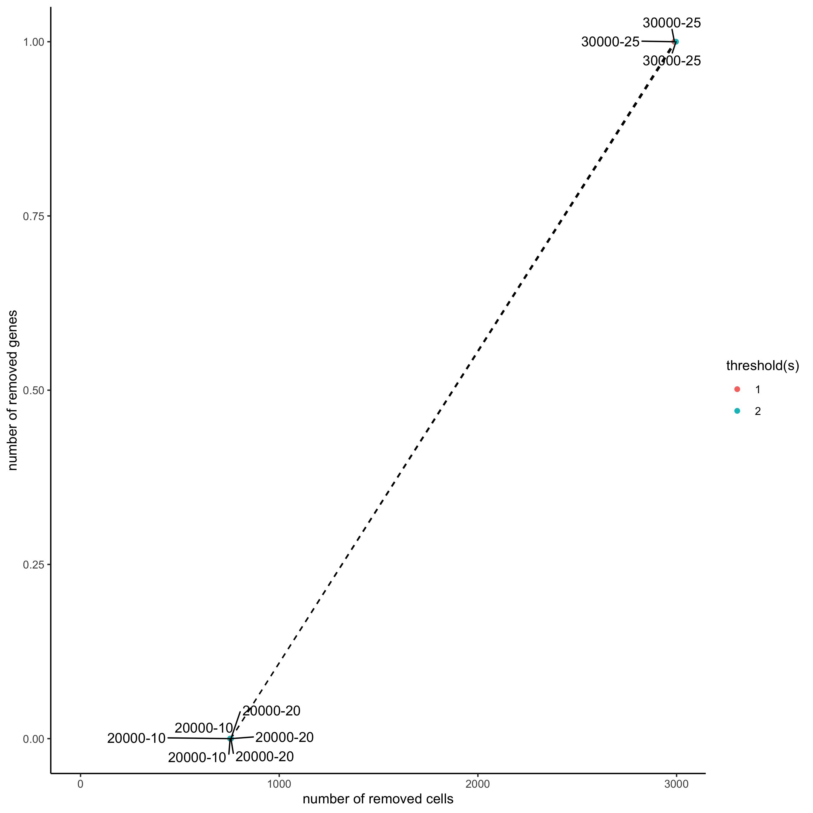{ width=50% } 

```{r eval=FALSE}
# filter
STAR_test <- filterGiotto(gobject = STAR_test,
                          gene_det_in_min_cells = 20000,
                          min_det_genes_per_cell = 20)
## normalize
STAR_test <- normalizeGiotto(gobject = STAR_test, scalefactor = 10000, verbose = T)
STAR_test <- addStatistics(gobject = STAR_test)
STAR_test <- adjustGiottoMatrix(gobject = STAR_test, expression_values = c('normalized'),
                                batch_columns = NULL, covariate_columns = c('nr_genes', 'total_expr'),
                                return_gobject = TRUE,
                                update_slot = c('custom'))
## visualize
# 3D
spatPlot3D(gobject = STAR_test, point_size = 2,
           save_param = list(save_name = '2_d_spatplot_3D'))
```

{ width=50% } 

## part 3: dimension reduction
```{r eval=FALSE}
STAR_test <- calculateHVG(gobject = STAR_test, method = 'cov_groups', 
                          zscore_threshold = 0.5, nr_expression_groups = 3,
                          save_param = list(save_name = '3_a_HVGplot', base_height = 5, base_width = 5))

```

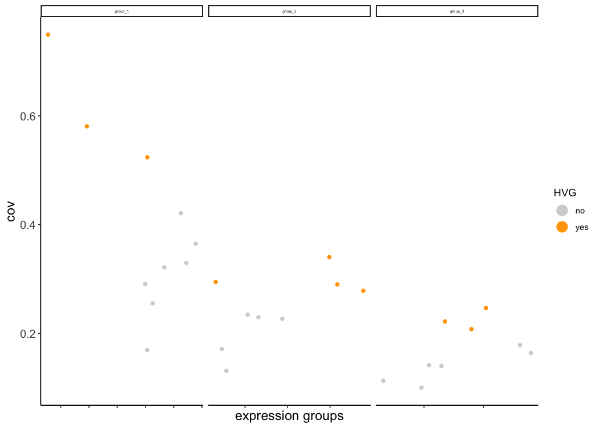{ width=50% } 

```{r eval=FALSE}
# too few highly variable genes
# genes_to_use = NULL is the default and will use all genes available
STAR_test <- runPCA(gobject = STAR_test, genes_to_use = NULL, scale_unit = F,method = 'factominer')
signPCA(STAR_test,
        save_param = list(save_name = '3_b_signPCs'))
```

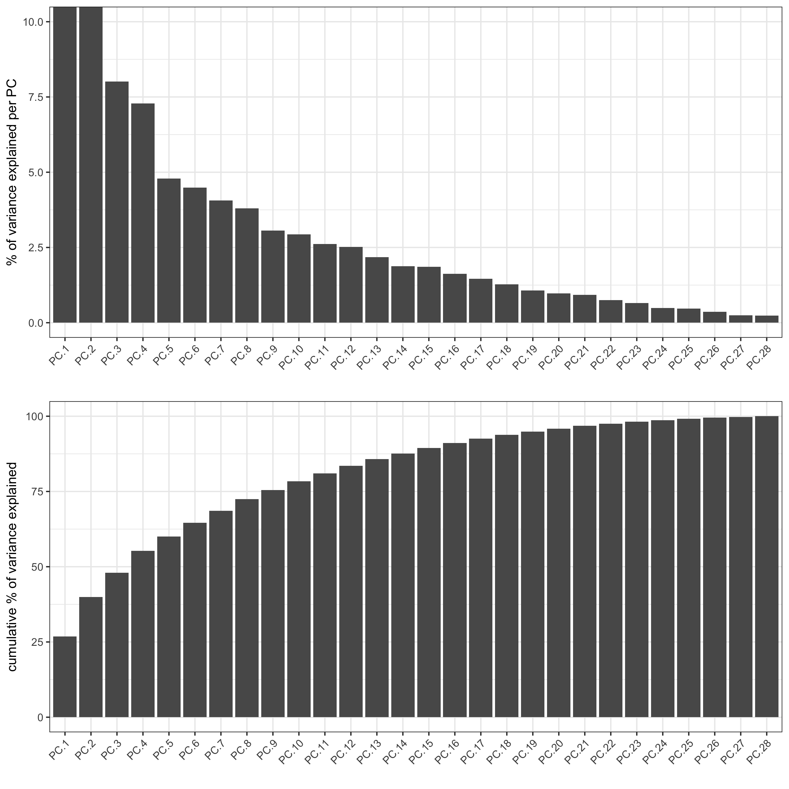{ width=50% } 

```{r eval=FALSE}

STAR_test <- runUMAP(STAR_test, dimensions_to_use = 1:8, n_components = 3, n_threads = 4)
plotUMAP_3D(gobject = STAR_test,
            save_param = list(save_name = '3_c_UMAP'))
```

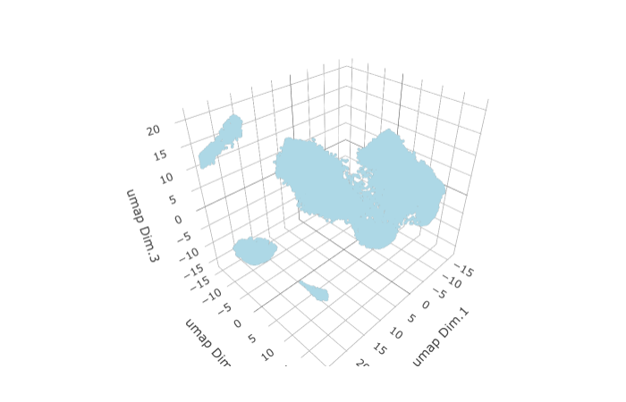{ width=50% } 

***
  
## part 4: cluster

```{r eval=FALSE}
## sNN network (default)
STAR_test <- createNearestNetwork(gobject = STAR_test, dimensions_to_use = 1:8, k = 15)

## Leiden clustering
STAR_test <- doLeidenCluster(gobject = STAR_test, resolution = 0.2, n_iterations = 100,
                             name = 'leiden_0.2')

plotUMAP_3D(gobject = STAR_test, cell_color = 'leiden_0.2',show_center_label = F,
            save_param = list(save_name = '4_a_UMAP'))

```

{ width=50% } 

***
  
## part 5: co-visualize ####

```{r eval=FALSE}
spatDimPlot3D(gobject = STAR_test,
              cell_color = 'leiden_0.2',
              save_param = list(save_name = '5_a_spatDimPlot'))
```

{ width=50% } 

***
  
## part 6: differential expression ####

```{r eval=FALSE}
markers = findMarkers_one_vs_all(gobject = STAR_test,
                                 method = 'gini',
                                 expression_values = 'normalized',
                                 cluster_column = 'leiden_0.2',
                                 min_expr_gini_score = 2,
                                 min_det_gini_score = 2,
                                 min_genes = 5, rank_score = 2)
markers[, head(.SD, 2), by = 'cluster']

# violinplot
violinPlot(STAR_test, genes = unique(markers$genes), cluster_column = 'leiden_0.2',
           strip_position = "right", save_param = list(save_name = '6_a_violinplot'))

```

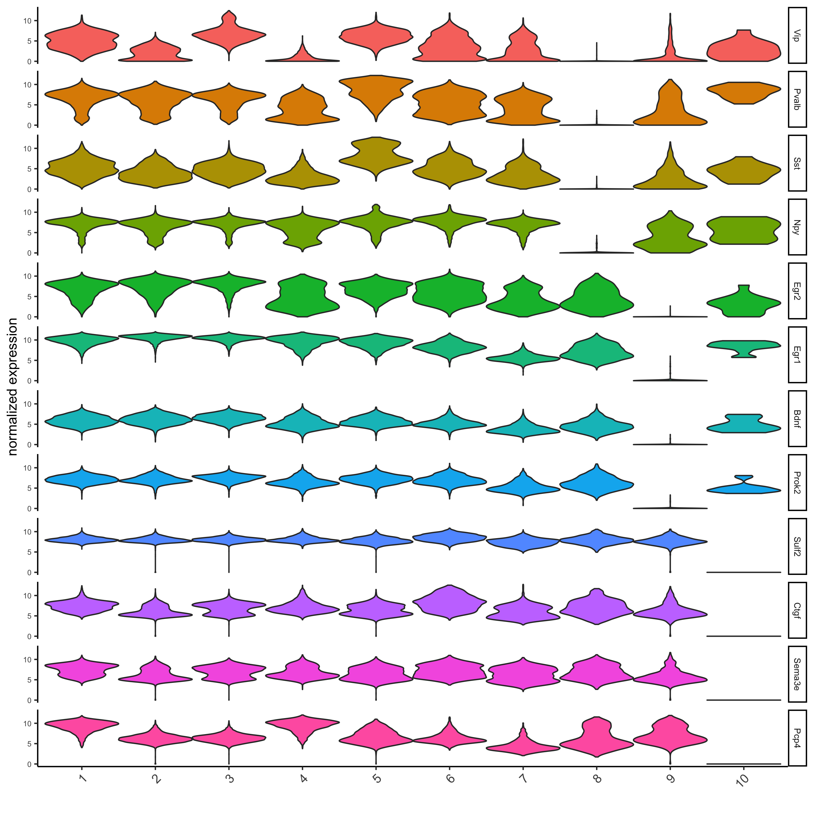{ width=50% } 

```{r eval=FALSE}

# cluster heatmap
plotMetaDataHeatmap(STAR_test, expression_values = 'scaled',
                    metadata_cols = c('leiden_0.2'),
                    save_param = list(save_name = '6_b_metaheatmap'))

```

{ width=50% } 

***
  

## part 7: cell-type annotation

```{r eval=FALSE}

## general cell types
clusters_cell_types_cortex = c('excit','excit','excit', 'inh', 'excit',
                               'other', 'other', 'other', 'inh', 'inh')
names(clusters_cell_types_cortex) = c(1:10)
STAR_test = annotateGiotto(gobject = STAR_test, annotation_vector = clusters_cell_types_cortex,
                           cluster_column = 'leiden_0.2', name = 'general_cell_types')

plotMetaDataHeatmap(STAR_test, expression_values = 'scaled',
                    metadata_cols = c('general_cell_types'),
                    save_param = list(save_name = '7_a_metaheatmap'))
```

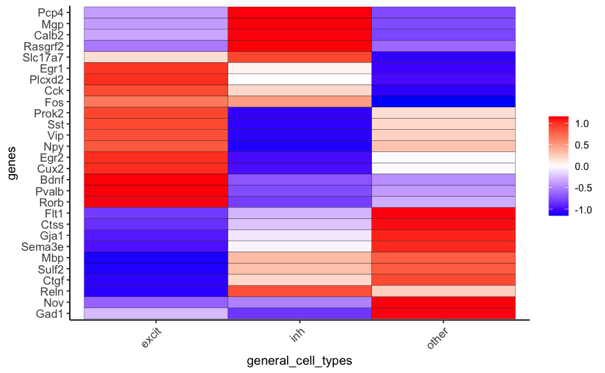{ width=50% } 

```{r eval=FALSE}

## detailed cell types
clusters_cell_types_cortex = c('L5','L4','L2/3', 'PV', 'L6',
                               'Astro', 'Olig1', 'Olig2', 'Calretinin', 'SST')
names(clusters_cell_types_cortex) = c(1:10)
STAR_test = annotateGiotto(gobject = STAR_test, annotation_vector = clusters_cell_types_cortex,
                           cluster_column = 'leiden_0.2', name = 'cell_types')

plotUMAP_3D(STAR_test, cell_color = 'cell_types', point_size = 1.5,show_center_label = F,
            save_param = list(save_name = '7_b_UMAP'))

```

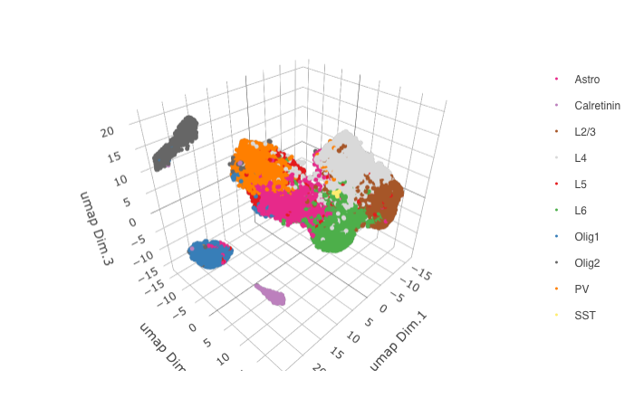{ width=50% } 

```{r eval=FALSE}

plotMetaDataHeatmap(STAR_test, expression_values = 'scaled',
                    metadata_cols = c('cell_types'),
                    custom_cluster_order = c("Calretinin", "SST", "L4", "L2/3", "PV", "L5", "L6", "Astro", "Olig2", "Olig1"),
                    save_param = list(save_name = '7_c_metaheatmap'))

```

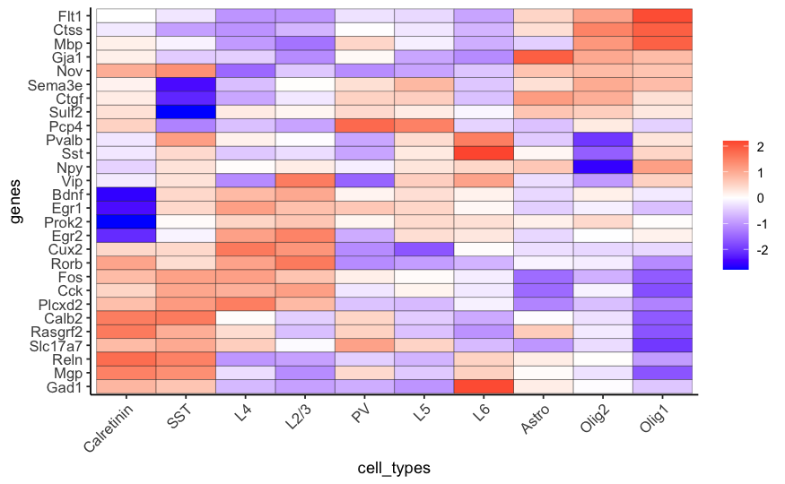{ width=50% } 

***
## part 8: co-visualize cell types


```{r eval=FALSE}
# create consistent color code
mynames = unique(pDataDT(STAR_test)$cell_types)
mycolorcode = Giotto:::getDistinctColors(n = length(mynames))
names(mycolorcode) = mynames

spatDimPlot3D(gobject = STAR_test,
              cell_color = 'cell_types',show_center_label = F,
              save_param = list(save_name = '8_a_spatdimplot'))
```

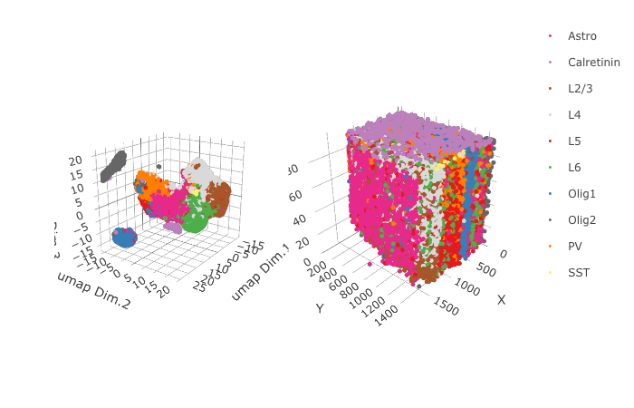{ width=50% } 

***
  
  
## part 9: visualize gene expression

```{r eval=FALSE}
dimGenePlot3D(STAR_test, expression_values = 'scaled',
              genes = "Rorb",
              genes_high_color = 'red', genes_mid_color = 'white', genes_low_color = 'darkblue',
              save_param = list(save_name = '9_a_dimGenePlot'))
```

{ width=50% } 

```{r eval=FALSE}
spatGenePlot3D(STAR_test, 
               expression_values = 'scaled',
               genes = "Rorb",
               show_other_cells = F,
               genes_high_color = 'red', genes_mid_color = 'white', genes_low_color = 'darkblue',
               save_param = list(save_name = '9_b_spatGenePlot'))
```

{ width=50% } 

```{r eval=FALSE}

dimGenePlot3D(STAR_test, expression_values = 'scaled',
              genes = "Pcp4",
              genes_high_color = 'red', genes_mid_color = 'white', genes_low_color = 'darkblue',
              save_param = list(save_name = '9_c_dimGenePlot'))
```

{ width=50% } 

```{r eval=FALSE}
spatGenePlot3D(STAR_test, 
               expression_values = 'scaled',
               genes = "Pcp4",
               show_other_cells = F,
               genes_high_color = 'red', genes_mid_color = 'white', genes_low_color = 'darkblue',
               save_param = list(save_name = '9_d_spatGenePlot'))
```

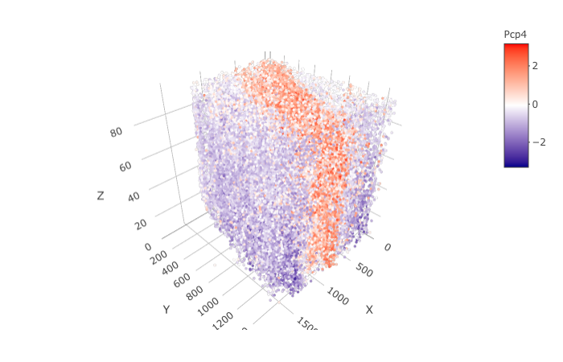{ width=50% } 

```{r eval=FALSE}

dimGenePlot3D(STAR_test, expression_values = 'scaled',
              genes = "Cux2",
              genes_high_color = 'red', genes_mid_color = 'white', genes_low_color = 'darkblue',
              save_param = list(save_name = '9_e_dimGenePlot'))
```

{ width=50% } 

```{r eval=FALSE}
spatGenePlot3D(STAR_test, 
               expression_values = 'scaled',
               genes = "Cux2",
               show_other_cells = F,
               genes_high_color = 'red', genes_mid_color = 'white', genes_low_color = 'darkblue',
               save_param = list(save_name = '9_f_spatGenePlot'))
```

{ width=50% } 

```{r eval=FALSE}
dimGenePlot3D(STAR_test, expression_values = 'scaled',
              genes = "Ctgf",
              genes_high_color = 'red', genes_mid_color = 'white', genes_low_color = 'darkblue',
              save_param = list(save_name = '9_g_dimGenePlot'))
```

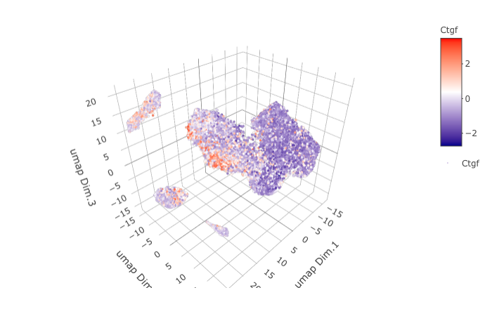{ width=50% } 

```{r eval=FALSE}
spatGenePlot3D(STAR_test, 
               expression_values = 'scaled',
               genes = "Ctgf",
               show_other_cells = F,
               genes_high_color = 'red', genes_mid_color = 'white', genes_low_color = 'darkblue',
               save_param = list(save_name = '9_h_spatGenePlot'))
```

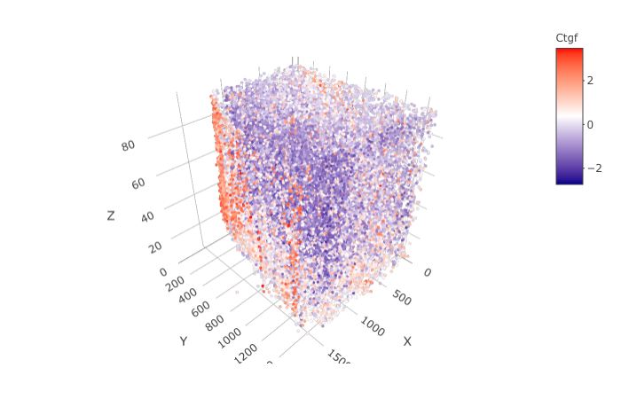{ width=50% } 

***
## part 10: virtual cross section

```{r eval=FALSE}
STAR_test <- createSpatialNetwork(gobject = STAR_test, delaunay_method = 'delaunayn_geometry')
STAR_test = createCrossSection(STAR_test,method="equation",
                               equation=c(0,1,0,600),
                               extend_ratio = 0.6)

```


```{r eval=FALSE}

insertCrossSectionSpatPlot3D(STAR_test, cell_color = 'cell_types', axis_scale = 'cube',
                             point_size = 2,
                             cell_color_code = mycolorcode)
```

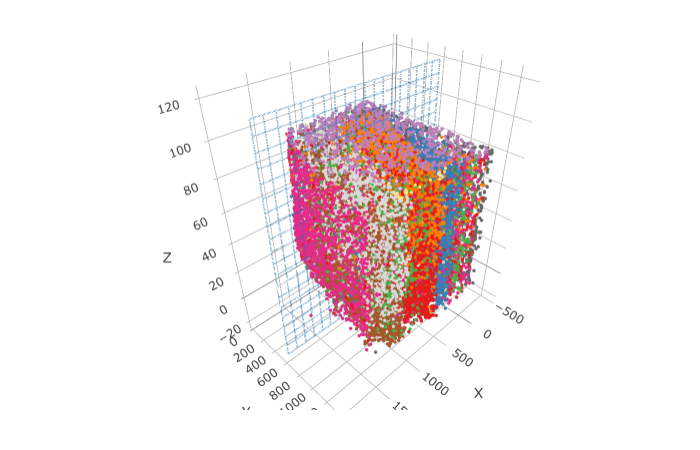{ width=50% } 

```{r eval=FALSE}
insertCrossSectionGenePlot3D(STAR_test, expression_values = 'scaled', axis_scale = "cube",
                             genes = "Slc17a7")

```

{ width=50% } 

```{r eval=FALSE}
crossSectionPlot(STAR_test,
                 point_size = 2, point_shape = "border",
                 cell_color = "cell_types",cell_color_code = mycolorcode,
                 save_param = list(save_name = '10_a_crossSectionPlot'))
```


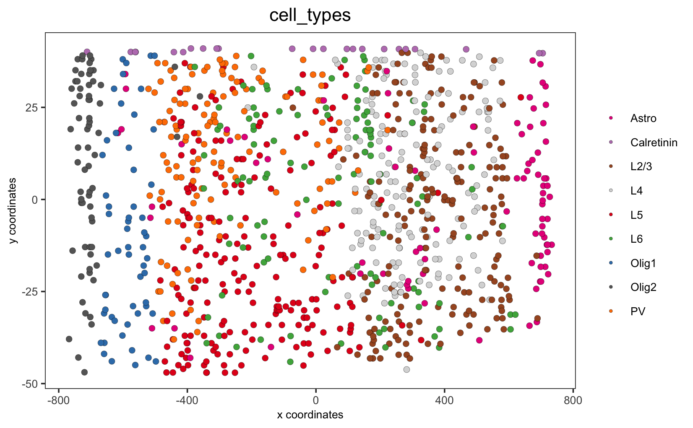{ width=50% } 

```{r eval=FALSE}
crossSectionPlot3D(STAR_test,
                   point_size = 2, cell_color = "cell_types", 
                   cell_color_code = mycolorcode,axis_scale = "cube",
                   save_param = list(save_name = '10_b_crossSectionPlot3D'))

```


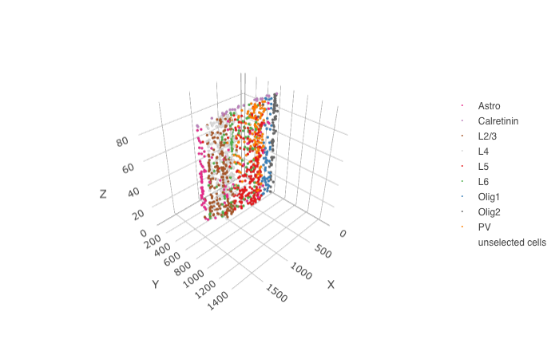{ width=50% } 


```{r eval=FALSE}

crossSectionGenePlot(STAR_test,
                     genes = "Slc17a7",
                     point_size = 2,point_shape = "border",
                     cow_n_col = 1.5,
                     expression_values = 'scaled',
                     save_param = list(save_name = '10_c_crossSectionGenePlot'))
```

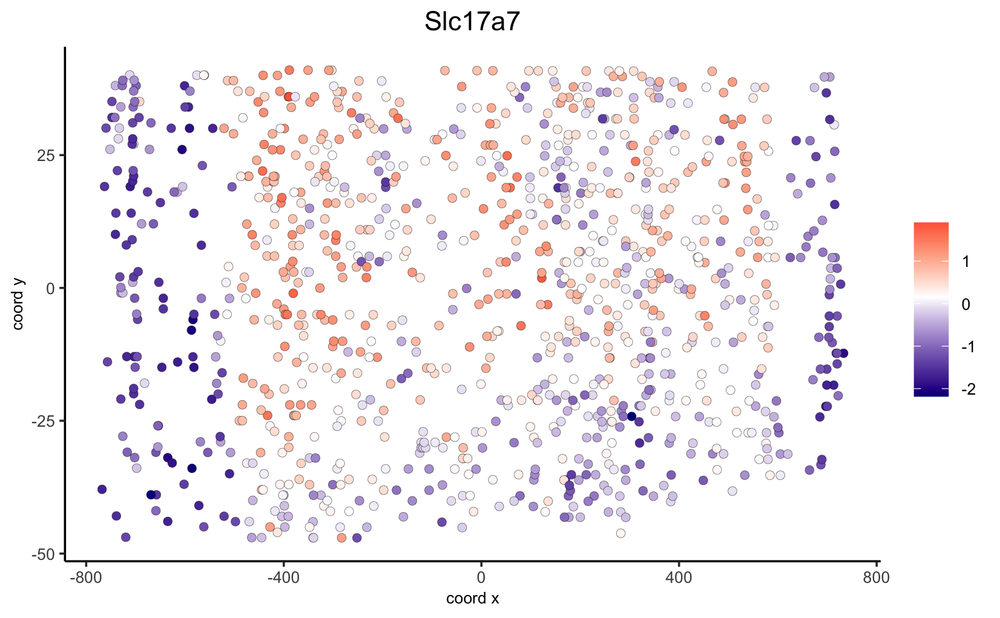{ width=50% } 

```{r eval=FALSE}
crossSectionGenePlot3D(STAR_test,
                       point_size = 2,
                       genes = c("Slc17a7"),
                       expression_values = 'scaled',
                       save_param = list(save_name = '10_d_crossSectionGenePlot3D'))

```

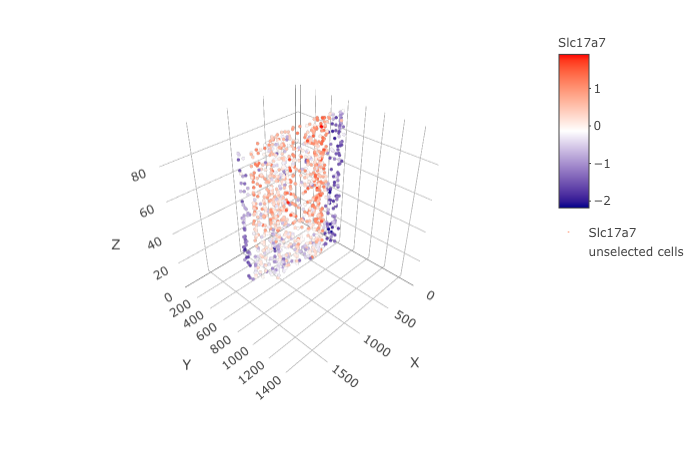{ width=50% } 

