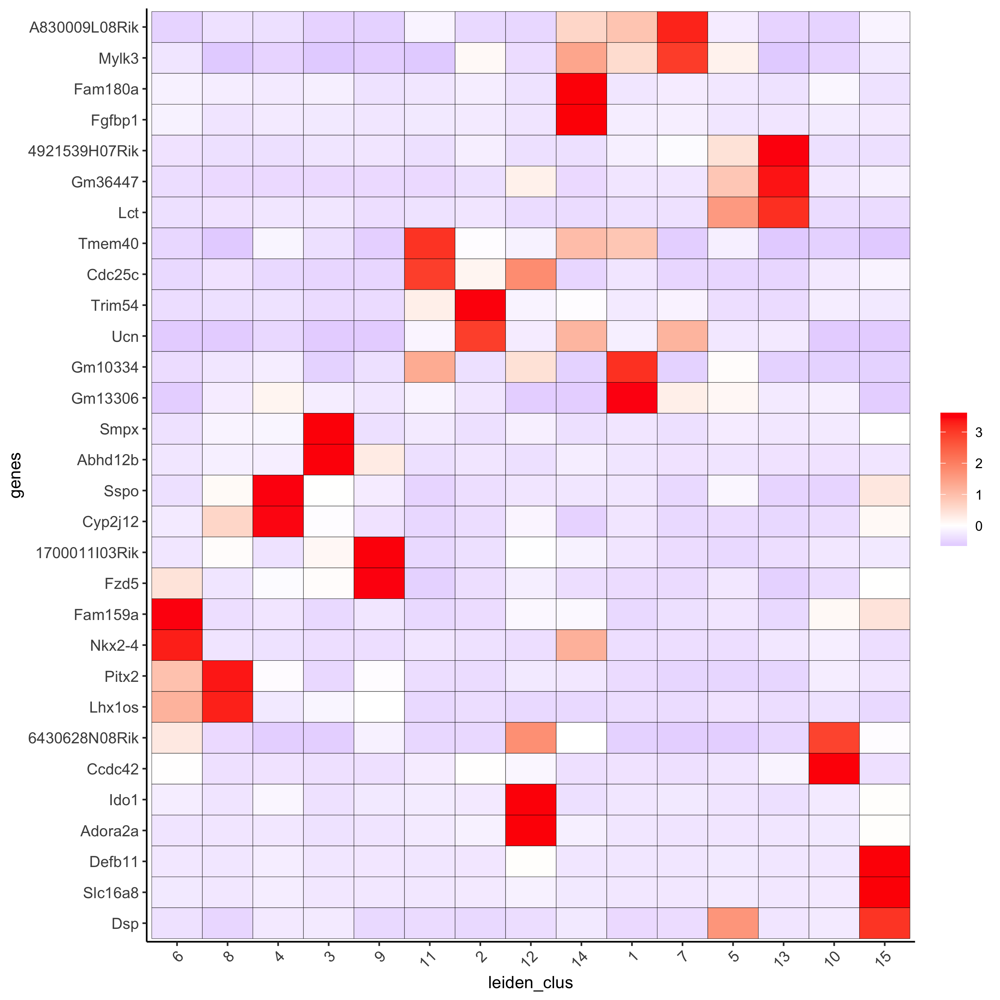

<!-- mouse_cortex_1_simple.md is generated from mouse_cortex_1_simple.Rmd Please edit that file -->

```{r, include = FALSE}
knitr::opts_chunk$set(
  collapse = TRUE,
  comment = "#>",
  fig.path = "man/figures/README-",
  out.width = "100%"
)
```


```{r eval=TRUE, echo=FALSE}
giotto_version = utils::packageVersion(pkg = 'Giotto')

if(giotto_version == '1.0.3') {
  warning('Your using the same Giotto version with which this tutorial was written')
} else if(giotto_version > '1.0.3'){
  warning('This tutorial was written with Giotto version 1.0.3, your version is ', giotto_version, '.', 
  'This is a more recent version and results should be reproducible')
} else {
  warning('This tutorial was written with Giotto version 1.0.3, your version is ', giotto_version, '.', 
  'This is an older version and results could be slightly different')
}
```


```{r eval=FALSE, message=FALSE, warning=FALSE}
library(Giotto)

# 1. set working directory
#results_folder = '/path/to/directory/'
results_folder = '/Volumes/Ruben_Seagate/Dropbox (Personal)/Projects/GC_lab/Ruben_Dries/190225_spatial_package/Results/Visium/Brain/201226_results//'

# 2. set giotto python path
# set python path to your preferred python version path
# set python path to NULL if you want to automatically install (only the 1st time) and use the giotto miniconda environment
python_path = NULL 
if(is.null(python_path)) {
  installGiottoEnvironment()
}
```

## Dataset explanation
[10X genomics](https://www.10xgenomics.com/spatial-transcriptomics/) recently launched a new platform to obtain spatial expression data using a Visium Spatial Gene Expression slide.

The Visium brain data to run this tutorial can be found [here]( https://support.10xgenomics.com/spatial-gene-expression/datasets/1.1.0/V1_Adult_Mouse_Brain)

Visium technology:  
{ width=50% }

High resolution png from original tissue:   
{ width=50% } 


## Part 1: Giotto global instructions and preparations

```{r eval=FALSE, message=FALSE, warning=FALSE}
## create instructions
instrs = createGiottoInstructions(save_dir = results_folder,
                                  save_plot = TRUE,
                                  show_plot = FALSE)

## provide path to visium folder
#data_path = '/path/to/Brain_data/'
data_path = '/Volumes/Ruben_Seagate/Dropbox (Personal)/Projects/GC_lab/Ruben_Dries/190225_spatial_package/Data/Visium_data/Brain_data/'
```


## part 2: Create Giotto object & process data

```{r, eval=FALSE}
## directly from visium folder
visium_brain = createGiottoVisiumObject(visium_dir = data_path, expr_data = 'raw',
                                         png_name = 'tissue_lowres_image.png',
                                         gene_column_index = 2, instructions = instrs)

## update and align background image
# problem: image is not perfectly aligned
spatPlot(gobject = visium_brain, cell_color = 'in_tissue', show_image = T, point_alpha = 0.7,
         save_param = list(save_name = '2_a_spatplot_image'))

```

{ width=50% }  

```{r, eval=FALSE}
# check name
showGiottoImageNames(visium_brain) # "image" is the default name
# adjust parameters to align image (iterative approach)
visium_brain = updateGiottoImage(visium_brain, image_name = 'image',
                                  xmax_adj = 1300, xmin_adj = 1200,
                                  ymax_adj = 1100, ymin_adj = 1000)

# now it's aligned
spatPlot(gobject = visium_brain, cell_color = 'in_tissue', show_image = T, point_alpha = 0.7,
         save_param = list(save_name = '2_b_spatplot_image_adjusted'))
```

{ width=50% } 

```{r, eval=FALSE}
## check metadata
pDataDT(visium_brain)

## compare in tissue with provided jpg
spatPlot(gobject = visium_brain, cell_color = 'in_tissue', point_size = 2,
         cell_color_code = c('0' = 'lightgrey', '1' = 'blue'),
         save_param = list(save_name = '2_c_in_tissue'))
```

{ width=50% } 

```{r, eval=FALSE}
## subset on spots that were covered by tissue
metadata = pDataDT(visium_brain)
in_tissue_barcodes = metadata[in_tissue == 1]$cell_ID
visium_brain = subsetGiotto(visium_brain, cell_ids = in_tissue_barcodes)

## filter
visium_brain <- filterGiotto(gobject = visium_brain,
                              expression_threshold = 1,
                              gene_det_in_min_cells = 50,
                              min_det_genes_per_cell = 1000,
                              expression_values = c('raw'),
                              verbose = T)

## normalize
visium_brain <- normalizeGiotto(gobject = visium_brain, scalefactor = 6000, verbose = T)

## add gene & cell statistics
visium_brain <- addStatistics(gobject = visium_brain)

## visualize
spatPlot2D(gobject = visium_brain, show_image = T, point_alpha = 0.7,
           save_param = list(save_name = '2_d_spatial_locations'))
```

{ width=50% } 


```{r, eval=FALSE}
spatPlot2D(gobject = visium_brain, show_image = T, point_alpha = 0.7,
           cell_color = 'nr_genes', color_as_factor = F,
           save_param = list(save_name = '2_e_nr_genes'))

```

{ width=50% } 


## part 3: dimension reduction

```{r, eval=FALSE}
## highly variable genes (HVG)
visium_brain <- calculateHVG(gobject = visium_brain,
                              save_param = list(save_name = '3_a_HVGplot'))
```

{ width=50% } 

```{r, eval=FALSE}
## run PCA on expression values (default)
gene_metadata = fDataDT(visium_brain)
featgenes = gene_metadata[hvg == 'yes' & perc_cells > 3 & mean_expr_det > 0.4]$gene_ID

visium_brain <- runPCA(gobject = visium_brain, 
                       genes_to_use = featgenes, 
                       scale_unit = F, center = T, 
                       method="factominer")

screePlot(visium_brain, ncp = 30, save_param = list(save_name = '3_b_screeplot'))
```

{ width=50% } 

```{r, eval=FALSE}
plotPCA(gobject = visium_brain,
        save_param = list(save_name = '3_c_PCA_reduction'))
```

{ width=50% } 

```{r, eval=FALSE}
## run UMAP and tSNE on PCA space (default)
visium_brain <- runUMAP(visium_brain, dimensions_to_use = 1:10)
plotUMAP(gobject = visium_brain,
         save_param = list(save_name = '3_d_UMAP_reduction'))
```

{ width=50% } 

```{r, eval=FALSE}
visium_brain <- runtSNE(visium_brain, dimensions_to_use = 1:10)
plotTSNE(gobject = visium_brain,
         save_param = list(save_name = '3_e_tSNE_reduction'))
```

{ width=50% } 


## part 4:  cluster

```{r, eval=FALSE}
## sNN network (default)
visium_brain <- createNearestNetwork(gobject = visium_brain, dimensions_to_use = 1:10, k = 15)
## Leiden clustering
visium_brain <- doLeidenCluster(gobject = visium_brain, resolution = 0.4, n_iterations = 1000)
plotUMAP(gobject = visium_brain,
         cell_color = 'leiden_clus', show_NN_network = T, point_size = 2.5,
         save_param = list(save_name = '4_a_UMAP_leiden'))
```


{ width=50% } 

## part 5: co-visualize

### 5.1 whole dataset
```{r, eval=FALSE}
# expression and spatial
spatDimPlot(gobject = visium_brain, cell_color = 'leiden_clus',
            dim_point_size = 2, spat_point_size = 2.5,
            save_param = list(save_name = '5_a_covis_leiden'))
```

{ width=50% } 

```{r, eval=FALSE}
spatDimPlot(gobject = visium_brain, cell_color = 'nr_genes', color_as_factor = F,
            dim_point_size = 2, spat_point_size = 2.5,
            save_param = list(save_name = '5_b_nr_genes'))
```

{ width=50% } 


### 5.2 subset dataset on DG region

```{r, eval=FALSE}
DG_subset = subsetGiottoLocs(visium_brain, 
                             x_max = 6500, x_min = 3000,
                             y_max = -2500, y_min = -5500,
                             return_gobject = TRUE)

spatDimPlot(gobject = DG_subset, 
            cell_color = 'leiden_clus', spat_point_size = 5, 
            save_param = list(save_name = '5_c_DEG_subset'))

```

{ width=50% } 


## part 6: cell type marker gene detection

#### gini
```{r, eval=FALSE}
gini_markers_subclusters = findMarkers_one_vs_all(gobject = visium_brain,
                                                  method = 'gini',
                                                  expression_values = 'normalized',
                                                  cluster_column = 'leiden_clus',
                                                  min_genes = 20,
                                                  min_expr_gini_score = 0.5,
                                                  min_det_gini_score = 0.5)
topgenes_gini = gini_markers_subclusters[, head(.SD, 2), by = 'cluster']$genes

# violinplot
violinPlot(visium_brain, genes = unique(topgenes_gini), cluster_column = 'leiden_clus',
           strip_text = 8, strip_position = 'right',
           save_param = list(save_name = '6_a_violinplot_gini', base_width = 5, base_height = 10))
```


{ width=50% } 

```{r, eval=FALSE}
# cluster heatmap
plotMetaDataHeatmap(visium_brain, selected_genes = topgenes_gini,
                    metadata_cols = c('leiden_clus'), 
                    x_text_size = 10, y_text_size = 10,
                    save_param = list(save_name = '6_b_metaheatmap_gini'))
```


{ width=50% } 

```{r, eval=FALSE}
# umap plots
dimGenePlot2D(visium_brain, expression_values = 'scaled',
              genes = gini_markers_subclusters[, head(.SD, 1), by = 'cluster']$genes,
              cow_n_col = 3, point_size = 1,
              save_param = list(save_name = '6_c_gini_umap', base_width = 8, base_height = 5))
```


{ width=50% } 


#### scran

```{r, eval=FALSE}
scran_markers_subclusters = findMarkers_one_vs_all(gobject = visium_brain,
                                                   method = 'scran',
                                                   expression_values = 'normalized',
                                                   cluster_column = 'leiden_clus')
topgenes_scran = scran_markers_subclusters[, head(.SD, 2), by = 'cluster']$genes

# violinplot
violinPlot(visium_brain, genes = unique(topgenes_scran), cluster_column = 'leiden_clus',
           strip_text = 10, strip_position = 'right',
           save_param = list(save_name = '6_d_violinplot_scran', base_width = 5))
```

{ width=50% } 

```{r, eval=FALSE}
# cluster heatmap
plotMetaDataHeatmap(visium_brain, selected_genes = topgenes_scran,
                    metadata_cols = c('leiden_clus'),
                    save_param = list(save_name = '6_e_metaheatmap_scran'))
```

{ width=50% } 

```{r, eval=FALSE}
# umap plots
dimGenePlot(visium_brain, expression_values = 'scaled',
            genes = scran_markers_subclusters[, head(.SD, 1), by = 'cluster']$genes,
            cow_n_col = 3, point_size = 1,
            save_param = list(save_name = '6_f_scran_umap', base_width = 8, base_height = 5))
```

{ width=50% } 


## part 7: cell-type annotation

Visium spatial transcriptomics does not provide single-cell resolution, making cell type annotation a harder problem. Giotto provides 3 ways to calculate enrichment of specific cell-type signature gene list:    
- PAGE  
- rank  
- hypergeometric test


known markers for different mouse brain cell types:  
Zeisel, A. et al. Molecular Architecture of the Mouse Nervous System. Cell 174, 999-1014.e22 (2018). 
cell type signatures  
combination of all marker genes identified in Zeisel et al  


### 7.1 PAGE enrichment 
```{r, eval=FALSE}

# 1.1 create binary matrix of cell signature genes
# small example #
gran_markers = c("Nr3c2", "Gabra5", "Tubgcp2", "Ahcyl2",
                 "Islr2", "Rasl10a", "Tmem114", "Bhlhe22", 
                 "Ntf3", "C1ql2")

oligo_markers = c("Efhd1", "H2-Ab1", "Enpp6", "Ninj2",
                  "Bmp4", "Tnr", "Hapln2", "Neu4",
                  "Wfdc18", "Ccp110")        

di_mesench_markers = c("Cartpt", "Scn1a", "Lypd6b",  "Drd5",
                       "Gpr88", "Plcxd2", "Cpne7", "Pou4f1",
                       "Ctxn2", "Wnt4")

signature_matrix = makeSignMatrixPAGE(sign_names = c('Granule_neurons',
                                                     'Oligo_dendrocytes',
                                                     'di_mesenchephalon'),
                                      sign_list = list(gran_markers,
                                                       oligo_markers,
                                                       di_mesench_markers))

# 1.2 [shortcut] fully pre-prepared matrix for all cell types
sign_matrix_path = system.file("extdata", "sig_matrix.txt", package = 'Giotto')
brain_sc_markers = data.table::fread(sign_matrix_path) 
sig_matrix = as.matrix(brain_sc_markers[,-1]); rownames(sig_matrix) = brain_sc_markers$Event


# 1.3 enrichment test with PAGE

# runSpatialEnrich() can also be used as a wrapper for all currently provided enrichment options
visium_brain = runPAGEEnrich(gobject = visium_brain, sign_matrix = sig_matrix)


# 1.4 heatmap of enrichment versus annotation (e.g. clustering result)
cell_types = colnames(sig_matrix)
plotMetaDataCellsHeatmap(gobject = visium_brain,
                         metadata_cols = 'leiden_clus',
                         value_cols = cell_types,
                         spat_enr_names = 'PAGE',
                         x_text_size = 8, 
                         y_text_size = 8,
                         save_param = list(save_name="7_a_metaheatmap"))
```

{ width=50% } 

```{r, eval=FALSE}
# 1.5 visualizations
cell_types_subset = colnames(sig_matrix)[1:10]
spatCellPlot(gobject = visium_brain, 
             spat_enr_names = 'PAGE',
             cell_annotation_values = cell_types_subset,
             cow_n_col = 4,coord_fix_ratio = NULL, point_size = 0.75,
             save_param = list(save_name="7_b_spatcellplot_1"))
```

{ width=50% } 

```{r, eval=FALSE}
cell_types_subset = colnames(sig_matrix)[11:20]
spatCellPlot(gobject = visium_brain, spat_enr_names = 'PAGE', 
             cell_annotation_values = cell_types_subset, cow_n_col = 4,
             coord_fix_ratio = NULL, point_size = 0.75, 
             save_param = list(save_name="7_c_spatcellplot_2"))
```

{ width=50% }

```{r, eval=FALSE}
spatDimCellPlot(gobject = visium_brain, 
                spat_enr_names = 'PAGE',
                cell_annotation_values = c('Cortex_hippocampus', 'Granule_neurons',
                                           'di_mesencephalon_1', 'Oligo_dendrocyte','Vascular'),
                cow_n_col = 1, spat_point_size = 1, 
                plot_alignment = 'horizontal', 
                save_param = list(save_name="7_d_spatDimCellPlot", base_width=7, base_height=10))
```

{ width=50% }


## part 8: spatial grid ####

```{r, eval=FALSE}
visium_brain <- createSpatialGrid(gobject = visium_brain,
                                   sdimx_stepsize = 400,
                                   sdimy_stepsize = 400,
                                   minimum_padding = 0)
spatPlot(visium_brain, cell_color = 'leiden_clus', show_grid = T,
         grid_color = 'red', spatial_grid_name = 'spatial_grid', 
         save_param = list(save_name = '8_grid'))
```

{ width=50% } 

## part 9: spatial network ####

```{r, eval=FALSE}
visium_brain <- createSpatialNetwork(gobject = visium_brain, 
                                     method = 'kNN', k = 5, 
                                     maximum_distance_knn = 400, 
                                     name = 'spatial_network')

showNetworks(visium_brain)

spatPlot(gobject = visium_brain, show_network = T,
         network_color = 'blue', spatial_network_name = 'spatial_network',
         save_param = list(save_name = '9_a_knn_network'))
```

{ width=50% } 

## part 10: spatial genes ####

### Spatial genes

```{r, eval=FALSE}
## kmeans binarization
kmtest = binSpect(visium_brain, calc_hub = T, hub_min_int = 5,
                  spatial_network_name = 'spatial_network')
spatGenePlot(visium_brain, expression_values = 'scaled',
             genes = kmtest$genes[1:6], cow_n_col = 2, point_size = 1.5,
             save_param = list(save_name = '10_a_spatial_genes_km'))
```

{ width=50% } 

```{r, eval=FALSE}
## rank binarization
ranktest = binSpect(visium_brain, bin_method = 'rank', 
                    calc_hub = T, hub_min_int = 5,
                    spatial_network_name = 'spatial_network')
spatGenePlot(visium_brain, expression_values = 'scaled',
             genes = ranktest$genes[1:6], cow_n_col = 2, point_size = 1.5,
             save_param = list(save_name = '10_b_spatial_genes_rank'))
```

{ width=50% } 


### Spatial patterns

```{r, eval=FALSE}
# cluster the top 1500 spatial genes into 20 clusters
ext_spatial_genes = ranktest[1:1500,]$gene

# here we use existing detectSpatialCorGenes function to calculate pairwise distances between genes (but set network_smoothing=0 to use default clustering)
spat_cor_netw_DT = detectSpatialCorGenes(visium_brain, 
                                         method = 'network', 
                                         spatial_network_name = 'spatial_network', 
                                         subset_genes = ext_spatial_genes)

# cluster spatial genes
spat_cor_netw_DT = clusterSpatialCorGenes(spat_cor_netw_DT, name = 'spat_netw_clus', k = 20)

# visualize clusters
heatmSpatialCorGenes(visium_brain, 
                     spatCorObject = spat_cor_netw_DT, 
                     use_clus_name = 'spat_netw_clus', 
                     heatmap_legend_param = list(title = NULL), 
                     save_param = list(save_name="10_c_heatmap",
                                       base_height = 6, base_width = 8, units = 'cm'))
```

{ width=50% } 


```{r, eval=FALSE}

table(spat_cor_netw_DT$cor_clusters$spat_netw_clus)

coexpr_dt = data.table::data.table(genes = names(spat_cor_netw_DT$cor_clusters$spat_netw_clus),
                       cluster = spat_cor_netw_DT$cor_clusters$spat_netw_clus)
data.table::setorder(coexpr_dt, cluster)
top30_coexpr_dt = coexpr_dt[, head(.SD, 30) , by = cluster]


# do HMRF with different betas on 500 spatial genes
my_spatial_genes <- top30_coexpr_dt$genes

hmrf_folder = paste0(results_folder,'/','11_HMRF/')
if(!file.exists(hmrf_folder)) dir.create(hmrf_folder, recursive = T)

HMRF_spatial_genes = doHMRF(gobject = visium_brain, 
                            expression_values = 'scaled', 
                            spatial_genes = my_spatial_genes, k = 20, 
                            spatial_network_name="spatial_network", 
                            betas = c(0, 10, 5), 
                            output_folder = paste0(hmrf_folder, '/', 'Spatial_genes/SG_topgenes_k20_scaled'))

visium_brain = addHMRF(gobject = visium_brain, HMRFoutput = HMRF_spatial_genes, 
                       k = 20, betas_to_add = c(0, 10, 20, 30, 40), 
                       hmrf_name = 'HMRF')

spatPlot(gobject = visium_brain, cell_color = 'HMRF_k20_b.40',
         point_size = 2, save_param=c(save_name="10_d_spatPlot2D_HMRF"))
```

{ width=50% } 


## Export and create Giotto Viewer 


```{r, eval=FALSE}
# check which annotations are available
combineMetadata(visium_brain, spat_enr_names = 'PAGE')

# select annotations, reductions and expression values to view in Giotto Viewer
viewer_folder = paste0(results_folder, '/', 'mouse_Visium_brain_viewer')

exportGiottoViewer(gobject = visium_brain,
                   output_directory = viewer_folder,
                   spat_enr_names = 'PAGE', 
                   factor_annotations = c('in_tissue',
                                          'leiden_clus',
                                          'HMRF_k20_b.40'),
                   numeric_annotations = c('nr_genes',
                                           'clus_25'),
                   dim_reductions = c('tsne', 'umap'),
                   dim_reduction_names = c('tsne', 'umap'),
                   expression_values = 'scaled',
                   expression_rounding = 2,
                   overwrite_dir = T)
```


